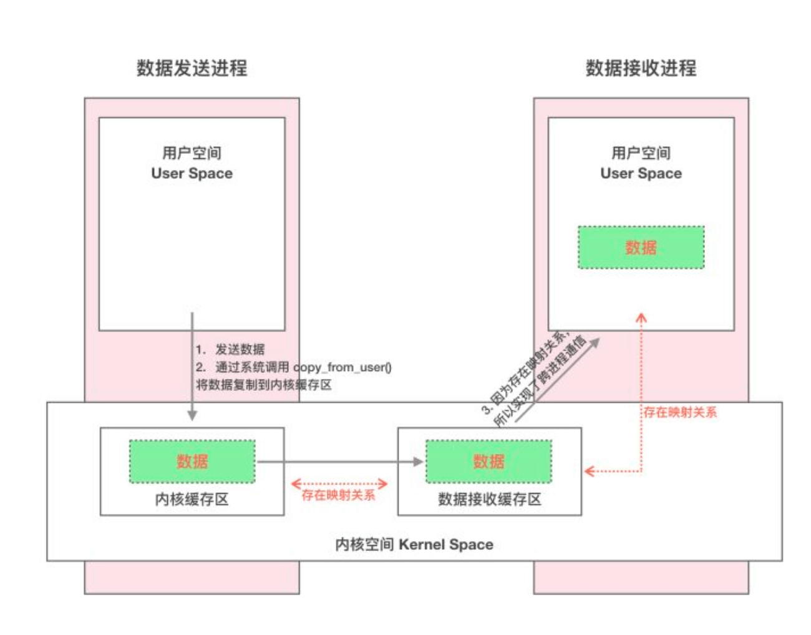
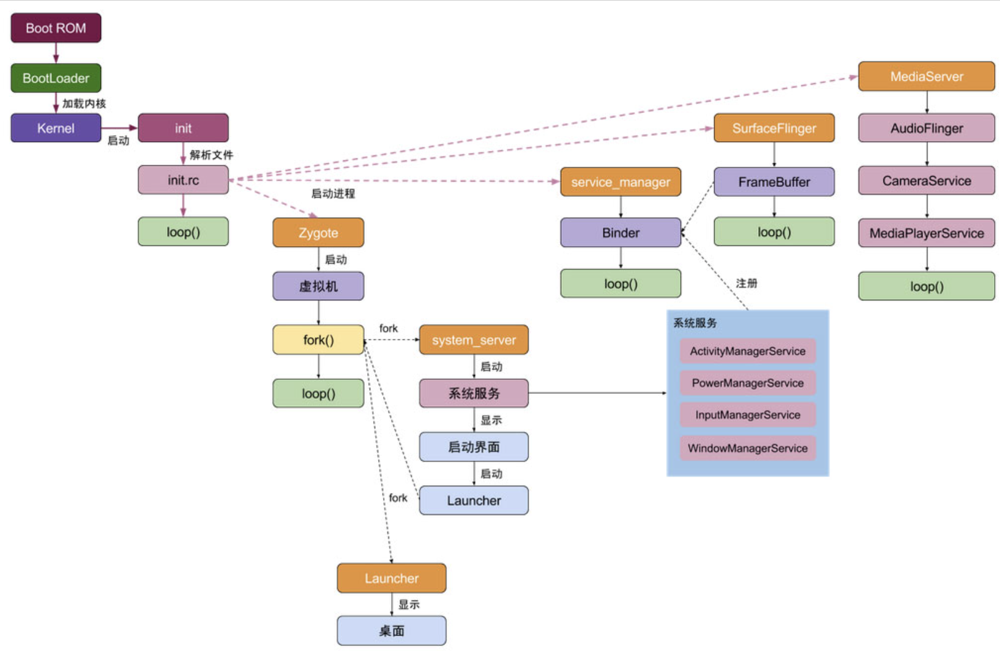
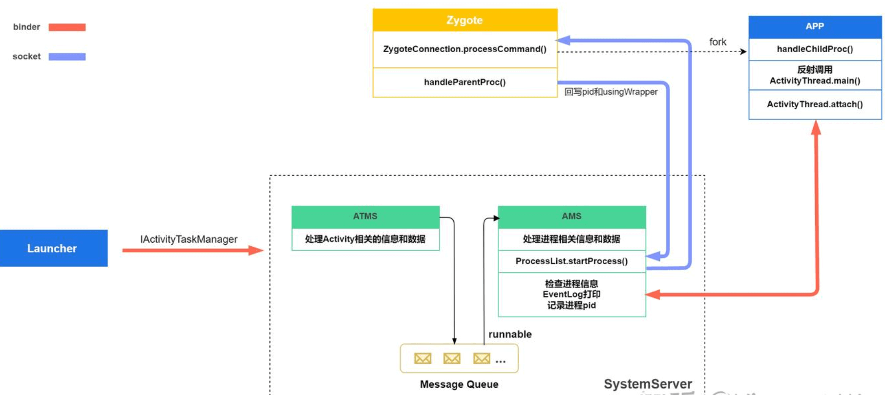
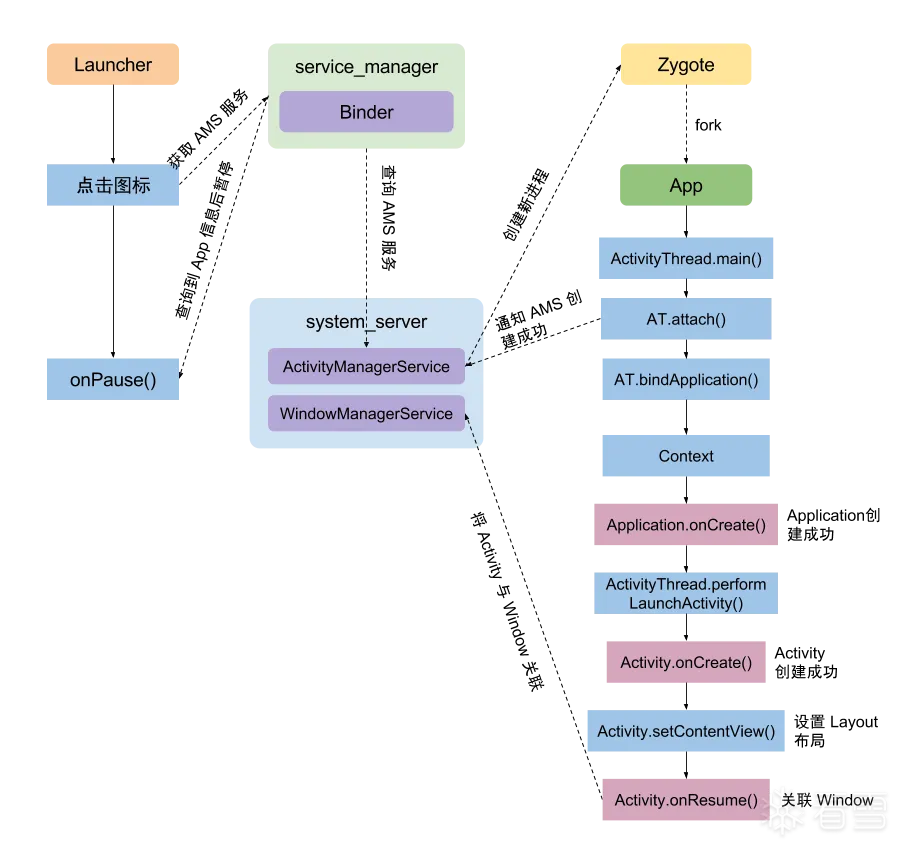
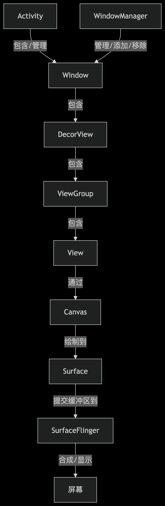

## ClassLoader

| ClassLoader类型            | 加载路径                          | 作用                                       | 使用场景                   |
| :------------------------- | :-------------------------------- | :----------------------------------------- | :------------------------- |
| **BootClassLoader**        | Android Framework类 (`android.*`) | 系统启动时加载核心框架类                   | 系统内部使用，开发者不可见 |
| **PathClassLoader**        | 应用安装目录（`/data/app/*.apk`） | 加载已安装APK中的主Dex                     | 默认应用主ClassLoader      |
| **DexClassLoader**         | 任意包含dex/jar/apk的目录         | 动态加载外部代码（需`WRITE_EXTERNAL`权限） | 插件化、热修复             |
| **InMemoryDexClassLoader** | 内存中的Dex字节数组               | 直接从内存加载Dex（无磁盘IO）              |                            |

## JVM知识

### 核心内存区域对比表

|     内存区域     |                         核心存储内容                         |                  核心特点                   |    与 GC 关系     |
| :--------------: | :----------------------------------------------------------: | :-----------------------------------------: | :---------------: |
|  虚拟机栈（栈）  | 基本数据类型值、引用数据类型的引用地址、方法局部变量 / 操作数栈 / 返回地址 |  线程私有，随方法调用销毁，大小固定易溢出   | 无需 GC，自动释放 |
|        堆        | 引用类型实例（对象 / 数组）、JDK1.7 + 字符串常量池、动态分配数据 |    线程共享，大小动态，分新生代 / 老年代    |  GC 核心回收区域  |
|      方法区      |             类元数据、静态变量、JDK1.7 前常量池              | 线程共享，JDK1.8 后改为元空间（用本地内存） |  低效回收无用类   |
| 常量区（常量池） |                 字面量、符号引用、final 常量                 | 1.7 前属方法区，1.7 后移至堆，享元模式复用  |    几乎不回收     |

### 可达性分析与 GC Roots

- 核心：以 GC Roots 为起点遍历引用链，无引用链的对象判定为可回收，解决循环引用问题。

|          类型          |                   说明                   |                   示例                    |
| :--------------------: | :--------------------------------------: | :---------------------------------------: |
|      虚拟机栈引用      |     正在执行方法的局部变量、参数引用     |       `User u = new User()` 中的`u`       |
|     类静态属性引用     |      方法区中 static 变量引用的对象      |   `static User globalUser = new User()`   |
|     方法区常量引用     | static final 常量（如 String）引用的对象 |    `static final String TAG = "Test"`     |
| JNI（Native 方法）引用 |   本地方法栈中 JNI 方法持有的对象引用    |      安卓 NDK 方法创建的 Native 对象      |
|      活跃线程对象      |      正在运行的线程实例，避免被回收      |          安卓主线程、子线程对象           |
|      系统内部引用      |  JVM/ART 核心对象（类加载器、系统类等）  |         `ClassLoader`、`System`类         |
|     同步锁持有对象     |      `synchronized`关键字锁定的对象      | `synchronized (lockObj) {}` 中的`lockObj` |

### 其他

1. 存储差异：基本类型（值 + 变量）全在栈；引用类型（引用在栈，实例在堆）。
2. String 特殊存储：`"abc"`存常量池，`new String("abc")`堆、常量池各存一份。
3. 安卓异常：OOM 多因堆内存不足（大图片 / 大量对象），栈溢出多由递归过深导致。

4. 栈线程私有自动释放，堆线程共享需 GC，是内存管理核心区域；

5. 方法区 / 常量区存类元信息与常量，版本及安卓有结构差异；

6. 可达性分析依赖 GC Roots 判定对象存活，覆盖栈、静态、JNI 等多类引用。


## 虚拟机

### 一、标准JVM GC算法

JVM的垃圾回收（GC）算法历经多代演进，从基础算法逐步优化至现代化方案，核心围绕对象存活判断与内存回收效率展开。

#### 1. 基础GC算法

- **引用计数法**：通过为每个对象维护引用计数器，记录被引用次数，当计数为0时回收对象。核心缺陷为无法解决对象间循环引用问题，导致内存泄漏，目前已基本被淘汰。

- **标记-清除算法（Mark-Sweep）**：分为“标记”与“清除”两个阶段，先标记所有可达对象，再清除未被标记的垃圾对象。核心缺点是回收后会产生大量内存碎片，无法满足连续内存块的申请需求，进而导致内存分配失败频率升高，间接加大垃圾回收频率。也不是生产使用的算法。

- **标记-压缩算法（Mark-Compact）**：作为标记-清除算法的进阶版本，在标记完成后，并非直接清除垃圾对象，而是将所有存活对象向内存区域的一端移动并紧凑排列，随后清除边界外的所有垃圾。该算法解决了内存碎片问题，但移动对象过程会增加性能开销。

- **标记-复制算法（Mark-Copy）**：将内存空间均分两份，每次仅使用其中一份。当当前使用区域内存不足时，标记所有存活对象并复制到另一份空闲区域，随后清空原使用区域。优点是回收后无内存碎片，缺点是最大可用内存仅为总内存的一半，内存利用率较低。

#### 2. 进阶与现代GC算法

- **逐代回收算法**：结合上述基础算法的特性，根据对象存活周期将内存划分为不同年代（如年轻代、老年代），对不同年代采用适配的GC算法。例如年轻代对象存活时间短，适合用标记-复制算法；老年代对象存活时间长，适合用标记-清除或标记-压缩算法，通过细化分区提升回收效率。

- **ZGC算法**：一种现代化的垃圾回收方式，打破传统逐代回收的设计，无年代划分。具备低延迟、高吞吐量的优势，通过动态区域划分和并发处理，大幅降低停顿时间，适配大规模内存场景。

### 二、Android GC算法

Android虚拟机的GC算法随系统版本迭代不断优化，核心目标是解决卡顿、内存碎片及性能开销问题，Android 8.0（API 26）是分代收集的重要分界点。

#### 1. Android 8.0 前（无分代收集）

##### （1）CMS算法（Android 4.4及以下）

本质是并发版本的标记-清除算法，流程分为五个阶段：初始化标记（STW，Stop The World，停止所有用户线程）→并发标记（与用户线程并行）→并发预处理→重新标记（STW，修正并发标记的偏差）→并发清理（与用户线程并行）。

该算法的特殊优化：仅当无连续内存可用或应用切换至后台时，才会执行压缩操作，日常极少压缩；搭配虚拟连续内存分配器，缓解碎片影响，同时划分多个内存区域，通过区域间拷贝优化回收效果。但存在明显缺陷：单线程回收导致卡顿现象突出，内存碎片化问题严重。

##### （2）CC算法（Android 5.0~7.x）

全称并发复制算法，核心改进是将STW时间优化为常量级别，大幅降低卡顿概率。通过并发方式将存活对象复制到空闲区域，避免了CMS的单线程卡顿问题，但代价是内存占用翻倍（需预留复制空间），且屏障指令会带来额外的性能开销。

#### 2. Android 8.0+（CMC算法）

CMC全称为并发压缩算法，是Android GC的重要突破，实现无屏障并发压缩，同时解决了内存碎片与性能开销的矛盾，平衡了内存占用率与回收效率。其核心判断逻辑基于可达性分析（通过GCRoot关联对象，判断对象是否可达，不可达则视为“死亡”内存，触发回收）。

### 三、Android虚拟机特性补充（ART vs Dalvik）

Android虚拟机分为Dalvik和ART两代，两者的执行机制差异直接影响GC效率与应用性能，目前Android系统已全面采用ART虚拟机，并通过热点收集进一步优化短板。

#### 1. Dalvik虚拟机

核心特点：安装速度快，无需提前编译；但每次应用运行前，需将DEX文件解析为机器码才能执行，运行时性能开销大，间接增加GC压力。

#### 2. ART虚拟机

核心特点：针对DEX文件优化（而非传统JAR文件），DEX格式具备class压缩、指令精简的优势，提升内存利用率与执行效率。安装时会将DEX文件预编译为机器码，导致安装速度慢，但每次运行时无需重复解析，运行速度显著提升，减少GC触发频率。

#### 3. 后续优化

ART虚拟机初期存在“安装慢”和“内存占用高”两大弱点，后续通过热点收集技术进一步改进：针对高频执行的代码（热点代码）优化编译与内存分配策略，兼顾安装速度与运行效率，同时降低GC对应用性能的影响。


## Apk打包流程

8个步骤

* appt2整合资源并生成R.java； aidl生成java；运行时注解

* javac 编译（javaCode，R.java，Aidl/output的java）成字节码

* 整合第三方字节码
* proguard
* dex
* apkbuilder整合资源，so和dex 得到未签名APK
* 签名得到签名APK
* zipalign APK


知识点：了解编译流程是**为了找到合适的点，做一些修改**。

- 比如我做了编译前的gradle依赖：实现了asset文件加密；实现了编译前下载。

- 研究了编译中的某些步骤，比如kotlinc/javac完成节点，可以做一些字节码改动的事情，比如字节码插桩。

- 编译完成后签名前，再做调整。


## Binder

**核心角色**：

 \- Client（请求方）、Server（服务提供方）

 \- ServiceManager（Binder 服务注册表，管理服务名与 IBinder 映射）

 \- Binder 驱动（核心中转，负责进程间数据转发）

**数据载体**：`Parcel` 是 Binder 数据序列化 / 反序列化的唯一载体，所有传输数据需通过 `Parcel` 封装

**AIDL 关联**：AIDL 是 Binder 的代码生成工具，自动生成 Stub（服务端）、Proxy（客户端）的 Binder 实现类

**引用计数**：Binder 内置引用计数机制，避免跨进程引用导致的内存泄漏

**进程模型**：C/S 架构，通过 Binder 驱动实现跨进程通信


**内存模型**：一次拷贝的核心是内核态内存映射



### 调用方式对比

|       类型        |                           核心特性                           |
| :---------------: | :----------------------------------------------------------: |
| 非 oneway（同步） |     客户端**阻塞等待服务端响应**，直至服务端处理完成返回     |
|  oneway（异步）   | 1. 客户端调用后**不阻塞**，立即返回 <br>2. 同一服务端 Stub 实例的 oneway 方法会**串行排队**执行 |

### Binder 核心优势

1. **一次拷贝**：数据仅从用户态拷贝到内核态（驱动直接映射内存给目标进程）

   对比传统 IPC（用户态→内核态→用户态两次拷贝）性能更高

2. 进程隔离与安全

    - 天然实现进程隔离，避免跨进程内存越界

    - 支持校验调用方 `pid/uid`，精准控制权限

3. **跨层统一支持**：提供 C++ Native 层 + Java 层统一 API，避免原生 Linux IPC 开发效率低的问题

4. **驱动解耦**：隔离底层通信协议，避免协议扩散，降低维护成本

* **Binder 传输数据支持类型： **

- 基本数据类型和`Parcelable`对象（常规结构化数据） 

- IBinder接口引用（跨进程传递服务实例）

### 数据与线程限制

**内存限制**：

- 单个事务缓冲区上限：`1MB - 8KB`（`ProcessState` 初始化时 `mmap` 申请）

- 异步（oneway）事务上限：约 `400KB`（一半缓冲区预留同步事务响应）

- Bundle 限制：单个 `Bundle` ≤ 50KB，进程内所有 `Bundle` 共享内存 ≤ 1MB

**线程池限制**：

- Binder 默认线程池为 **1 主线程 + 15 子线程**，超出则请求排队

### 死亡通知（进程崩溃监听）

1. **核心 API**：`linkToDeath` + `unlinkToDeath`
2. **作用**：服务端进程意外崩溃时，客户端通过 `DeathRecipient` 回调接收通知，执行重连 / 资源清理逻辑
3. **补充**：使用时需注册 `DeathRecipient` 代理，服务崩溃后需主动调用 `unlinkToDeath` 防止内存泄漏


## 系统启动与桌面流程



### 一、 启动总流程（按顺序梳理）

```
Bootloader → Kernel → Init进程(pid=1) 
 → Zygote进程
 → SystemServer进程
 → Launcher桌面启动
```

### 二、 各阶段核心详解

#### 1. Bootloader 阶段

- 定位：设备上电后第一个执行的程序，属于硬件引导层。
- 核心操作：初始化硬件（如内存、CPU），加载并启动 Linux Kernel。

#### 2. Kernel（内核）阶段

- 核心操作：初始化内核核心组件，挂载根文件系统，启动用户空间第一个进程（Init 进程）。
- 关键标志：内核启动完成的核心标志是成功启动 Init 进程，移交用户空间控制权。

#### 3. Init 进程（pid=1，用户空间首个进程）

- 基础初始化：完成文件系统初始化、SELinux 安全策略加载。
- 配置解析：解析 init.rc 配置文件，按规则创建子进程。
- fork 关键 Native 进程：
  - servicemanager：Binder 通信管家，负责服务注册与查询。
  - mediaserver：管理音频、相机相关服务（如 AudioFlinger、CameraService）。
  - surfaceflinger：负责 UI 图层合成，保障界面显示。
- 关键任务：fork Zygote 进程，为后续 Java 进程启动奠定基础。

#### 4. Zygote 进程

- 启动触发：由 init.rc 配置拉起 Zygote.cpp 的 main() 方法，触发启动流程。

- 核心初始化：1. 初始化 AndroidRuntime；2. 调用 runtime.start()（内部执行 startVM() 启动虚拟机、startRegJNI() 注册JNI）；3. 回调 ZygoteInit.java 的 main 函数。

- 核心操作：预加载 framework 类/资源（加速App启动）→ 初始化 ZygoteServer（通过Socket监听请求）→ fork SystemServer，之后进入死循环等待请求。

- 面试重点：为什么Zygote来fork？

  - Zygote 统一创建虚拟机，避免 SystemServer（启动近百个系统服务）重复初始化虚拟机，提升效率。

  - 通信选择：选择Socket 而非 Binder，核心是规避 fork 没有必要的binder线程，Binder线程池会导致子进程资源竞争混乱，Socket为轻量单连接，无此隐患。

#### 5. SystemServer 进程（Zygote 首个 fork 出的进程）

- SystemServiceManager用来启动服务。反射创建对象。

​	- Binder 通信的 “注册表”，所有服务端需向其注册 `IBinder` 对象

​	- 客户端通过服务名从`ServiceManager`获取对应`IBinder`，实现跨进程调用

- 服务启动：分三类启动系统核心服务，按优先级执行：
  - startBootstrapServices()：引导服务（AMS、PMS、DisplayManagerService 等核心基础服务）。
  - startCoreServices()：核心功能服务（如 BatteryService 电池服务）。
  - startOtherServices()：其他扩展服务（WMS、PowerManagerService 等）。
  - AMS.systemReady
- 服务注册：将所有启动的系统服务注册到 ServiceManager，以 HashMap 存储，供客户端查询调用。
- 服务特性：AMS、WMS、PMS 等服务均开启独立线程，搭配 Handler/Looper 实现消息循环，部分服务仅作为 Binder 通信代理。
- 扩展说明：自定义系统服务需在此处添加启动逻辑，并扩展 getSystemService 字段，实现 App 层调用。


#### 6. AMS 主导的收尾启动（系统启动收尾）

- 核心操作：AMS 执行 systemReady() 回调，触发后续启动流程。

  ​	不仅是应用生命周期管理者，还负责通过 Socket 向 Zygote 发送 App 启动请求。

- 组件启动：启动 WebView、SystemUI、Watchdog（看门狗，监控服务阻塞情况）。

- 用户界面：启动 Launcher 桌面 App，标志系统进入用户可操作状态。

- 广播发送：发送系统开机广播，通知各组件完成初始化。

- 设计模式：AMS 采用门面模式封装跨进程调用逻辑，简化客户端使用。

### 三. Launcher启动核心流程（承接AMS systemReady）

AMS完成核心初始化并调用systemReady()回调后，启动流程继续向下推进，最终触发桌面Launcher启动，具体步骤如下：

1. 代码追查与显示区域确定：systemReady()回调后，系统进一步追查代码，确认屏幕显示区域范围，完成显示参数校准。
2. HomeActivity信息解析：读取系统配置，解析HomeActivity（即桌面Launcher对应的Activity）的组件信息，确定默认启动的桌面应用。
3. 启动Launcher：调用startHomeActivity()方法，通过AMS/ATMS调度，启动Launcher进程及对应Activity，完成桌面界面加载与显示。
4. 发送启动完成广播：Launcher启动成功后，系统才会发出ACTION_BOOT_COMPLETED（开机完成）广播，标志整个系统启动流程收尾。

5. 定制ROM关键注意事项

​	核心原则：ACTION_BOOT_COMPLETED广播在Launcher启动后发送，因此定制ROM时，需在该广播发出前（即Launcher启动前）完成核心参数初始化。


## SurfaceFlinger

### 一、 核心职责

系统级显示合成服务，核心负责UI层级合成与显示推送。接收多应用、系统服务（如SystemUI）的图像缓冲区，根据位置、大小、透明度、Z轴顺序等属性排序，将多层Surface及其他显示层合成到单一最终缓冲区，再推送至显示设备（屏幕），确保UI层级正确、显示流畅。同时作为Binder服务，支持上层跨进程调用获取显示相关能力。

### 二、 进程属性

- 由Init进程fork生成，属于Native进程（无JVM），独立于Java层框架运行，提升显示稳定性。
- 通过main函数启动，执行 `ps -e` 可查看其进程信息及父进程ID（对应Init进程pid=1）。
- 启动后会初始化核心组件（EGL、HWComposer等），读取显示设备配置，建立与Binder驱动、GPU的通信链路。

### 三、 关键关联组件

- EGL：衔接GPU与Surface的桥梁型API，负责绑定Surface、配置帧缓冲区（framebuffer）、管理GPU渲染上下文，最终将渲染结果交换至显示缓冲区。
- HWComposer：硬件组合抽象层，核心作用是分流合成压力——简单层级（如静态图片）直接通过硬件合成，复杂场景联动SurfaceFlinger软件合成；同时生成vsync（垂直同步）信号，控制渲染节奏避免画面撕裂。
- EventThread：专用事件分发线程，接收HWComposer产生的vsync信号，分发至上层应用渲染线程、SurfaceFlinger自身合成线程，同步全链路绘制节奏。

### 四、 核心特性与设计

- 合成策略：支持硬件合成（HWComposer主导，高效低耗）与软件合成（CPU主导，适配复杂场景）自动切换，平衡性能与兼容性。
- vsync核心作用：通过固定频率（如60Hz、120Hz）信号同步渲染、合成、显示全流程，消除画面撕裂和卡顿。
- 线程模型：采用多线程设计，核心包含合成线程、事件分发线程（EventThread），避免单线程阻塞影响显示流畅度。


## AMS/WMS/Surfaceflinger

### 1. AMS（ActivityManagerService）—— 系统“大管家”

- 核心职责：统筹四大组件（Activity/Service/Broadcast/ContentProvider）调度、进程生命周期管理、内存回收、权限控制，是SystemServer进程的核心引导服务。
- 关键操作：通过 `setSystemProcess()` 注册到ServiceManager，借助本地Socket与Zygote通信，触发新APP进程的fork。
- 辅助组件：像“档案管理员”一样持有 `ProcessRecord`（进程状态档案）、`recentTasks`（最近任务栈），依赖 `StackSupervisor` 初步协调任务栈。
- Instrumentation：ActivityThread的“助理”，协助完成Activity的启动、生命周期回调等底层操作，承接系统服务与APP侧的交互细节。

* 启动流程:

  ```
  SystemServer#startBootstrapServices() 中创建AMS实例 → 
  初始化AndroidRuntime、Context上下文 → 
  调用setSystemProcess() 注册AMS及meminfo、cpuinfo等关联服务到ServiceManager → 
  执行installSystemProviders() 
  加载SettingsProvider（配置系统参数） → 
  启动SystemUIService（系统UI服务） → 
  调用全量服务的systemReady() 回调（同步各服务就绪状态） 
  → 发布Binder服务供上层调用 
  → 完成启动收尾。
  ```

  

### 2. ATMS（ActivityTaskManagerService）—— AMS的“Activity专属调度员”

- 核心职责：专注Activity生命周期、任务栈（Task）、多窗口模式、启动模式（如singleTask）的精细化管理，剥离AMS中Activity相关的核心工作。
- 关键组件：`ActivityRecord`（AMS侧的Activity状态档案，记录Window、ActivityInfo）、`ActivityTaskSupervisor`（任务栈协调中枢），是Activity启动与切换的直接操控者。

### 3. WMS（WindowManagerService）—— 窗口“交通管制员”

- 核心职责：管控所有Window的显示、隐藏、位置、层级，相当于给每个窗口分配“显示车道”，确保界面层级有序。
- 核心认知：Window是界面呈现的“容器载体”，一个Activity必绑定一个Window（无Window则和Service功能相近，仅后台运行无界面），所有视图（View）都通过Window落地呈现（如`setContentView`本质是向Window添加视图）。
- 关键属性：通过Token（窗口标识）、type（层级）、flags（显示属性）区分和管理每个Window，自身是SystemServer进程中的核心服务，接收APP侧WindowManager（Binder客户端）的请求。

### 4. SurfaceFlinger —— 屏幕“最终画师”

Native进程（由Init fork生成），负责接收WMS传递的所有Window对应的Layer（图像缓冲区），按层级、透明度等属性合成最终画面，推送至屏幕显示，是界面呈现的“最后一公里”。

### 关联关系

1. Activity与Window：Activity是“业务载体”（管生命周期和事件管理），Window是“显示载体”（管界面视图呈现），二者是“灵魂与躯体”的关系——Activity依附Window存在，Window的显示状态决定Activity是否可见。
2. AMS与ATMS：AMS是“全局统筹者”，ATMS是“Activity专项执行者”，ATMS剥离AMS的Activity管理工作，专注任务栈与生命周期，AMS则聚焦进程、权限等全局管控，二者协同确保组件调度有序。
3. AMS/ATMS与WMS：ATMS触发Activity启动/切换时，会同步通知WMS；WMS根据Activity对应的Window信息（通过ActivityRecord关联），分配层级、位置，相当于ATMS“安排Activity出场”，WMS“给Activity找好显示位置”。所有APP的activity都由AMS统一调度。
4. WMS与SurfaceFlinger：WMS管理Window的“逻辑状态”（层级、位置），SurfaceFlinger负责“物理呈现”——WMS将Window对应的Layer传递给SurfaceFlinger，SurfaceFlinger通过EGL、HWComposer合成画面，最终显示到屏幕，二者是“逻辑管控与物理呈现”的衔接关系。
5. APP侧与系统服务：APP进程通过ActivityThread（主线程“总控面板”，非线程，是静态类，Zygote fork进程后调用其main函数初始化Looper/Handler）与系统服务通信；ActivityThread的子对象ApplicationThread（Binder实体）被AMS持有代理，作为系统服务调用APP侧组件的“通信桥梁”；APP侧通过`ActivityClientRecord`（ActivityThread维护的本地HashMap）管理自身进程内的Activity，但其操作全由AMS/ATMS远程调度。

6. “Window”表明它是和窗口相关的，“窗口”是一个抽象的概念，从用户的角度来讲，它是一个“界面”；从
   SurfaceFlinger的角度来看，它是一个Layer（buffer），承载着和界面有关的数据和属性；从WMS角度来看，它是一个WIndowState，用于管理和界面有关的状态。


## PackageManagerService

SystemServer里面会启动PKMS。主要负责：

解析AndroidManifest.xml，各种receiver，contentProvider，Activity，service等等信息。

扫描apk，安装应用；安装，卸载，查询等等。


## Application和Activity启动流程





1. A.startActivity->Instrumentation.execStartActivity()其实就是找到ATMS/ActivityManagerService在本app进程里面的代理对象activityManager这个binder对象，去调用startActivity；
2. AMS：ActivityStarter解析intent，权限等ActivityStackSupervisior/ActivityStack 
3. AMS首先把windowManager动画和标记显示更改，会先把原来的activity onPause;
4. 通过localSocket通知Zygote去fork新进程；

4. fork得到新app进程
5. ActivityThread main函数执行，创建Handler loop起来；
6. attachApplication就是把ApplicationThread(binder)交给AMS管理；
7. bindApplication
8. 创建ContentImpl
9. Instrumentation
10. Application对象 
11. 启动contentProvider
12. application.onCreate
13. 最后ActivityThread ClassLoader加载performlaunchActivity。 onCreate、onStart，onResume流程。


>  在launcherActivity的过程中：会
>
> 通过classLoader创建出对应的activity。
>
> 在attach函数里面，创建PhoneWindow。
>
> 一个activity或者Dialog会包含一个PhoneWindow，里面创建了DecorView
>
> 把app xml布局我们app层的view都是贴在decorView里面的。
>
> 进程里面的Window，ViewRootImpl都在WindowManagerGlobal里面管理。它会跟WMS交互。
>
> WMS里面addView，就是校验和分组token，type，创建WindowState，对window层级。
>
> 同时，ViewRootImpl里面setView，requestLayout，scheduleTraversals() 
> 


## Activity生命周期

1. 基本情况


* 一般情况：

onCreate->onStart(可见)->onResume(可交互)----（按back键）---->onPause(不可交互)->onStop(不可见)->onDestory

* 多Activity情况：

A.onCreate->A.onStart->A.onResume

------>（来个BActivity）

->A.onPause（让他不交互，还可以看见，所以不要干太耗时的活影响启动其他activity的速度）

->B.onCreate -> B.onStart -> B.onResume

->A.onStop

-----> B被点击back键(back的作用就是触发onDestory，home的话，不会onDestory)

-> B.onPause（让他不交互，还可以看见，所以不要干太耗时的活影响启动其他activity的速度）

->A.onRestart->A.onStart->A.onResume

->B.onStop

->B.Destroy

* 还有情况：

  按home键退出的activity，系统最后回收，或者切换横竖屏(当然可以通过xml禁用)，会触发onSaveInstanceState(), 不确定在onPause()前后，P在onStop之后。但是也只是建议保存一些临时数据(比如你正在fragment2上面这个index，比如你滑动到某个位置的position)，onPause，onStop时候保存持久化的数据。

  而再次回来的时候，（不一定）会触发onRestoreInstanceState()或者在onCreate(bundle）里面提取可以做一些恢复。有疑问是onRstoreInstanceState和onCreate怎么选择，有的控件可能我们并没有在onCreate初始化好，onRstoreInstanceState一般在onStart之后，可以在这里做一些恢复。

## Activity启动模式

**Standard**：非以下特殊场景的普通Activity。

**SingleTop**：栈顶复用，如果有了就不创建，走onNewIntent。APP接收到多条推送消息，点开不同消息，均由同一实例展示。singleTop适合接收推送通知的内容显示页面。例如，某个新闻客户端的新闻内容页面，如果收到10个新闻推送，每次都打开一个新闻内容页面是很烦人的。

**SingleTask**：栈内复用，有的话就拉出来，并清理所有上面的Activity。应用APP的主界面。系统会将其移至栈顶并清除其上方所有Activity。适合作为程序入口点。例如淘宝的主界面，在淘宝陆续打开商品搜索界面、商品详细界面、订单界面、付款成功界面后，在付款成功界面一键返回主界面。

**SingleInstance**：如APP经常调用的拨打电话、系统通讯录、系统Launcher、锁屏键、来电显示等系统应用。singleInstance适合需要与程序分离开的页面。例如闹铃提醒，将闹铃提醒与闹铃设置分离。singleInstance不要用于中间页面，如果用于中间页面，跳转会有问题，比如：A -> B (singleInstance) -> C，完全退出后，在此启动，首先打开的是B。

**taskAffinify**： 可以让他真正创建一个单独（当然可以配置其他的啦）的task。

FLAG_ACTIVITY_CLEAR_TOP 等操作来清理栈顶，FLAG_ACTIVITY_SINGLE_TOP来保留重用之前的activity。

FLAG_ACTIVITY_NEW_TASK 仅仅表示会去查找他配置过的taskAffinfy，然后压入对应的栈。如果存在就把整个栈拉出去显示，才不管你配置的activity呢。

FLAG_ACTIVITY_CLEAR_TASK 如果Intent中设置了这个标志，会导致含有待启动Activity的Task在Activity被启动前清空。也就是说，这个Activity会成为一个新的root，并且所有旧的activity都被finish掉。这个标志只能与FLAG_ACTIVITY_NEW_TASK 一起使用。

FLAG_ACTIVITY_BROUGHT_TO_FRONT installer以后启动的第一屏比如就会携带这个intent。将task中的activity移到栈顶。

SingleTask如果不配置taskAffinify，就像singleTop(只保证最上面)一样，会触发onNewIntent并且，将之前的都删除。只留一个。

singleTask的问题：

1. task2(activity1->activity2)  已经在栈中。  (task1)activity3->(task1)activity4->(task2)singleTaskActivity

   点击返回会返回到另外一个activity2去；这是因为，singleTask的activity出来以后，如果它是另外一个任务栈的话，将会把整个栈带到前台来。因此，singleTask只建议作为MainActivity。

2. 作为MainActivity的SingleTask会出现，再次Launcher打开清理了整个应用的activity。

   因为带有FLAG_ACTIVITY_BROUGHT_TO_FRONT。


## onSaveInstanceState(), onRestoreIntanceState()

### performStopActivity 触发 onSaveInstanceState () 保存

- `onSaveInstanceState()` 核心触发时机是 ActivityThread 的 `performStopActivity()` 执行阶段；
- 仅在 Activity 因系统回收 / 配置变更（如横竖屏）即将销毁且可能重建时触发；
- 仅保存**轻量、可序列化**数据（如控件状态），用户主动销毁（返回键）时不执行。

### performLaunchActivity 读取恢复数据

- Activity 重建时，ActivityThread 的 `performLaunchActivity()` 会读取已保存的 Bundle 数据；
- 数据可在 `onRestoreInstanceState()`（onStart 后执行）或 onCreate ()（需判空）中恢复；
- 仅恢复之前通过 `onSaveInstanceState()` 保存的临时状态。

### 与 ViewModel 实现原理对比

|   维度   | onSaveInstanceState/onRestoreInstanceState |             ViewModel              |
| :------: | :----------------------------------------: | :--------------------------------: |
| 存储介质 |       Bundle（序列化，存在系统进程）       |       内存（关联 Lifecycle）       |
| 数据类型 |      仅支持可序列化 / Parcelable 数据      |    任意数据类型（对象 / 集合）     |
| 生命周期 |           仅 Activity 重建时生效           | 跨越配置变更，至 Activity 真正销毁 |
| 数据量级 |          轻量（避免 Bundle 过大）          |        支持大量 / 复杂数据         |

### 2. 实际使用场景

#### （1）onSaveInstanceState ()/onRestoreInstanceState () 场景

- 保存 / 恢复 EditText 输入内容、RecyclerView 滚动位置；
- 保存页面临时状态（如选中的 Tab 索引、弹窗显示状态）；
- 应对系统低内存回收后台 Activity，重建时恢复基础状态。

#### （2）ViewModel 场景

- 存储网络请求返回的列表数据，避免横竖屏切换重复请求；
- 跨 Fragment 共享数据（如 ViewPager 中多个 Fragment 共用）；
- 持有耗时任务引用（如协程），防止配置变更导致任务中断。


## View的绘制

`Activity` 持有 `Window` → `Window` 持有 `DecorView` → `ViewRootImpl` 关联 `DecorView` 并对接 `WMS` → `WMS` 协调分配 `Surface` → 最终 **`GraphicBuffer`（像素缓冲区数据）** 输出给 `SurfaceFlinger` 完成屏幕合成。

上层（Activity/Window/DecorView）负责**视图容器与界面结构**。

中层（ViewRootImpl/WMS）负责**视图流程驱动与系统窗口管理**。

底层（SurfaceFlinger）负责**跨窗口像素合成与屏幕显示**。

### **Activity & Window & DecorView  **

- `Activity` 启动时，在 `attach()` 方法中创建 **`PhoneWindow`** 实例，通过 `mWindow` 成员持有。
- `PhoneWindow` 初始化时创建 **`DecorView`**，并将其设为自身的根视图（`mDecor` 成员）。
- 开发者调用 `setContentView(layoutResId)` 时，实际是将布局添加到 `DecorView` 的 `ContentParent` 容器中。
- **关键关系**：`Activity` → 持有 → `PhoneWindow` → 持有 → `DecorView` → 包含 → 业务布局。

### ViewRootImpl & DecorView & WMS

- `Activity` 执行到 `onResume()` 后，`WindowManager` 会创建 **`ViewRootImpl`**，并调用 `ViewRootImpl.setView(decorView, ...)` 方法，完成 `ViewRootImpl` 与 `DecorView` 的绑定。
- `setView()` 方法触发 `ViewRootImpl` 通过 **`IWindowSession`**（WMS 提供的 Binder 接口）向 WMS **申请创建窗口**。
- WMS 接收到请求后，创建 `WindowState` 对象描述该窗口，根据窗口类型（如 `TYPE_APPLICATION`）分配 z-order，然后通过 `SurfaceControl` 创建对应的 **`Surface`**，并返回给 `ViewRootImpl`。
- **关键关系**：`ViewRootImpl` → 绑定 → `DecorView`；`ViewRootImpl` → 通过 Session → 通信 → `WMS`。

### WMS & SurfaceFlinger

- WMS 不直接操作图形数据，仅负责**窗口的逻辑管理**；每个窗口的 `Surface` 由 `SurfaceControl` 管理，而 `SurfaceControl` 是 `SurfaceFlinger` 的客户端接口。
- WMS 会将窗口的排版信息（位置、大小、层级）同步给 `SurfaceFlinger`，用于 `SurfaceFlinger` 合成时的层级叠加计算。

### View 绘制与数据流向 SurfaceFlinger 流程

1. `ViewRootImpl` 触发 `performTraversals()` 方法，驱动 View 树完成 **`measure`（测量）→ `layout`（布局）→ `draw`（绘制）** 三步流程。
2. 绘制阶段，`View` 的 `draw()` 方法最终会将像素数据写入 **`Surface` 的 `GraphicBuffer`（图形缓冲区）** 中。
3. `GraphicBuffer` 是跨进程共享的内存缓冲区，由 `SurfaceFlinger` 管理的 `Gralloc` 分配。
4. 当一个窗口的一帧数据绘制完成后，`ViewRootImpl` 会通知 `SurfaceFlinger` 该 `GraphicBuffer` 已就绪。
5. `SurfaceFlinger` 收集所有可见窗口的 `GraphicBuffer`，根据 WMS 提供的排版信息进行**图层合成**（如透明混合、旋转缩放）。
6. 合成后的最终像素数据写入 **帧缓冲区（FrameBuffer）**，由显示驱动输出到物理屏幕。

### 最终输出给 SurfaceFlinger 

输出给 `SurfaceFlinger` 的核心是 **`GraphicBuffer` 实例**，每个 `GraphicBuffer` 包含以下关键信息：

1. **像素数据**：窗口当前帧的 RGB/RGBA 格式像素值。
2. **缓冲区属性**：宽度、高度、像素格式（如 `PIXEL_FORMAT_RGBA_8888`）、使用的内存类型（如硬件纹理内存）。
3. **元数据**：窗口的变换矩阵、透明度、裁剪区域等合成所需参数。

简单来说：**`SurfaceFlinger` 接收的是每个窗口的 “图像帧数据块”，而非 View 对象或绘制指令**。


### View的绘制流程

以 `invalidate()` 触发为起点，整体流程分为**脏区传递、调度准备、遍历执行**三个核心阶段，最终完成 View 树的测量、布局、绘制。

* 一、**脏区向上传递阶段**

1. 目标 View 调用 `invalidate()`，标记自身为**脏区（dirty）**。
2. 逐层向上调用父 View 的 `invalidateChild()` 方法，**合并计算脏区范围**，直到传递至 DecorView。
3. DecorView 将脏区传递给 `ViewRootImpl`，触发 `invalidateRectOnScreen(dirty)`。

* 二、**绘制调度准备阶段**

`ViewRootImpl` 执行 `scheduleTraversals()` 启动调度流程，核心操作：

1. **设置消息屏障**：通过 `postSyncBarrier()` 给主线程 Looper 加屏障，阻断普通消息，确保渲染流程不被干扰。
2. **请求 VSYNC 信号**：通过 `Choreographer` 提交 `TRAVERSAL` 类型回调 `mTraversalRunnable`，等待屏幕垂直同步信号。
3. **移除消息屏障**：VYSNC 信号到来后，移除屏障，保证后续普通消息正常执行。

* 三、**遍历执行阶段**

执行 `doTraversal()` → `performTraversals()`，该方法包含**5 个细分步骤**，最终完成三大核心流程，且流程会**自上而下遍历 View 树**：

|            细分步骤             |             核心作用             |    对应 View 生命周期方法     |                关键说明                |
| :-----------------------------: | :------------------------------: | :---------------------------: | :------------------------------------: |
| 1. 预测量（`measureHierarchy`） | 协商 View 尺寸，包含尺寸协商逻辑 | `onMeasure()`（可能多次执行） |     最终还是调用 `performMeasure`      |
| 2. 窗口布局（`relayoutWindow`） |        调整窗口尺寸和位置        |               -               |             与系统窗口交互             |
| 3. 正式测量（`performMeasure`） |      确定 View 最终测量尺寸      |         `onMeasure()`         | `getMeasuredWidth/Height` 在此阶段生效 |
|   4. 布局（`performLayout`）    |    确定 View 在父容器中的位置    | `onLayout()`（至少执行 1 次） |     `getWidth/Height` 在此阶段生效     |
|    5. 绘制（`performDraw`）     |  绘制 View 内容（颜色、图形等）  |  `onDraw()`（一般执行 1 次）  |            完成像素最终渲染            |

#### measure过程

```java
//activityThread ViewRootImpl
private void performMeasure(int childWidthMeasureSpec, int childHeightMeasureSpec) {
    mView.measure(childWidthMeasureSpec, childHeightMeasureSpec); //mView是decorView
}
```

DecorView和所有的RelativeLayout，FrameLayout, LinearLayout(只有一次)等等一样：

```java
public final void measure(int widthMeasureSpec, int heightMeasureSpec) {
    ...
    // 这里会走decorView自身的onMeasure()函数
    onMeasure(widthMeasureSpec, heightMeasureSpec);
}

protected void onMeasure(int widthMeasureSpec, int heightMeasureSpec) {
    int count = getChildCount();
    for (int i = 0; i < count; i++) {
        final View child = getChildAt(i);
        //在这里，如果子view是显示的话，就会进行第一次测量
        measureChildWithMargins(child, widthMeasureSpec, 0, heightMeasureSpec, 0);
        if(xx) { //某些条件
          mMatchParentChildren.add(child);
        }
    }
    ...
    count = mMatchParentChildren.size();
    // 当Match_Parent的子布局超过1个时
    if (count > 1) {
        for (int i = 0; i < count; i++) {
            final View child = mMatchParentChildren.get(i);
            // 将mMatchParentChildren中的子布局再次测量
            child.measure(childWidthMeasureSpec, childHeightMeasureSpec);
        }
    }
}
```

大家在写自定义View时，可能也会发现自己写的View onMeasure函数有时会被回调多次，从上面这个函数中可以看出一些端倪，当满足三个条件：

- 1.父布局宽高测量模式不为EXACTLY
- 2.子布局属性为MatchParent
- 3.父布局中子布局属性为MatchParent大于1个时

满足这些条件，子View就会被多次测量。

```java
//View.java
public final void measure(int widthMeasureSpec, int heightMeasureSpec) {
  ...
    onMeasure(xx, xx);
  ...
}
protected void onMeasure(int widthMeasureSpec, int heightMeasureSpec){ //允许你覆盖。
  
}
```

#### layout过程

layout与measure类似，由ViewRootImpl的performLayout()触发，执行View的Layout函数，先看下View中layout实现。

```java
//View.java
public void layout(int l, int t, int r, int b) {
  if ((mPrivateFlags3 & PFLAG3_MEASURE_NEEDED_BEFORE_LAYOUT) != 0) {
        onMeasure(mOldWidthMeasureSpec, mOldHeightMeasureSpec);
    	...
    }
    if (xxx) {
        // 在View中是空实现，ViewGroup需要重写此函数确定子View的布局
        onLayout(changed, l, t, r, b);
        ...
    }
}

//ViewGroup.java 里面没有layout().但是覆写了onLayout
 protected void onLayout(boolean changed, int l, int t, int r, int b) {
    //  The layout has actually already been performed and the positions
    //  cached.  Apply the cached values to the children.
    final int count = getChildCount();
    for (int i = 0; i < count; i++) {
      	...
        child.layout(st.mLeft, st.mTop, st.mRight, st.mBottom);
    }
}
```


#### Draw过程

```java
private void performDraw() {
    ...
    draw(fullRefrawNeeded);
    ...
}

private void draw(boolean fullRedrawNeeded) {
    ...
    if (!drawSoftware(surface, mAttachInfo, xOffest, yOffset,
            scalingRequired, dirty)) {
        return;
    }
    ...
}

private boolean drawSoftware(Surface surface, AttachInfo attachInfo,
int xoff, int yoff, boolean scallingRequired, Rect dirty) {
    ...
    mView.draw(canvas);
    ...
}
// 绘制基本上可以分为六个步骤
public void draw(Canvas canvas) {
        ...
   // 步骤一：绘制View的背景
   drawBackground(canvas);

   ...
   // 步骤二：如果需要的话，保持canvas的图层，为fading做准备
   saveCount = canvas.getSaveCount();
   ...
   canvas.saveLayer(left, top, right, top + length, null, flags);

   ...
   // 步骤三：绘制View的内容
   onDraw(canvas);

   ...
   // 步骤四：绘制View的子View
   dispatchDraw(canvas);

   ...
   // 步骤五：如果需要的话，绘制View的fading边缘并恢复图层
   canvas.drawRect(left, top, right, top + length, p);
   ...
   canvas.restoreToCount(saveCount);

   ...
   // 步骤六：绘制View的装饰(例如滚动条等等)
   onDrawForeground(canvas)
 }
```


总结来看，

就是算法的迭代。

#### 精简模型

从ViewRootImpl中开始，

```java
scheduleTraversals();
doTraversal()
performTraversals() -> performMeasure() -> performLayout() -> performDraw() 

//mView就是decorView
1. decorView.measure(）
    
    //约等于
    View v = decorView;
  	while(v != null) {
      	if(xx) v.measure();
      	if(yy) v.measure(); //ViewGroup类型，比如RelativeLayout, FrameLayout..

      	v = v.children();
    }
    //从这个迭代模型来看，由于在ViewGroup经常出现二次测量。所以当我调用一次的时候，从最外到最里面，按照2^n的消耗来遍历了一遍。
                  
2. decorView.layout()
                  
3. decorView.perforDraw()

```

ViewRootImpl 是在 ActivityThread.handleResumeActivity 里创建的。

ViewRootImpl 和 DecorView 的关系就是 ViewRootImpl 是 DecorView 的 parent。

## Choreographer和他的应用

ViewRootImpl，postCallback等待一个vsync信号。

信号后来以后，打印一个"skipped xx frames！"的日志。

执行回调。

>  实际用途：Choreographer.getInstance().postFrameCallback用来监听fps，也可以监听卡顿。


## WatchDog

属于SystemServer进程里面的一个线程。监控AMS, PMS, WMS等多个功能的观测者。

主要干2个事情：监控某个线程是否死锁或阻塞，监控某个线程


## touch事件分发

> 如果没有父控件没有拦截，View事件就往子控件传递，一直传递到没有子控件的View上；
>
> 如果子控件也不消费，才返回上一层的父控件再处理。


activity的分发为：

```java
if(getWindow().superDispatchTouchEvent(ev)) { //传导到viewGroup
	return true;
}
return onTouchEvent(ev);
```

ViewGroup的分发：

```java
if (== MotionEvent.ACTION_DOWN ||mFirstTouchTaget != null) {
	intercepted = onInterceptTouchEvent(ev);
}
if(!canceled && !intercepted) {
	if (ACTIONDOWN) {
		handled = child.dispatchTouchEvent(ev);
	}
}

if (!handled) {
	return onTouchEvent();
}
```

View的分发：

```java
public boolean dispatchTouchEvent(MotionEvent ev) {
    //如果该对象的监听成员变量不为空，则会调用其onTouch方法，
    if (mOnTouchListener != null && mOnTouchListener.onTouch(this, event)) {
        return true;    //若onTouch方法返回TRUE，则表示消费了该事件，则dispachtouTouchEvent返回TRUE，让其调用者知道该事件已被消费。
    }
    return onTouchEvent(ev);    //若监听成员为空或onTouch没有消费该事件，则调用对象自身的onTouchEvent方法处理。
}

public boolean onTouchEvent(ev) {
    在actionUp的时候，才会触发performClick()和longClick的事件。
}
```

而onTouchEvent里面会处理onClick，onLongClick事情。

源码2.3的模型

```java
//View.java
public boolean dispatchTouchEvent(MotionEvent)
{
    if (mOnTouchListener != null && mOnTouchListener.onTouch(motionEvent)) {
      	return true;
    }
  	return onTouchEvent(motionEvent);
}

public boolean onTouchEvent(MotionEvent event) {
  	if (mTouchDelegate!= null && onTouchEvent(MotionEvent event)) { //我们暂时忽略它
      	return true;
    }
  
  	if (!Clickable) {
      return false;
    }
  
  	if(MotionEvent.ACTION_DOWN) { //是点下事件
      	postDelay(longClickRunnable);
    } else if (MotionEvent.ACTION_MOVE) {
        remove(longClickRunnable);
    } else if(MotionEvent.ACTION_UP) { //抬起
      	remove(longClickRunnable);
      	mOnClick.onClick();
    }
  	return true;
}

//Activity.java
public boolean onTouchEvent(MotionEvent event) {
    return false;
}

public boolean dispatchTouchEvent(MotionEvent ev) {
    if (getWindow().superDispatchTouchEvent(ev)) {
        return true;
    }
    return onTouchEvent(ev);                           
}

//ViewGroup.java
public boolean dispatchTouchEvent(MotionEvent ev) {
		if (ev.ACTION_DOWN) {
      	if (disallowIntercept || !onInterceptTouchEvent(ev)) { //disallowInterger就是子类说我不想让你拦截的标记方式
          	for(;;) {
              if(child.dispatchTouchEvent()) {
                mMotionTarget = child; 
                return true; //down事件子view消费了，直接就完成了，并保存了target
              }
            }
        }
    }
  
  	//没找到或者是其他后续事件
  	if(target == null) {
      	return super.dispatchTouchEvent(ev); 
      	//这个就是View的方法，没子类消费，那我自己判断下自己要不要消费
    }
  
  	if (!disallowIntercept && onInterceptTouchEvent(ev)) {
      	mMotionTarget.dispatchTouchEvent();
        mMotionTarget = null;
    		return true; //因为拦截了，不论子View做什么处理，都在这一层结束
    }
  
  	//也就是ACTION_DOWN后续的事件直接给到标记过的子View
  	return taget.dispatchTouchEvent(ev); //有子类就子类消费
}

public boolean onInterceptTouchEvent(MotionEvent ev) {   
    return false;                                        
} 
```

4.2ViewGroup就变样了：

```java
public boolean dispatchTouchEvent(MotionEvent ev) {
  final boolean intercepted;
  if(target != null || MotionEvent.ACTION_DOWN) {
       if (!disallowIntercept) {
         	intercepted = onInterceptTouchEvent(ev);  
       } else {
         intercepted = false;
       }
  } else {
    intercepted = true; //没有目标又不是DOWN，表明我自己来处理
  }
  
  if(!canceled && !intercepted) {
    	if (ACTION_DOWN) {
        	for(;;) {
            newTarget = getTouchTarget(); //这一步是通过链表缓存以前的点击View todo推测，来加速访问不用每次都遍历查找了
            if (newTarget != null) {
              break;
            }
            if (dispatchTransformedTouchEvent(ev, false, child, idBitsToAssign)) {
              newTouchTarget = addTouchTarget(child, idBitsToAssign); //添加链表缓存
            }
          }
        
        	if (newTouchTarget == null && mFirstTouchTarget != null) {        
            // Did not find a child to receive the event.                 
            // Assign the pointer to the least recently added target.     
            newTouchTarget = mFirstTouchTarget;                           
            while (newTouchTarget.next != null) {                         
                newTouchTarget = newTouchTarget.next;                     
            }                                                             
            newTouchTarget.pointerIdBits |= idBitsToAssign;               
					}                                                                 
      }
  }
  
  boolean handled = false;
  if (mFirstTouchTarget == null) {
    handled = dispatchTransformedTouchEvent(ev, canceled, null,
        TouchTarget.ALL_POINTER_IDS); 
  } else {
    	while(mFirstTouchTarget != null) dispatchTransformedTouchEvent();
  }
  
}
```

### 一、外部拦截法（父 View 主导）

#### 核心原理

父 View 通过重写`onInterceptTouchEvent`方法主动控制事件拦截时机：**只拦截需要处理的滑动事件（如 MOTION_MOVE），放行 DOWN/UP 等基础事件**，避免干扰子 View 的点击、长按等正常交互，是解决滑动冲突最基础、最常用的方案。

#### 举例

场景：RecyclerView（垂直滑动，父 View）嵌套 ViewPager（水平滑动，子 View），需避免 RecyclerView 拦截 ViewPager 的水平滑动事件。

```java
// 自定义RecyclerView（父View）重写onInterceptTouchEvent
@Override
public boolean onInterceptTouchEvent(MotionEvent ev) {
    int action = ev.getAction();
    // DOWN事件必须放行，否则子View永远拿不到事件
    if (action == MotionEvent.ACTION_DOWN) {
        super.onInterceptTouchEvent(ev);
        return false;
    }
    // 判断滑动方向：垂直滑则拦截（RecyclerView自己处理），水平滑则放行（交给ViewPager）
    boolean isVerticalScroll = 判断是否为垂直滑动(ev);
    // 只拦截垂直滑动的MOVE事件，水平滑动放行
    return isVerticalScroll;
}
```

### 二、内部拦截法（子 View 主导）

#### 核心原理

子 View 通过`requestDisallowInterceptTouchEvent(boolean)`主动控制父 View 的事件拦截权限：

1. 父 View 需保证不拦截`ACTION_DOWN`事件（否则子 View 拿不到事件）；
2. 子 View 在需要处理事件时（如自身要滑动），调用`getParent().requestDisallowInterceptTouchEvent(true)`禁止父 View 拦截；
3. 子 View 不需要处理事件时（如滑动到边界），调用`false`放开拦截权限，让父 View 处理滑动。

#### 举例

##### 场景 1：自定义可继承的滑动子 View（HorizontalScrollView）嵌套 RecyclerView

适合子 View 可继承重写的场景，更贴合 “重写 onTouchEvent” 的核心逻辑：

```java
// 自定义水平滑动子View（继承HorizontalScrollView）
public class CustomHorizontalScrollView extends HorizontalScrollView {
    public CustomHorizontalScrollView(Context context) {
        super(context);
    }

    @Override
    public boolean onTouchEvent(MotionEvent ev) {
        int action = ev.getActionMasked();
        switch (action) {
            case MotionEvent.ACTION_DOWN:
                // 初始阶段：禁止父View（RecyclerView）拦截，确保自己拿到完整事件
                getParent().requestDisallowInterceptTouchEvent(true);
                break;
            case MotionEvent.ACTION_MOVE:
                // 判断是否滑动到子View的边界：比如滑到最右侧
                boolean isAtRightEdge = isScrollToRightEdge();
                if (isAtRightEdge) {
                    // 滑到边界，放开拦截权限，让父View（RecyclerView）处理垂直滑动
                    getParent().requestDisallowInterceptTouchEvent(false);
                } else {
                    // 未到边界，继续禁止父View拦截，自己处理水平滑动
                    getParent().requestDisallowInterceptTouchEvent(true);
                }
                break;
            case MotionEvent.ACTION_UP:
            case MotionEvent.ACTION_CANCEL:
                // 事件结束，恢复父View的拦截权限
                getParent().requestDisallowInterceptTouchEvent(false);
                break;
        }
        return super.onTouchEvent(ev);
    }

    // 判断是否滑到水平滚动的最右侧
    private boolean isScrollToRightEdge() {
        // getScrollX()是已滑动的水平距离，getChildWidth()是子View总宽度，getWidth()是当前View可视宽度
        return getScrollX() + getWidth() >= getChildAt(0).getWidth() - 10; // 10是容差，避免精度问题
    }
}
```

##### 场景 2：ViewPager2（不可继承）的内部拦截实现（实际开发方案）

ViewPager2 无法继承，因此通过`setOnTouchListener`监听触摸事件，实现相同的内部拦截逻辑：

```java
// 给ViewPager2设置触摸监听（替代重写onTouchEvent）
viewPager2.setOnTouchListener((v, ev) -> {
    int action = ev.getActionMasked();
    switch (action) {
        case MotionEvent.ACTION_DOWN:
            // 按下时禁止父View拦截
            viewPager2.getParent().requestDisallowInterceptTouchEvent(true);
            break;
        case MotionEvent.ACTION_MOVE:
            // 判断ViewPager2是否滑到最后一页
            boolean isLastPage = viewPager2.getCurrentItem() == viewPager2.getAdapter().getItemCount() - 1;
            if (isLastPage) {
                // 最后一页，允许父View拦截（比如RecyclerView垂直滑动）
                viewPager2.getParent().requestDisallowInterceptTouchEvent(false);
            } else {
                // 非最后一页，禁止父View拦截，保证ViewPager2水平滑动
                viewPager2.getParent().requestDisallowInterceptTouchEvent(true);
            }
            break;
        case MotionEvent.ACTION_UP:
        case MotionEvent.ACTION_CANCEL:
            // 事件结束，恢复父View权限
            viewPager2.getParent().requestDisallowInterceptTouchEvent(false);
            break;
    }
    // 返回false：让ViewPager2自身的onTouchEvent继续处理事件（保留原有滑动逻辑）
    return false;
});
```

#### 总结

1. 内部拦截法的核心不是 “继承重写”，而是通过`requestDisallowInterceptTouchEvent`控制父 View 的拦截权限；
2. 对可继承的子 View（如自定义 ScrollView），可重写`onTouchEvent`实现逻辑；对不可继承的 View（如 ViewPager2），用`OnTouchListener`替代即可；
3. 无论哪种实现，都要保证`ACTION_DOWN`事件放行（禁止父 View 拦截），否则子 View 无法拿到后续事件。

### 三、NestedScrollingParent&Child（嵌套滑动机制，官方精细方案）

#### 核心原理

Android 官方推荐的**精细化滑动协调方案**，通过`NestedScrollingParent`（父 View 实现）和`NestedScrollingChild`（子 View 实现）接口的回调，让父子 View 分步处理滑动事件（比如父 View 先处理一部分滑动，剩余的交给子 View），实现更灵活的滑动联动。

#### 举例

场景：CoordinatorLayout（父，实现 NestedScrollingParent）配合 RecyclerView（子，实现 NestedScrollingChild），实现 “上滑隐藏 Toolbar、下滑显示 Toolbar” 的效果。

- RecyclerView 滑动时，先通过`dispatchNestedPreScroll`把滑动距离传递给 CoordinatorLayout；
- CoordinatorLayout 收到后，先处理 Toolbar 的隐藏 / 显示（比如上滑时向上偏移 Toolbar）；
- CoordinatorLayout 处理完后，剩余的滑动距离再由 RecyclerView 处理自身的滚动；
- 整个过程通过接口回调分步完成，无需粗暴拦截，滑动体验更流畅。

### 总结

1. 外部拦截法：父 View 主导，重写`onInterceptTouchEvent`按需拦截，逻辑简单，是解决基础滑动冲突的首选；
2. 内部拦截法：子 View 主导，通过`requestDisallowInterceptTouchEvent`控制父 View 拦截权限，适合子 View 需主动掌控事件的场景；
3. NestedScrolling 机制：官方精细化方案，通过接口回调实现父子滑动联动，适合复杂的滑动交互（如 Toolbar 联动、下拉刷新）。

## ROM：Adj & Persist保活

定义在ProcessList.java中oom_adj划分了等级。越大优先级越低。

updateOmmAdjLocked

ActivityManager.java文件 process_state


## Handler原理&AdleHandler

涉及的类：ThreadLocal, MessageQueue, Message, Handler, Looper.

Message就是个数据结构的链表。

Handler发送消息其实就是把消息根据来临时间，挂到MessageQueue的变量Message mMessages链表里面去。

* 工作流程：

通过ThreadLocal，保证每一个线程有一个Looper。

而Looper对象里面就包含一个MessageQueue，prepare() loop()以后，其实就是调用MessageQueue的next()提取下一个Message。

next()函数其实就相当于一个死循环。

当没有消息的时候，通过epoll/eventfd等方式，阻塞住队列。当消息来了或者到点以后，唤醒队列，取得下一个消息。

循环里面还设计了异步消息（屏障机制）来保证系统View的调度消息优先执行；

IdleHandler的设计，最低优先级的执行。

## Binder解析

### aidl / java binder

定义一个aidl接口。它会自动实现IInterface。

然后会有Stub和Proxy。从接口来看，都一样，但是同进程下，拿的就是真实执行对象；不同进程则是拿的binder的代理对象，通信的时候，就会通过transact，挂起等待，服务端那边收到onTransact后，还要回执唤醒binder线程继续往下执行。

> 进程间通信：
>
> socket（网络，没有权限系统设计，比较慢），
>
> 共享内存（快，但是内存边界，难用，不安全），
>
> 管道，
>
> 消息队列

匿名service，和非匿名（AMS，PMS这些）。

用户空间的虚拟内存地址，映射到物理内存中，mmap。

1MB上限。

### C++ binder

BpBinder（proxy，对应调用方的Client端）

BnXXXX（服务端实现的本身）

### Anonymous Shared Memory匿名共享内存

服务端构造好地址空间，客户端会请求服务端返回的信息，映射好客户端进程的地址空间。


## android图形系统

### 概述




https://www.jianshu.com/p/fdc12d049524 

https://source.android.google.cn/docs/core/graphics?hl=zh-cn

软件绘制：cpu渲染： measure->layout->draw ==>skia => 栅格化 => screen

软件绘制：gpu渲染： measure->layout->draw ==>openGL ES => GPU-栅格化 => screen


Activity：一个傀儡管理者，属于是windowManager在app进程的代理，帮忙管理将View贴到decorView附加上window上。

PhoneWindow：Activity(PhoneWindow (DecorView(titleBar, contentView)) ) 是Activity的子对象。

window：是一块矩形区域；是windowManager操作的对象；含有Surface；

​		是windowManagerService在app进程的代理，调用它，来把我们的View给上屏；

​		有一个DecorView，我们的activity xml里面的view被inflate出来以后，都是往这个rootView上添加。

​		resume的时候，才把DecorView给到windowManager，而这个windowManger仅仅是本进程的。其实就是给到了WindowManagerGlobal，并创建了ViewRootImpl。

​	而ViewRootImpl就会跟WMS打交道。

​	并且触发onMesuare，onLayout，onDraw的流程。

​	同时ViewRootImpl里面，还负责接收按键事件，再发送给到activity'的disptachxxxEvent，各种event到Activity中。再往我们的事件分发里面走。

windowManger/WMS: 管理这些window的显示；同时，与SurfaceFlinger打交道申请window的surface，并把SurfaceControl传递给SurfaceFlinger做合成。

View/ViewGroup: onMeasure/onLayout/onDraw，通过Canvas来绘制文本，图形，图片等内容。

Surface：图形缓冲区队列BufferQueue的生产端；代表一个可绘制的原始缓冲区层；通过Canvas/EGL/Vulkan等软硬件方式，绘制到了缓冲区；绘制完成以后，dequeueBuff到BuffQueue中；SurfaceFlinger根据vsync信号，将所有Surface的缓冲区合成，给到显示驱动显示。


### Surface图形系统

其中每一层之间的数据传递是使用Buffer（缓冲区）作为载体, 上层和surfaceFlinger间的buffer为图形缓冲区，framework与显示屏间的buffer是硬件帧缓冲区。

ViewRootImpl发起performTravesal绘制View的流程：

measure，layout，draw，最后就是调用图形处理引擎。skia，或者opengl es， vulkan。

一个window，对应一个Surface，其实在ViewRootImpl里面，app进程中，hardwareRender。


surface->GLConsumer->SurfaceFlinger->HWComposer


#### Surface

上层app通过Surface获取buffer，供上层绘制，绘制过程通过Canvas来完成，底层实现是skia引擎，绘制完成后数据通过Surface被queue进BufferQueue, 然后监听会通知SurfaceFlinger去消费buffer, 接着SurfaceFlinger就acquire数据拿去合成, 合成完成后会将buffer release回BufferQueue。如此循环，形成一个Buffer被循环使用的过程。

所以Surface主要干两件事：获取Canvas来干绘制的活。申请buffer，并把Canvas最终生产的图形、纹理数据放进去。

#### SurfaceFlinger

System_server进程中的一个线程服务。接收所有surface作为输入。创建layer（BufferQueue）与Surface一一对应。计算每个layer最终合成图像，交给HWComposer或者openGL栅格化数据，最终framebuffer上。

#### Layer

Layer是SurfaceFlinger 进行合成的基本操作单元，其主要的组件是一个 BufferQueue。Layer在应用请求创建Surface的时候在SurfaceFlinger内部创建，因此一个Surface对应一个 Layer。Layer 其实是一个 FrameBuffer，每个 FrameBuffer 中有两个 GraphicBuffer 记作 FrontBuffer 和 BackBuffer。

#### HWComposer

Cpu合成还是GPU合成，显示。

#### Vsync & Buffer个数

一个buffer，撕裂，因为同时写入同时读取；

2个buffer，不会撕裂，但是卡顿，cpu、gpu利用率偏低；因为来一个vsync信号生成一次

3个buffer，避免1个buffer同时需要上屏显示使用不能被修改，2个buffer正在cpu和gpu处理中，弄出第三个可以在vsync来的时候，立刻开始合成。提升cpu、gpu的利用率，减少卡顿发生。但仍然需要引入延迟。

##### Choreographer

因为vsync其实是给硬件帧缓冲区发信号的。于是android加了上层也能接收屏幕vsync信号的。

Choreographer向surfaceFlinger注册DisplayEventReceiver。又配合handler里面的屏障机制，优先绘制UI，而不是我们其他的事件。


### 5. app与surfaceFlinger服务连接

Activity.makeVisible，通过windowManage addView，将decorView。

ViewRootImpl里面new Surface()，是parcelable可以跨进程传递的；有windowSession也是binder对象，就是WMS在app进程的代理。

session.addToDisplay, WMS.addWindow，就将客户端的window，传递到了WMS中，并组装成windowState。

windowState.attach() -> windowAddedLocked() -> SurfaceSession，会调用到JNI，nativeCreate。


在JNI层，nativeCreate，SurfaceComposerClient，会去拿去SurfaceFlinger服务的代理接口。

ComposerService作为client 与 SurfaceFlinger server进行binder IPC , 获取到SurfaceFlinger创建的Client对象，它相当于是SurfaceFlinger内部对应用程序客户端的封装对象，而Client与SurfaceComposerClient又互为binder ipc的两端，SurfaceComposerClient为client端，Client为server端。


app进程最终是createSurface，到了SurfaceFlinger就是创建layer。

app通过Surface（GraphicBufferProducer，dequeueBuffer）向SurfaceFlinger申请buffer。


### View ，Canvas，Surface

Surface通过dequeueBuffer流程（具体操作在此不多赘述）获取一块存放绘制数据的buffer。

View 在onDraw的时候，通过传入的Canvas进行绘制。（这里只是一个绘制的入口而已，本文是针对requestLayout流程来讲述的，当然你单独用Canvas实现绘制也是一样的）。

调用java层的CanvasAPI，实际真正负责绘制工作的是底层的Skia引擎，这里核心类包括SKCanvas（画家）以及SKBitmap（画布），绘制好的内容放入Surface 通过dequeueBuffer获取到的GraphicBuffer。

绘制完毕后，Surface通过queueBuffer将存放好绘制数据的buffer投递到队列中，并通知SurfaceFlinger消费。


## 进程管理

进程adj。是否前台Activity，是否有前台服务，后台service，reciever


## 虚拟录屏

Android DisplayManager提供了createVirtualDisplay接口，用于创建虚拟屏。MediaProjection也支持。

传入Surface。

转到DMS中，创建DisplayDevice，统一管理。

DMS调用SurfaceFlinger，创建Display。


* SurfaceView vs TextureView

  有自己的Surface，就有对应的WMS管理的Layer， windowState。

  TextureView没有，而是通过硬件加速，将buffer处理好后，转变成View。收到decorView统一的ViewTree管理

  
