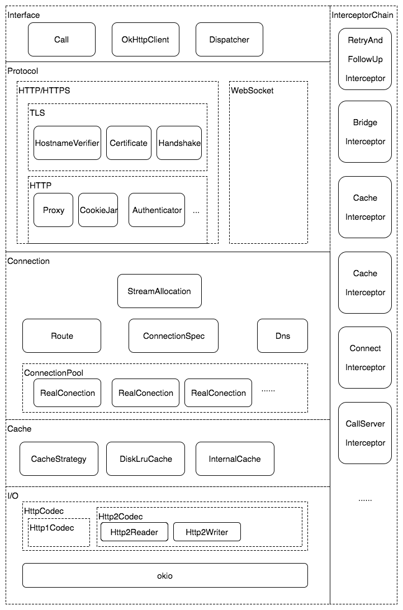
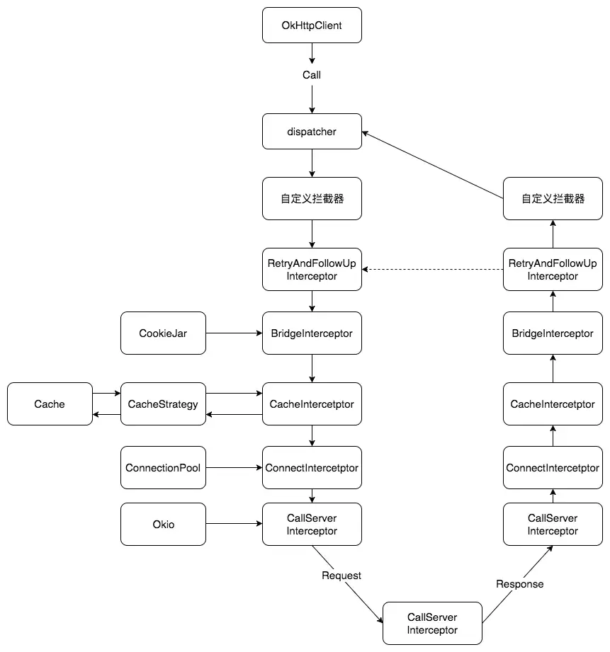

### 架构

MVVM，MVI

单向数据流，数据驱动，绑定监听，生命周期感知，内存泄露

### Jetpack

#### Flow

[kotlin Flow快速学习2025-CSDN博客](https://blog.csdn.net/jzlhll123/article/details/149488028)

#### Navigation

**Navigation 库** 是 Android Jetpack 组件的一部分，用于**简化应用内的导航逻辑**（如 Fragment 或 Activity 之间的跳转），统一管理页面切换、参数传递和返回栈处理，提升开发效率和可维护性。

通过导航图，跳转具体的id。


#### Application的ActivityLifeCycleCallbacks

其实就是framework中对于activity的基础实现做了基类的设计。

在activity本身的onStop、onCreate等生命周期，通知到了application （因为只有他是唯一的）。

然后对于我们使用者而言，就是使用Application里面去注册即可。


你可以自己想象一下，如果我们自己想要实现一个activity切换的监听，就搞一个baseActivity，自己往activity的生命周期追加代码。其实功能与系统父类中干了一样的事情，只是因为不熟悉没用过罢了。


#### ProcessLifecycleOwner

```
ProcessLifecycleOwner.get().lifecycle.addObserver(GlobalBackgroundCallback)
```

前后台切换监听。


#### WorkManager

可延迟的异步任务。

android23+   JobScheduler

<androi23     BroadcastReceiver+AlarmManager

#### LifeCycle

AppCompatActivity实现了LifecycleOwner。再结合LifeCycleObserver。

在appCompact的基础包中，做了自定义的event，statusChanged等处理。

#### LiveData+ViewModel

从使用角度才能更好的理解它：

ViewModel不能去new，要ViewModelProvider.of(activity|fragment)，一个activity或者fragment，只有一个ViewModelStore
里面用hashMap存储k(xxxViewModel.class),  v (框架反射new出来的xxViewModel对象) 。在框架里就可以看到从1个activity无论获取多少次，就只有一份。

ViewModel里面不能放生命周期长的东西，比如context。

在restartActivity的时候会残留他，通过framework提供的activity onRetianxxxx函数实现。


liveData则本质上只是一个内部有监听列表的一个类而已。所以要建议放在viewModel里面；

LiveData感知生命是因为当你调用observer某个activity|fragment的时候，追加到了LiveCycle的监听里面去，随着生命周期的消失，也会自行被移除监听。

LiveData作为数据驱动的设计理念，存活的生命周期自然要跟activity保持一致，ViewModel显然是最合适的了。也因为ViewModel保证了唯一性，LiveData也能保证唯一性。


#### ROOM

[android ROOM kotlin官方文档完全学习-CSDN博客](https://blog.csdn.net/jzlhll123/article/details/149433460)

https://blog.csdn.net/jzlhll123/article/details/156064655

#### Paging3

#### Startup

通过一个contentProvider来实现自启动。因为在activity的启动流程中，可以看到contentProvider比application还要早。而且是自动启动的。很多自启的框架都是通过自定义`contentProvider`来初始化。

但是各个模块都搞的话，`ContentProvider`就太多了而且没有依赖关系。所以startup就可以让大家只共用一个。然后提供了一点简略的相互依赖的逻辑。使用起来呢，效果见仁见智，一般般吧。

一个有向无环图DAG实现的依赖关系初始化过程。

#### Hilt

通过注解，实现依赖注入。

application的标注；四大组件的标注。如何注入类。如何注入普通类。

原理对于application和Activity我研究过就是通过二次继承实现。数据其实都挂在Application的对象中。


### leakcanary原理

**监控对象生命周期** → **触发GC并验证存活** → **分析引用链**。

基本流程：

通过一些手段监听viewModel，Service，Activity, Fragment的生命周期，在他们destroy的时候，通过**WeakReference**来弱引用他们，ReferenceQueue来当弱引用指向的对象被垃圾回收后，对应的`WeakReference`对象会被自动加入到这个队列中。然后过一会儿触发GC，看看是否存活。再通过heap dump下来，分析GC root。

概念和手段：

Activity监控：ActivityLifecycleCallbacks

Fragment监控：activity.supportFragmentManager.registerFragmentLifecycleCallbacks

Service、ViewModel有一些hook的办法来达到监听destroy的目的。

heap dump：堆抓取hprof文件


### 路由框架

>  它的设计初衷是解决模块间的解耦问题。让主工程或者模块A，不关注模块B，C，D的具体类名。
>
>  通过APT收集编译期间生成路由表，后续通过字符串查找匹配跳转，解决了不依赖class调用的目的；
>
>  同时，加入拦截机制，做登录检查，权限等。

发展：

1. 第一版。最底层的route库，搞Router.java, 定义static List<? extends Activity> 然后搞个register() 方法。
   这样在app最顶层，就可以把所有模块的activity全部注册进来。

2. 第二版：从app顶端，下沉到各个模块，减少注册代码，DexFile 反射查询所有类调用注册。
   将app最顶层的注册动作，改变为：
   router底层模块定义接口IRoute 注册。 每个模块，自己实现自己的注册逻辑。
   每一个模块，定义一个专门的类实现IRouter。然后在init的时候，
   通过DexFile读取apk所有的我们规定的包名下的class，过滤实现了IRouter的类，添加到list。这样就减少了注册的动作。

3. 第三版：APT自动生成extends IRouter类。

   通过定义注解 让所有的Activity注解上。 然后编写APT，RouterProcessor abstractProcessor。
   让注解自己生成实现的IRouter类。Filter， processingEnv。
   这样的话，又减少了，每次添加实现IRouter类的方式。
   但是没完成，需要实现APT：
   javaCompileOptions.annotaionProcessorOptions.argurs;

   Processor.java中的init，可以从procesingEnv里面拿到Options，拿到名字。
   SupportedOptions（“moduleName”）
   annotaionProcessor 添加build.gradle里面才会被执行

   process（RoundEnvirontments）
   从routeEnvirmonet里面getElementAnnotionWith(Route.class) 节点，我们拿到一个Element的set数组，
   在遍历TypeElement后，getQualifiedName 动态的获取到了被注解的Activity的名字。

   然后不断拼接文字，继续从遍历的节点中拿到，getAnnotation的可以获得到注解的key value数，拼接到类中。

到现在，我们只需要给Activity添加注解，就可以通过编译时工具APT获取所有添加过注解的activity然后自动生成每一个IRouter的子类。

APP里面application搞一下init，把所有的activity添加到最底层的Router库的List里面去。其他啥也不用干了。
	

4. 第四版：优化反射的时间
   现在问题就是init那需要搞一堆反射去拿对应的IRouter实现类，太慢了。
   需要字节码插桩（ASM）+ Gradle （AOP一种实现）。将反射部分的代码，变成了真实的代码。


   SPI通信，注解，APT，反射，dexFile，Gradle+字节码插桩。


#### 组件化

解耦，接口解耦。复用，独立打包。

5层：壳工程，业务模块，基础组件，通用组件中间层，三方库。

组件间通信：路由框架，通信框架，apk编译版本相同处理，禁止complie

### 插件化


### RecylerView

#### 一、RecyclerView 核心原理

##### 1. 六大核心部件（职责分工）

RecyclerView 的核心能力由 6 个关键部件协同实现，每个部件各司其职：

|      部件      |                           核心职责                           |
| :------------: | :----------------------------------------------------------: |
| LayoutManager  | 核心调度者，全权接管 Item 的**测量（measure）、布局（layout）、绘制（draw）**，决定 Item 的排列方式（线性 / 网格 / 瀑布流） |
| ItemDecoration | 用于为 Item 添加装饰效果（如分割线、内边距、悬浮标题），需开发者自行实现和添加 |
|  ItemAnimator  | 处理 Item 添加、删除、移动时的过渡动画（如默认的渐隐渐显、平移） |
|    Adapter     | 业务逻辑核心，负责组织数据、创建 ViewHolder、绑定数据到 ViewHolder |
|   ViewHolder   | 封装 Item 的子布局视图，减少 findViewById 的性能损耗，是 RecyclerView 复用的核心载体 |
|    Recycler    | 缓存池管理者，负责 ViewHolder 的回收、复用、缓存管理，是 RecyclerView 高性能的核心 |

##### 2. 四层缓存机制（复用核心）

RecyclerView 通过四级缓存实现 ViewHolder 的高效复用，层级由高到低（复用优先级递减）：

1. **mAttachedScrap**：「可见区域缓存」，存放当前屏幕可见的 ViewHolder；其中`mChangedScrap`是子集合，专门存放数据有变化但视图仍可复用的 ViewHolder。
2. **mCachedView**：「近期离屏缓存」，默认容量 2 个（新版支持预取后变为 2+N），存放刚滑出屏幕的 ViewHolder，无需重新创建 / 绑定。
3. **ViewCacheExtension**：「自定义缓存」，开发者可自行实现的扩展缓存层，按需定制复用规则。
4. **RecycledViewPool**：「全局缓存池」，跨 RecyclerView 共享的缓存池，默认每种类型的 ViewHolder 缓存 5 个；从该池复用的 ViewHolder 需要重新绑定数据（onBindViewHolder）。

**复用规则**：`mAttachedScrap`和`mCachedView`中的 ViewHolder 无需执行`onCreateViewHolder`（创建）和`onBindViewHolder`（绑定）；`RecycledViewPool`中的 ViewHolder 仅需执行`onBindViewHolder`，无需创建。

#### 二、RecyclerView 性能优化方案

针对缓存机制和渲染流程，从 8 个维度优化，核心目标是**减少 onCreateViewHolder 和 onBindViewHolder 的执行次数 / 耗时**：

##### 1. 精准刷新数据

- 避免使用` notifyDataSetChanged() `

  （全量刷新，会销毁所有缓存），改用精准刷新方法：

  - `notifyItemChanged(int position)`：仅刷新指定位置 Item
  - `notifyItemRangeChanged(int start, int count)`：仅刷新指定范围 Item

- 进阶：使用    `payload`  局部刷新（只更新 Item 的某个子 View，而非整个 Item）：

  ```java
  // 刷新时传入payload标识
  adapter.notifyItemChanged(position, "UPDATE_TEXT");
  
  // 在Adapter中重写，只更新需要的视图
  @Override
  public void onBindViewHolder(@NonNull ViewHolder holder, int position, @NonNull List<Object> payloads) {
      if (payloads.isEmpty()) {
          super.onBindViewHolder(holder, position, payloads);
      } else {
          // 仅更新文本，不刷新图片等其他视图
          if ("UPDATE_TEXT".equals(payloads.get(0))) {
              holder.tvContent.setText(data.get(position).getContent());
          }
      }
  }
  ```
  
- 高阶：使用`DiffUtil`计算新旧数据差异，自动生成精准刷新指令，避免手动判断。

##### 2. 优化 Item 布局

- 减少 Item 布局层级（如用 ConstraintLayout 替代多层 LinearLayout/RelativeLayout），降低 measure/layout 耗时；
- 移除不必要的透明度（alpha）、背景重叠，避免过度绘制（OverDraw）。

##### 3. 优化 ViewHolder 绑定逻辑

- 将 Item 的点击监听、长按监听在`onCreateViewHolder`中设置（仅创建时执行一次），而非`onBindViewHolder`（每次复用都会执行）；

- 示例：

  ```java
@Override
  public ViewHolder onCreateViewHolder(ViewGroup parent, int viewType) {
    View view = LayoutInflater.from(parent.getContext()).inflate(R.layout.item_layout, parent, false);
      ViewHolder holder = new ViewHolder(view);
    // 点击监听只在创建时设置一次
      holder.itemView.setOnClickListener(v -> {
        int position = holder.getAdapterPosition();
          // 处理点击逻辑
    });
      return holder;
}
  ```


##### 4. 扩展缓存能力

- 自定义`ViewCacheExtension`实现专属缓存逻辑，适配特殊业务场景；

- 多 RecyclerView 共享`RecycledViewPool`（如 ViewPager 中的多个 RecyclerView），提升跨列表复用率：

  ```java
  RecycledViewPool pool = new RecycledViewPool();
  recyclerView1.setRecycledViewPool(pool);
recyclerView2.setRecycledViewPool(pool);
  ```


##### 5. 设置固定尺寸

- 若 RecyclerView 的宽高固定（不会因 Item 内容变化而改变），设置

  ```
  rcv.setHasFixedSize(true)
  ```

  作用：避免 RecyclerView 因 Item 变化重复执行 measure/layout，减少性能损耗。

##### 6. 图片加载优化（结合 Glide）

滑动时暂停图片请求，停止滑动后恢复，避免无效请求占用资源。你提供的工具类优化后如下（补充注释 + 异常处理）：

```java
import android.content.Context;
import android.view.View;
import androidx.annotation.NonNull;
import androidx.recyclerview.widget.RecyclerView;
import com.bumptech.glide.Glide;

public class RecyclerViewUtils {
    /**
     * 为RecyclerView添加滑动监听：滑动中暂停Glide图片加载，滑动停止后恢复
     * @param context 上下文（建议使用Activity/Fragment的上下文，避免内存泄漏）
     * @param recyclerView 目标RecyclerView
     */
    public static void pauseGlideOnScroll(Context context, RecyclerView recyclerView) {
        if (recyclerView == null) return; // 空值保护
        
        recyclerView.addOnScrollListener(new RecyclerView.OnScrollListener() {
            @Override
            public void onScrollStateChanged(@NonNull RecyclerView recyclerView, int newState) {
                super.onScrollStateChanged(recyclerView, newState);
                // SCROLL_STATE_DRAGGING：手指拖动滑动；SCROLL_STATE_SETTLING：惯性滑动
                if (newState == RecyclerView.SCROLL_STATE_DRAGGING || newState == RecyclerView.SCROLL_STATE_SETTLING) {
                    Glide.with(context).pauseRequests(); // 暂停所有图片请求
                } 
                // SCROLL_STATE_IDLE：滑动停止
                else if (newState == RecyclerView.SCROLL_STATE_IDLE) {
                    Glide.with(context).resumeRequests(); // 恢复图片请求
                }
            }

            @Override
            public void onScrolled(@NonNull RecyclerView recyclerView, int dx, int dy) {
                super.onScrolled(recyclerView, dx, dy);
                // 滑动过程中无需额外处理
            }
        });
    }
}
```

**使用方式**：

```
// 在Activity/Fragment中调用
RecyclerViewUtils.pauseGlideOnScroll(this, mRecyclerView);
```

#### 总结

1. **核心原理**：RecyclerView 靠 6 大部件分工、4 层缓存复用实现高性能，其中`Recycler`是缓存核心，`LayoutManager`是布局核心；
2. **优化核心**：减少`onCreateViewHolder`（复用缓存）和`onBindViewHolder`（精准刷新、提前绑定监听）的耗时 / 执行次数；
3. **关键优化点**：精准刷新（DiffUtil/payload）、布局瘦身、固定尺寸、Glide 滑动暂停、共享缓存池。

### 编译时注解

https://blog.csdn.net/jzlhll123/article/details/140216236


### Android热修复

BootClassLoader用来加载系统类；

PathClassLoader加载app类。

bundle取出Parcelable的时候，出现classNotFound。

是因为使用了bootClassloader加载的。所以传递以后需要setClassLoader为本地的classLoader。


* QQ空间1代修复方案，将BaseDexClassLoader的DexPathList的Element[]数组，将class放到前面；

  缺点：随着修复数量上来，花费时间过大。需要重启；

* 微信Tinker：

  新进程合并dex方案，需要重启。

* 阿里百川AndFix：

  运行时native指针修改方法的替换。不用重启应用。缺点：主要针对函数的修复。兼容性差。

* 阿里Sophfix：

  综合方案。


### ANR框架

[卡顿监测 · 方案篇 · Android卡顿监测指导原则-阿里云开发者社区](https://developer.aliyun.com/article/1192958)


1. blockCanary：设置主线程messaging printer；

2. watchlog：不断的发送消息；

3. Choreographer：

​	ViewRootImpl，postCallback等待一个vsync信号。

​	信号后来以后，打印一个"skipped xx frames！"的日志。

​	执行回调。

​	Choreographer.getInstance().postFrameCallback用来监听fps，也可以监听卡顿。

 4：ASM技术，函数插桩统计时间。微信Matrix影响相对较少。

### Glide

1. ‌**活动缓存（Active Resources）**‌
   - 存储当前正在使用的图片资源，通过弱引用实现，避免被系统回收。当图片不再显示时（如Activity销毁），资源会转移到内存缓存。‌‌
2. ‌**内存缓存（Memory Cache）**‌
   * 默认使用LRU算法管理，存储暂时未使用的图片。当内存不足时，优先移除最近最少使用的资源。与活动缓存配合，防止频繁GC和重复加载。‌‌
3. ‌**磁盘缓存（Disk Cache）**‌
   - 分为原始数据（DATA）和转换后资源（RESOURCE）两种策略，默认根据来源智能选择（网络图片缓存原始数据，本地图片缓存转换后资源）。‌‌

* 内存缓存 （先从存活的弱引用缓存；再从Lru缓存）

  key->loadFromMemory() 实际分为2块，1块是已经被人引用计数正在使用的资源；找不到再从cache中找。

* 磁盘缓存（原尺寸，实际使用尺寸）

* 尺寸优化ovveride、inSampleSize、565RGB

* 内存复用，BitmapPool

* 生命周期的把控，非主线程或者application的时候，就是一个全局的；

  而自行搞无界面的fragment来监听生命周期。因为fragment会伴随activitiy而如果是appcompact则有lifecycle。如果是继承标准activity则没有，那么所以他就通过这个机制来监听生命周期。


LruCache的实现（最近最久没有使用）

最简单的就是"双向链表"。来一个就挂到前面；size超了就移除尾部。

要查找就比较费事了，所以使用HashMap来辅助缓存key。

替代的就用：

LinkedHashMap就可以实现；找到他，删除他；然后添加到头。size超了就移除尾部。

并没有体现使用freq。

Glide几个优点：

内存缓存分两块；磁盘缓存，有原尺寸，适用尺寸；565,8888的图像使用率。

内存复用池；

生命周期用fragment管理是一大特点。

### Okhttp



从代码分层来看：

1. 接口层：okhttpClient（外观模式操控底下的复杂逻辑），Dispatcher（任务队列）, call（任务片）
2. 协议层：http1, http2, websocket；
3. 连接层：连接池；其实就是对于Socket连接的管理，以及对于http/2 socket多路复用；
4. 缓存层：diskLruCache来缓存到本地；当然也要结合http的报文参数。
5. I/O层：高效的IO操作的实现okio。目的对于操控对象池的复用，减少屏蔽内存抖动。

另外就是拦截器的设计，类似AOP，基本贯穿整个体系：

* 重试和重定向拦截器:  网络请求失败自动重试，重定向的时候复用

* 桥接拦截器： 主要是补充http请求包头

* 缓存拦截器： 本地缓存，更新缓存，移除等；

* 连接拦截器： 选择合适的realConnection | socket

* 请求服务拦截器：正式的请求，和处理http报文的解析封装。并操作io来存储。




从设计模式来看：

最后再总结下`okhttp`中涉及到的设计模式：

- `外观模式`。通过okHttpClient这个外观去实现内部各种功能。
- `建造者模式`。构建不同的Request对象。减少大量参数的输入。
- `工厂模式`。通过OkHttpClient生产出产品RealCall。忽略创建的细节，让调用者只关系接口。
- `享元模式`。通过线程池、连接池共享对象。主要的思路，通过工厂类，hashMap来缓存对象，查找并复用。
- `责任链模式`。将不同功能的拦截器形成一个链。

其实还是有一些设计模式没说到的，比如

- websocket相关用到的`观察者模式`。
- Cache集合相关的`迭代器模式`。

最重要的是拦截器设计，简化版拦截器的实现：

```java
class call {
	excute() {
				var chain = Chain(0)
				chain.proceed()
	}
}

class Interceptor {
	 fun intercept(chain: Chain) : Response{
	 		var request = chain.request
	 		chain.proceed() //必须这样才能形成链条
	 }
}

Chain {
   proceed() {
    	//循环列表遍历
      for (i : interceptors) {
          var interceptor = interceptors(i)
          var chain = Chain(i + 1)//把下一个要处理的封装成chain传递进去
          var response = interceptor.intercept(chain)
          return response
      }
   }
}	
```

设计逻辑：

通过遍历interceptors列表，将下一个interceptor包裹成chain往当前interceptor里面传递。那么，在interceptor的intercept执行的时候，继续往下调用chain的proceed。进而形成了类似嵌套的链条调用。
