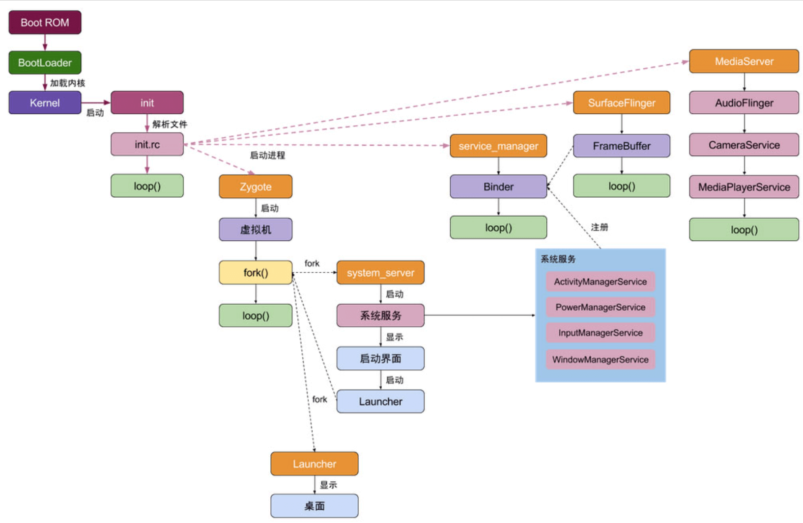

### 插件化

android有几个classLoader？

```
BaseDexClassLoader
```

| ClassLoader类型            | 加载路径                          | 作用                                       | 使用场景                   |
| :------------------------- | :-------------------------------- | :----------------------------------------- | :------------------------- |
| **BootClassLoader**        | Android Framework类 (`android.*`) | 系统启动时加载核心框架类                   | 系统内部使用，开发者不可见 |
| **PathClassLoader**        | 应用安装目录（`/data/app/*.apk`） | 加载已安装APK中的主Dex                     | 默认应用主ClassLoader      |
| **DexClassLoader**         | 任意包含dex/jar/apk的目录         | 动态加载外部代码（需`WRITE_EXTERNAL`权限） | 插件化、热修复             |
| **InMemoryDexClassLoader** | 内存中的Dex字节数组               | 直接从内存加载Dex（无磁盘IO）              |                            |

### JVM&虚拟机

栈，堆，方法区，常量区

**可达性分析**

 **GC roots**

虚拟机栈：基本对应正在执行的函数。≈函数。

类静态属性：对应static变量

方法区常量：对应static final的String

JNI对象：native分配的变量。

**标准JVMGC算法**

1. 引用计数法：无法解决循环引用
2. 标记&清除mark-sweep算法：缺点：大量碎片，无法申请连续内存，也会导致加大回收频率。
3. 标记&压缩mark-compact算法：初代：其实是标记&清除的进阶，往一边赶。
4. 标记&复制mark-copy算法：对半分，每次往一半用，用不够就左右拷贝；缺点，最大内存可用只有一半。
5. 逐代回收：结合上述分出各种年代，更细化。
6. ZGC：更现代化的回收方式，也没年代之分。

**andorid GC算法** 

android8前没有分代收集：

CMS <=4.4：

初始化标记stw，并发标记，并发预处理，重新标记stw，并发清理。

其实就是并发版本的**标记-清理**。只有当没有连续内存，或者切换到后台的时候，才**压缩**。很少压缩，有虚拟连续内存分配器。但是android也有优化：划分了多个区域，相互拷贝。

单线程回收导致卡顿明显，内存碎片化严重。

CC：5.0~7.x：

并发复制。stop the world成为常量级别。

内存占用翻倍，屏障指令带来性能开销

CMC 8.0：

CMC: **并发压缩**。无屏障并发压缩，解决内存碎片与开销。平衡内存占用和效率。

可达性分析(GCRoot关联)；判断内存已死：


* android 虚拟机 ART

针对dex；而非jar。

dex优化了class压缩；精简指令。

davik虚拟机，安装快，每次运行前，需要解析成机器码再运行；

ART虚拟机，安装太慢，每次运行就快了。

现在又有热点收集进一步改进2个弱点。


### Apk打包流程

了解编译流程是**为了找到合适的点，做一些修改**。

比如我做了编译前的gradle依赖：

实现了asset文件加密；实现了编译前下载。

研究了编译中的某些步骤，比如kotlinc/javac完成节点，可以做一些字节码改动的事情。

又或者编译完成后签名前，再做调整。


7个步骤

* appt2整合资源并生成R.java， aidl生成java，运行时注解

* javac 编译（javaCode，R.java，Aidl/output的java）成字节码

* 整合第三方字节码
* proguard
* dex
* apkbuilder整合资源，so和dex 得到未签名APK
* 签名得到签名APK
* zipalign APK


### android input

linux设备驱动，/dev/input/

linux二次映射到kl

windowManger里面有从

### Binder

* oneway 和 非oneway

非oneway相当于Thread.sleep直接卡柱。

oneway客户端不会被挂起；但是对于操控的同一个服务端的实例对象stub则会内部排队。


* 一次拷贝


在client这边需要进行用户态copy到内核。

进程隔离，安全性提高。

### 系统启动流程

加载bootloader，初始化内核，启动init进程，init进程fork出Zygote进程，zygote就fork出SystemServer进程。然后启动一堆的服务，AMS，PMS，WMS，PMS。。。(这些服务端都是运行在SystemServer进程里面)。



1. Bootloader启动

2. kernel启动

2. init进程：用户空间的第一个进程pid=1

​	init.rc里面有很多描述创建子进程的任务。

  	 创建service_manager, mountd, rild, media_server,surface_flinger, zygote等进程。

4. 最后zygote ，fork出system_server进程。

​	SystemServer进程里面：

​	AMS，WMS，PowerManagerService，PMS等等；还会把这些服务全部注册到ServiceManager中用hashMap存起来。

> 题外话就是我们给系统追加一个服务就是在这里去追加；getSystemService多一个字段，集成对应的接口；就可以在标准app中使用；
>
> AMS还多门面模式包裹了一层。本质也是对于跨进程AMS的调用。
>
> 创建AMS，WMS，PMS, 都是开启了新的线程，拥有自身的loop和handler。有的Service可能就仅仅是Binder的代表。

5. AMS启动

电池状态Services;

installSystemProviders();

ActivityThread.systemMain()

systemReady

​	启动 WebView，SystemUI，开启 Watchdog，启动桌面 Launcher App。
​	发送系统开机广播。


### App启动流程


srcApp端启动会通过本地的代理通知到AMS，AMS首先把windowManager动画和标记显示更改，会先把原来的activity onPause，然后通知Zygote去fork新进程，fork出来以后，初始化Application和provider，然后onCreate，onStart，onResume新的activity。


### Activity启动流程

点击图标启动activity：

通过桌面launcher的Activity，Instrumentation去帮忙。在launcher进程中调用跨进程到AMS(system_server进程)。

* 如果不存在ProcessRecord：

会Process.start, 使用本地socket通信让zygote进程fork新进程得到pid。

然后ActivityThread.main函数被调用了以后，就有一个主线程；

ApplicationThread被创建用来管理binder通信并非一个线程，只是AMS binder的代理。

再attachApplication(system)到AMS上去，这样AMS就管理这个新进程ProcessRecord。

然后用跑回到新app进程中，来bindApplication，创建出mInstrumentation。

就是installProviders，然后applicationOnCreate。
* 紧接着就是有进程的情况：
attachApplication回到AMS以后，AMS准备好以后，再次scheduleLaunchActivity到ApplicationThread来。

再通过内部的H消息，通过反射创建出InstallActivity。


activity创建出来的同时，就有PhoneWindow, windowManagerGlobal。

然后就走生命周期的流程。


### Activity生命周期

1. 基本情况


* 一般情况：

onCreate->onStart(可见)->onResume(可交互)----（按back键）---->onPause(不可交互)->onStop(不可见)->onDestory

* 多Activity情况：

A.onCreate->A.onStart->A.onResume

------>（来个BActivity）

->A.onPause（让他不交互，还可以看见，所以不要干太耗时的活影响启动其他activity的速度）

->B.onCreate -> B.onStart -> B.onResume

->A.onStop

-----> B被点击back键(back的作用就是触发onDestory，home的话，不会onDestory)

-> B.onPause（让他不交互，还可以看见，所以不要干太耗时的活影响启动其他activity的速度）

->A.onRestart->A.onStart->A.onResume

->B.onStop

->B.Destroy

* 还有情况：

  按home键退出的activity，系统最后回收，或者切换横竖屏(当然可以通过xml禁用)，会触发onSaveInstanceState(), 不确定在onPause()前后，P在onStop之后。但是也只是建议保存一些临时数据(比如你正在fragment2上面这个index，比如你滑动到某个位置的position)，onPause，onStop时候保存持久化的数据。

  而再次回来的时候，（不一定）会触发onRestoreInstanceState()或者在onCreate(bundle）里面提取可以做一些恢复。有疑问是onRstoreInstanceState和onCreate怎么选择，有的控件可能我们并没有在onCreate初始化好，onRstoreInstanceState一般在onStart之后，可以在这里做一些恢复。

### Activity启动模式

Standard：非以下特殊场景的普通Activity。

SingleTop：APP接收到多条推送消息，点开不同消息，均由同一实例展示。singleTop适合接收推送通知的内容显示页面。例如，某个新闻客户端的新闻内容页面，如果收到10个新闻推送，每次都打开一个新闻内容页面是很烦人的。

SingleTask：应用APP的主界面（Fragment的containerActivity）。singleTask适合作为程序入口点。例如淘宝的主界面，在淘宝陆续打开商品搜索界面、商品详细界面、订单界面、付款成功界面后，在付款成功界面一键返回主界面。

SingleInstance：如APP经常调用的拨打电话、系统通讯录、系统Launcher、锁屏键、来电显示等系统应用。singleInstance适合需要与程序分离开的页面。例如闹铃提醒，将闹铃提醒与闹铃设置分离。singleInstance不要用于中间页面，如果用于中间页面，跳转会有问题，比如：A -> B (singleInstance) -> C，完全退出后，在此启动，首先打开的是B。

**taskAffinify** 可以让他真正创建一个单独（当然可以配置其他的啦）的task。

FLAG_ACTIVITY_CLEAR_TOP 等操作来清理栈顶，FLAG_ACTIVITY_SINGLE_TOP来保留重用之前的activity。

FLAG_ACTIVITY_NEW_TASK 仅仅表示会去查找他配置过的taskAffinfy，然后压入对应的栈。如果存在就把整个栈拉出去显示，才不管你配置的activity呢。

FLAG_ACTIVITY_CLEAR_TASK 如果Intent中设置了这个标志，会导致含有待启动Activity的Task在Activity被启动前清空。也就是说，这个Activity会成为一个新的root，并且所有旧的activity都被finish掉。这个标志只能与FLAG_ACTIVITY_NEW_TASK 一起使用。

FLAG_ACTIVITY_BROUGHT_TO_FRONT installer以后启动的第一屏比如就会携带这个intent。将task中的activity移到栈顶。

SingleTask如果不配置taskAffinify，就像singleTop(只保证最上面)一样，会触发onNewIntent并且，将之前的都删除。只留一个。

singleTask的问题：

1. normalActivity1->normalActivity2->singleTaskActivity

   点击返回会返回到另外一个activity3去；这是因为，singleTask的activity出来以后，如果它是另外一个任务栈的话，将会把整个栈带到前台来。因此，singleTask只建议作为MainActivity。

2. 作为MainActivity的SingleTask会出现，再次Launcher打开清理了整个应用的activity。

   因为带有FLAG_ACTIVITY_BROUGHT_TO_FRONT。


### Zygote启动

zygote是被init.rc里面配置的拉起Zygote.cpp main()

1. 初始化AndroidRuntime

2. runtime.start() : startVM(),   startRegJNI() , 调用ZygoteInit.java的main函数 

3. preload() 加速应用进程启动->new ZygoteServer() socket服务-> fork SystemServer

死循环。

面试点：fork写时拷贝避免多线程的binder操作。

为什么需要zygote：

创建虚拟机；init只是脚本并没有虚拟机；SystemServer启动系统服务接近100个，如果fork SystemServer没什么必要。


### SystemSever

SystemServiceManager用来启动服务。反射创建对象。

BootstrapServices(AMS, PMS, PKMS)

StartCoreServices(电池)

startOtherServices() (WMS, AMS.systemReady)


### AMS

StackSupervisor,

recentTasks当前任务栈

setSystemProcess()

把自己添加到SystemManager里面。


对于Activity的启动管理


### WMS


### PMS


#### View，Activity，Window

window是windowManagerService在这边的代理，调用它，来把我们的View给上屏；

Activity就是管理者。

Activity是一个类似controller的角色，用来组织window和view的，PhoneWindow也就是Activity的子对象。

而Window里面有一个DecorView，我们的activity xml里面的view被inflate出来以后，都是往这个rootView上添加。

resume的时候，才把DecorView给到windowManager，而这个windowManger仅仅是本进程的。其实就是给到了WindowManagerGlobal，并创建了ViewRootImpl。

而ViewRootImpl就会跟WMS打交道。

并且触发onMesuare，onLayout，onDraw的流程。


同时ViewRootImpl里面，还负责接收按键事件，再发送给到activity'的disptachxxxEvent，各种event到Activity中。再往我们的事件分发里面走。


> Instrumentation: 是帮ActivityThread这个类打工的。
>
> ProcessRecord: 记录每个进程是否创建了。
>
> ActivityThread: 不是线程，他是主线程的静态类。zygote fork出进程就是调用它的main函数。
>
> ​        这样就有mainLooper Handler。又有applicationThread是binder.
>
> ApplicationThread: binder通信。这个就被AMS去持有的代理。ActivityThread的子对象。
>
> ActivityRecord:
>
>    记录window，activityInfo，是AMS的；
>
> ActivityClientRecord：
>
> 是app的。是ActivityThread的一个hashMap管理自己进程内的activity。
>
> 但是呢，所有的操作，却由AMS来调用操作。


### onSaveInstanceState(), onRestoreIntanceState()

performStopActivity进行保存；

performLauncher读取是否有。

类似的还是ViewModel的实现原理。


### View的绘制

> 从发起View的这个View开始，一直往上调用透出invalidateChild到DecorView,一路上计算区域。 最后通过ViewRootImpl，去发起invalidateRectOnScreen。scheduleTraversals();。
>
>  然后发送内存屏障给到主线程looper，不准干扰渲染。比如生命周期，比如别的自定义主线程handler。
>  mTraversalBarrier = mHandler.getLooper().getQueue().postSyncBarrier();
> 再然后，请求vsync。
>  mChoreographer.postCallback(
>                 Choreographer.CALLBACK_TRAVERSAL, mTraversalRunnable, null);
>
> 最后得到了：
>
> 再移除handler屏障。再performTraversals();
>
> 即开始了onMesaure，onlayout，onDraw的流程。
>


measure - 测量流程（确定View的大小）

layout      - 布局流程（确定View的位置）

draw        - 绘制流程 (颜色，内容的绘制)


activity onCreate setContentView加载xml，反射解析。

在onResume里面，

ActivityThread.java 中的handleResumeActivity，

wm.addView(decor, l) 即：WindowManagerImpl里面：

mGlobal.addView(view,xxx), 

ViewRootImpl的setView(),

 然后是requestLayout(),


此函数会依次触发scheduleTraversals()-> doTraversal() -> performTraversals() -> performMeasure() -> performLayout() -> performDraw() 。

#### measure过程

```java
//activityThread ViewRootImpl
private void performMeasure(int childWidthMeasureSpec, int childHeightMeasureSpec) {
    mView.measure(childWidthMeasureSpec, childHeightMeasureSpec); //mView是decorView
}
```

DecorView和所有的RelativeLayout，FrameLayout, LinearLayout(只有一次)等等一样：

```java
public final void measure(int widthMeasureSpec, int heightMeasureSpec) {
    ...
    // 这里会走decorView自身的onMeasure()函数
    onMeasure(widthMeasureSpec, heightMeasureSpec);
}

protected void onMeasure(int widthMeasureSpec, int heightMeasureSpec) {
    int count = getChildCount();
    for (int i = 0; i < count; i++) {
        final View child = getChildAt(i);
        //在这里，如果子view是显示的话，就会进行第一次测量
        measureChildWithMargins(child, widthMeasureSpec, 0, heightMeasureSpec, 0);
        if(xx) { //某些条件
          mMatchParentChildren.add(child);
        }
    }
    ...
    count = mMatchParentChildren.size();
    // 当Match_Parent的子布局超过1个时
    if (count > 1) {
        for (int i = 0; i < count; i++) {
            final View child = mMatchParentChildren.get(i);
            // 将mMatchParentChildren中的子布局再次测量
            child.measure(childWidthMeasureSpec, childHeightMeasureSpec);
        }
    }
}
```

大家在写自定义View时，可能也会发现自己写的View onMeasure函数有时会被回调多次，从上面这个函数中可以看出一些端倪，当满足三个条件：

- 1.父布局宽高测量模式不为EXACTLY
- 2.子布局属性为MatchParent
- 3.父布局中子布局属性为MatchParent大于1个时

满足这些条件，子View就会被多次测量。

```java
//View.java
public final void measure(int widthMeasureSpec, int heightMeasureSpec) {
  ...
    onMeasure(xx, xx);
  ...
}
protected void onMeasure(int widthMeasureSpec, int heightMeasureSpec){ //允许你覆盖。
  
}
```

#### layout过程

layout与measure类似，由ViewRootImpl的performLayout()触发，执行View的Layout函数，先看下View中layout实现。

```java
//View.java
public void layout(int l, int t, int r, int b) {
  if ((mPrivateFlags3 & PFLAG3_MEASURE_NEEDED_BEFORE_LAYOUT) != 0) {
        onMeasure(mOldWidthMeasureSpec, mOldHeightMeasureSpec);
    	...
    }
    if (xxx) {
        // 在View中是空实现，ViewGroup需要重写此函数确定子View的布局
        onLayout(changed, l, t, r, b);
        ...
    }
}

//ViewGroup.java 里面没有layout().但是覆写了onLayout
 protected void onLayout(boolean changed, int l, int t, int r, int b) {
    //  The layout has actually already been performed and the positions
    //  cached.  Apply the cached values to the children.
    final int count = getChildCount();
    for (int i = 0; i < count; i++) {
      	...
        child.layout(st.mLeft, st.mTop, st.mRight, st.mBottom);
    }
}
```


#### Draw过程

```java
private void performDraw() {
    ...
    draw(fullRefrawNeeded);
    ...
}

private void draw(boolean fullRedrawNeeded) {
    ...
    if (!drawSoftware(surface, mAttachInfo, xOffest, yOffset,
            scalingRequired, dirty)) {
        return;
    }
    ...
}

private boolean drawSoftware(Surface surface, AttachInfo attachInfo,
int xoff, int yoff, boolean scallingRequired, Rect dirty) {
    ...
    mView.draw(canvas);
    ...
}
// 绘制基本上可以分为六个步骤
public void draw(Canvas canvas) {
        ...
   // 步骤一：绘制View的背景
   drawBackground(canvas);

   ...
   // 步骤二：如果需要的话，保持canvas的图层，为fading做准备
   saveCount = canvas.getSaveCount();
   ...
   canvas.saveLayer(left, top, right, top + length, null, flags);

   ...
   // 步骤三：绘制View的内容
   onDraw(canvas);

   ...
   // 步骤四：绘制View的子View
   dispatchDraw(canvas);

   ...
   // 步骤五：如果需要的话，绘制View的fading边缘并恢复图层
   canvas.drawRect(left, top, right, top + length, p);
   ...
   canvas.restoreToCount(saveCount);

   ...
   // 步骤六：绘制View的装饰(例如滚动条等等)
   onDrawForeground(canvas)
 }
```


总结来看，

就是算法的迭代。

精简一下模型：从ViewRootImpl中开始，

```java
scheduleTraversals();
doTraversal()
performTraversals() -> performMeasure() -> performLayout() -> performDraw() 

//mView就是decorView
1. decorView.measure(）
    
    //约等于
    View v = decorView;
  	while(v != null) {
      	if(xx) v.measure();
      	if(yy) v.measure(); //ViewGroup类型，比如RelativeLayout, FrameLayout..

      	v = v.children();
    }
    //从这个迭代模型来看，由于在ViewGroup经常出现二次测量。所以当我调用一次的时候，从最外到最里面，按照2^n的消耗来遍历了一遍。
                  
2. decorView.layout()
                  
3. decorView.perforDraw()

```


### Choreographer和他的应用

ViewRootImpl，postCallback等待一个vsync信号。

信号后来以后，打印一个"skipped xx frames！"的日志。

执行回调。

Choreographer.getInstance().postFrameCallback用来监听fps，也可以监听卡顿。


### WatchDog

属于SystemServer进程里面的一个线程。监控AMS, PMS, WMS等多个功能的观测者。

主要干2个事情：监控某个线程是否死锁或阻塞，监控某个线程


### touch事件分发

> 多叉树遍历的方式；如果没有父控件没有拦截，View事件就往子控件传递，一直传递到没有子控件的View上；
>
> 如果子控件也不消费，才返回上一层的父控件再处理。

activity的分发为：

```java
if(getWindow().superDispatchTouchEvent(ev)) { //传导到viewGroup
	return true;
}
return onTouchEvent(ev);
```

ViewGroup的分发：

```java
if (== MotionEvent.ACTION_DOWN ||mFirstTouchTaget != null) {
	intercepted = onInterceptTouchEvent(ev);
}
if(!canceled && !intercepted) {
	if (ACTIONDOWN) {
		handled = child.dispatchTouchEvent(ev);
	}
}

if (!handled) {
	return onTouchEvent();
}
```

View的分发：

```java
public boolean dispatchTouchEvent(MotionEvent ev) {
    //如果该对象的监听成员变量不为空，则会调用其onTouch方法，
    if (mOnTouchListener != null && mOnTouchListener.onTouch(this, event)) {
        return true;    //若onTouch方法返回TRUE，则表示消费了该事件，则dispachtouTouchEvent返回TRUE，让其调用者知道该事件已被消费。
    }
    return onTouchEvent(ev);    //若监听成员为空或onTouch没有消费该事件，则调用对象自身的onTouchEvent方法处理。
}

public boolean onTouchEvent(ev) {
    在actionUp的时候，才会触发performClick()和longClick的事件。
}
```

而onTouchEvent里面会处理onClick，onLongClick事情。

源码2.3的模型

```java
//View.java
public boolean dispatchTouchEvent(MotionEvent)
{
    if (mOnTouchListener != null && mOnTouchListener.onTouch(motionEvent)) {
      	return true;
    }
  	return onTouchEvent(motionEvent);
}

public boolean onTouchEvent(MotionEvent event) {
  	if (mTouchDelegate!= null && onTouchEvent(MotionEvent event)) { //我们暂时忽略它
      	return true;
    }
  
  	if (!Clickable) {
      return false;
    }
  
  	if(MotionEvent.ACTION_DOWN) { //是点下事件
      	postDelay(longClickRunnable);
    } else if (MotionEvent.ACTION_MOVE) {
        remove(longClickRunnable);
    } else if(MotionEvent.ACTION_UP) { //抬起
      	remove(longClickRunnable);
      	mOnClick.onClick();
    }
  	return true;
}


//Activity.java
public boolean onTouchEvent(MotionEvent event) {
    return false;
}

public boolean dispatchTouchEvent(MotionEvent ev) {
    if (getWindow().superDispatchTouchEvent(ev)) {
        return true;
    }
    return onTouchEvent(ev);                           
}


//ViewGroup.java
public boolean dispatchTouchEvent(MotionEvent ev) {
		if (ev.ACTION_DOWN) {
      	if (disallowIntercept || !onInterceptTouchEvent(ev)) { //disallowInterger就是子类说我不想让你拦截的标记方式
          	for(;;) {
              if(child.dispatchTouchEvent()) {
                mMotionTarget = child; 
                return true; //down事件子view消费了，直接就完成了，并保存了target
              }
            }
        }
    }
  
  	//没找到或者是其他后续事件
  	if(target == null) {
      	return super.dispatchTouchEvent(ev); 
      	//这个就是View的方法，没子类消费，那我自己判断下自己要不要消费
    }
  
  	if (!disallowIntercept && onInterceptTouchEvent(ev)) {
      	mMotionTarget.dispatchTouchEvent();
        mMotionTarget = null;
    		return true; //因为拦截了，不论子View做什么处理，都在这一层结束
    }
  
  	//也就是ACTION_DOWN后续的事件直接给到标记过的子View
  	return taget.dispatchTouchEvent(ev); //有子类就子类消费
}

public boolean onInterceptTouchEvent(MotionEvent ev) {   
    return false;                                        
} 
```

4.2ViewGroup就变样了：

```java
public boolean dispatchTouchEvent(MotionEvent ev) {
  final boolean intercepted;
  if(target != null || MotionEvent.ACTION_DOWN) {
       if (!disallowIntercept) {
         	intercepted = onInterceptTouchEvent(ev);  
       } else {
         intercepted = false;
       }
  } else {
    intercepted = true; //没有目标又不是DOWN，表明我自己来处理
  }
  
  if(!canceled && !intercepted) {
    	if (ACTION_DOWN) {
        	for(;;) {
            newTarget = getTouchTarget(); //这一步是通过链表缓存以前的点击View todo推测，来加速访问不用每次都遍历查找了
            if (newTarget != null) {
              break;
            }
            if (dispatchTransformedTouchEvent(ev, false, child, idBitsToAssign)) {
              newTouchTarget = addTouchTarget(child, idBitsToAssign); //添加链表缓存
            }
          }
        
        	if (newTouchTarget == null && mFirstTouchTarget != null) {        
            // Did not find a child to receive the event.                 
            // Assign the pointer to the least recently added target.     
            newTouchTarget = mFirstTouchTarget;                           
            while (newTouchTarget.next != null) {                         
                newTouchTarget = newTouchTarget.next;                     
            }                                                             
            newTouchTarget.pointerIdBits |= idBitsToAssign;               
					}                                                                 
      }
  }
  
  boolean handled = false;
  if (mFirstTouchTarget == null) {
    handled = dispatchTransformedTouchEvent(ev, canceled, null,
        TouchTarget.ALL_POINTER_IDS); 
  } else {
    	while(mFirstTouchTarget != null) dispatchTransformedTouchEvent();
  }
  
}
```

#### 内部拦截法

就是当父View进行dispatch分发的时候，因为是先遍历给子View的，于是你这个子View告知了不要拦截它，则会直接到了这里。比如RecyclerView内部含有一个ViewPager的时候，希望viewPager不被滑动，这是因为ViewPager的onTouchEvent默认return true表明，他能被标记成为target，但是recyclerView的onInterceptTouchEvent在滑动的时候return true进行拦截。

例子1：recyclerView内部有viewPager，拦截方式就在实现ViewPager的dispatchTouchEvent，在return super的时候 getParent().requestDisallowInterceptTouchEvent(true);

#### 外部拦截法

父view重写onInterceptTouchEvent，只拦截MOTION_MOVE, 其他的放走。这样就不干扰正常的流向和点击事件。只是根据父view想要拦截的东西进行拦截。适合滑动冲突的解决。

#### NestedScrollingParent&Child

更为精细。


### Handler原理&AdleHandler

ThreadLocal, MessageQueue, Message, Handler, Looper.

Message就是个数据结构的链表。

Handler发送消息其实就是把消息根据来临时间，挂到MessageQueue的变量Message mMessages链表里面去。


* 工作流程：

通过ThreadLocal，保证每一个线程有一个Looper。

而Looper对象里面就包含一个MessageQueue，prepare() loop()以后，其实就是调用MessageQueue的next()提取下一个Message。

next()函数其实就相当于一个死循环。

当没有消息的时候，通过epoll/eventfd等方式，阻塞住队列。当消息来了或者到点以后，唤醒队列，取得下一个消息。


循环里面还设计了异步消息（屏障机制）来保证系统View的调度消息优先执行；

IdleHandler的设计，最低优先级的执行。
