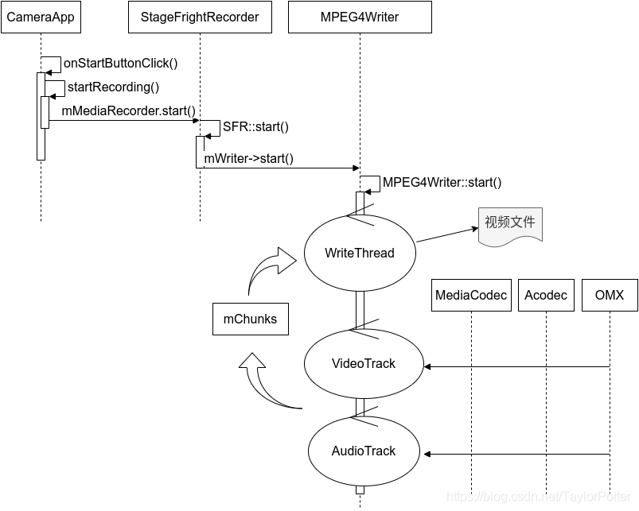

### android13 api动效
RuntimeShader,AGSL 实现光晕动效。再结合canvas绘制粒子特效

### pictureSelector
android13以后不推荐使用原来的media查询选择器；直接使用android的ResultContract picker做选择简单通用，无权限。

### AI Skills + Plan+（LLM，gemini3 pro，KIMI）


### 日志系统

产测，工厂那边比较远，快速添加一个日志方便分析问题。

1. logback+ **Elasticsearch**‌ + **Kibana**‌ 上传日志；

2. 标准磁盘存储，按日期，勾选传到OSS。

   

### okhttp拦截器

研究了okhttp拦截器的源码，大致理解了2大类拦截器的执行流程。就是责任链模式。具体就是将所有拦截器，串成一个链条，逐个执行，每一个拦截器都是返回下一层执行（proceed）得到的response。

针对下一个拦截器得到的response解析或者try-catch chain的proceed函数，捕捉异常做二次处理。

所以我设计了2个拦截器：

第二个拦截器，不做异常捕捉，解析response，得到服务器返回的错误码，token过期，时间戳不对，都转变成不同的exception往上抛；

第1个拦截器，做异常捕捉，解析，将刚才的几个异常分别进行修改request的请求头，再进行二次请求。另外禁用了原来的retryOnConnectionFailure的重试机制，原来的重试可能次数过多，有时候在弱网请求很多次。所以禁掉。然后自行参考了它的逻辑，其实就是几个特定的可恢复的Exception进行做多3次重试请求。


### JNI加密

##### 加固

加密，防君子不防小人。没有不可破的软件。但是使用了一些不新的加固方式，可能导致比如16kb没有适配，杀毒误报，某些加固方式会加重运行效率负担。而且现在都是网络应用嘛，通过请求公司API，拿到一些加密的数据更为稳妥。相比破解apk，破解系统的data/data/目录可难多了。

保护下appkey/id: 通过JNI获取+gradle脚本二次加密，原文分散为char或者移位运算，在jni中组合还原。还会校验签名。

##### 静态字符串加密方案

有的是根据编译时阶段，修改字节码的过程。

我设计了一个直接修改源码，注释写上原文。替换成一个JNI获取转换文案的代码。


### 每个界面都悬浮方案

globalActivityCallback

DecorView添加显示 避免系统权限授权。

### 99%不crash方案

第1步，通过Thread defaultCrashHandler来捕捉所有异常，这一步就拦截了所有的异常可能。

第2步，主线程崩溃的恢复。

我们在app初始化的时候一上来就发送一个:

```kotlin
Handler(Looper.getMainLooper()).post {
    while (true) {
        try {
            Looper.loop()
        } catch (e: Throwable) {
        }
    }
}
```

看着很荒谬，解释起来就比较有意思。

本来在android app启动过程中，zygote孵化了我们的进程以后，当时的那个就是主线程。就开启了一个Looper.loop()。

然后，我们app onCreate里面发送上述，就变成了**handler永远在执行我们这个runnable，永远走不出来**。

同时，

```java
final Looper me = myLooper();
...
for (;;) {
    if (!loopOnce(me, ident, thresholdOverride)) {
        return;
    }
}
```

loopOnce也会帮忙去提取下一个消息体的处理。

第3步，结合跳转一个崩溃界面，来避免无限crash。同时加一些清理缓存，重启的按钮。


### jsbridge2.0 

> 它的原理**loadUrl** + **shouldOverrideUrlLoading + Iframe.src**更新的相互通知的机制。
>
> 1. 准备工作做好基础的插入js片段；
> 2. 通过native java代码将消息拼接到一段执行handleMsgDisptach的script字符串，调用WebView的loadUrl(script)；通过这种方式实现native调用WebView js；
> 3. js掉native，则是通过iframe.src的赋值，进而触发native的shouldOverrideUrlLoading函数；native可以解析得到消息内容。
> 4. 然后设计一些缓存map，msgId，做callback实现等。

但是到了今天，可以摒弃4.x。于是我基于该框架，并完全兼容以前的前端H5代码，实现了jsbridge2.0。目前公司日活顶峰50w+。支持androiod5.0+，使用evaluateJavascript和重写，代码上也能简化。

> 我的原理webView的`addJavascriptInterface(bridgeObject)` + `evaluateJavascript` 
> JsBridge主要的目的是解决四种逻辑：
> native -> H5; 
>
> H5 -> native; 
>
> native -> h5并有回调；
>
> H5->native并有回调。
>
> 1. 准备工作做好基础的插入js片段；并插入addJavascriptInterface的对象体；
> 2. native调用js很简单，直接evaluateJavascript("WebViewJavascriptBridge._handleMessageFromNative('%s');")就可以传递内容而且没有2MB大小限制；
> 3. js调用native也简单，通过对象体的加了`@JavascriptInterface`的函数直接调用native函数(jsCall)即可。
> 4. H5->native的回调设计：js调用native的时候，把js的callback体缓存到一个map中，并创建msgId，和消息体形成Message通过jsCall调用到native；native解析Message，同步也好异步也好，再将msgId结合结果信息封装Message通过evaluateJavascript回调_handleMessageFromNative回来，然后从map中提取callback去执行；
> 5. native->H5的回调设计：native通过执行js调用，封装msgId和消息体，给到了js去_handleMessageFromNative。js处理完成后，通过直接调用JavascriptInterface的函数jsResponse往native调用。native通过Message解析出之前的msgId，进而将缓存的callback提取并执行回调。
> 6. 还设计了handleName来实现统一分类逻辑，native和H5都有map（messageHandlers）提供注册好需要执行的处理函数。

* 优化点

> 解决原代码1.0.4和master中的问题：jsbridge2.0 解决了大量存在的问题。

* 新增scheme uri跳转支持。
* onPageFinished插入js片段问题
坑点：某些网址无法触发。
包括他现在的代码都是在onPageFinished以后才loadJs文件，这个时机对于某些在线网址，可能由于某些组件刷新机制，或者加载过慢的情况，无法触发。改成onPageStarted 后500ms或者onPageFinished立刻执行加载，来保证一定执行。
* 无法通信原因是iframe被清理
    坑点：有的网址使用的某些框架搭建的，无法jsbridge通信，研究了很久，发现iframe会被清理。
    js注入片段，调整init执行顺序。master有解决。
*  二次过快执行loadUrl导致丢失指令
    坑点：通信框架出现问题或者消息丢失
    原因loadUrl多次，导致_fetechQueue多次，第一次的iframe将messageQueue传递了进去，但是没有触发shouldOverride，第二次的messageQueue又是空的。
    导致消息丢失。master有从js的执行上做了延迟处理解决。我遇到的就是chromium版本低的情况，出现该问题。导致，初始化信息未能给到WebView。
    之所以原来的代码这样做是为了支持android4.x，那么，到了今天我们的app基本上最低要求minSDK都是android6.0+，甚至8.0了。
    所以抛弃掉使用shouldOverride这套机制，而是直接通过evaluateJavascript来实现，这样可以避免大量的来来回回的传递消息。也解决此问题。
* 长度过长loadUrl vs evaluateJavascript
    master上有根据长度，做了处理。大约2M。原因是webView限制loadUrl的长度，而evaluateJavascript不限制。无此问题。
* 效率对比
    抛弃4.4的loadUrl+shouldOverrideUrlLoading +iframe更新机制。
    完全采用evaluateJavascript即可。
    既能简化jsbrige框架，又能提升效率。无需来来回回的向上向下通知。


### 蓝牙android14 mtu

Android 14 BLE 通信MTU适配问题排查与解决

是做蓝牙BLE通信开发时遇到的Android 14系统下MTU值强制覆盖的适配坑，这个问题不仅涉及到Android系统底层的变更差异，还需要结合BLE通信的核心机制、第三方库定制修改来解决，整个排查和解决的过程让我对BLE通信的理解更深入了。

当时开发的是一款基于BLE的跨端通信产品，需要Android端与嵌入式设备做稳定的数据交互，双方预先约定MTU值为251，这是嵌入式设备侧最优的处理值，能兼顾传输效率和设备性能。按照BLE开发的常规流程，我在Android端通过Gatt的 requestMtu(251) 方法设置MTU值，方法返回了 true ，按照Android SDK的文档描述，返回true即代表MTU设置请求发送成功，本以为整个配置流程已经完成，可实际联调时发现，Android端与嵌入式设备的数据交互频繁出现丢包、解析失败的问题。

排查过程中我先核对了BLE通信的核心机制：BLE的通信是基于GATT协议的，GATT以服务、特征为核心载体，数据交互主要通过特征的Write（写）、Notify（通知）方式实现，而MTU值作为BLE通信的最大传输单元，直接决定了单次Write/Notify能传输的最大数据量，双方MTU值不一致，就会导致数据分包、组包的规则不匹配，这也是丢包和解析失败的核心原因。通过日志排查发现，Android 14系统下，即便我们调用 requestMtu(251) 且返回true，底层实际却将MTU值强制修改为了517，这与我们和嵌入式设备约定的251完全不符。

起初我以为是自己的代码调用时机、方式有问题，反复调整了Gatt连接的生命周期、MTU设置的调用节点，问题依然存在。为了验证问题根源，我去Google官方的Issue区发帖确认，最终得到了官方的间接反馈：Android 14对BLE的MTU值做了底层变更，SDK文档的描述与实际系统行为存在差异， requestMtu 方法的返回值仅代表请求发送成功，不代表设置成功，即便开发者自定义设置MTU值，底层也可能强制覆盖为系统默认值，而原本用于返回实际MTU值的 onMtuChanged 回调，在该版本中也存在数值返回不准确的问题，无法通过该回调获取真实的底层MTU值。

确认问题根源后，核心解决思路就明确了：既然Android系统底层无法强制修改为约定的251，那就从双方通信的适配层入手，我们项目中使用的是业内知名的Blufi库，这款库在嵌入式开发领域的口碑很好，它的独特设计让这次定制修改成为了可能——Blufi库并非简单的BLE通信封装，而是在GATT协议之上做了专属的协议层设计，自带完善的自定义协议头、标准化的分包与组包策略，还内置了WiFi列表配网、心跳保活等适配嵌入式开发的实用功能，协议头中包含了数据长度、校验位、分包标识等关键信息，能灵活适配不同的MTU值规则，这也是我们选择该库的核心原因。

基于Blufi库的设计特点，我对其源码做了定制化修改：摒弃Android系统底层的MTU自动协商逻辑，在Blufi库的协议层中，强制按照双端约定的251设置单次传输的最大数据量，重新调整了库的分包、组包规则，让Android端即便底层MTU为517，也能在应用层按照251的MTU值进行数据拆分和封装，同时保持与嵌入式设备侧的Blufi协议解析规则一致。修改完成后重新联调，Android端与嵌入式设备的通信恢复稳定，丢包、解析失败的问题彻底解决，最终实现了双端基于251 MTU值的高效、稳定数据交互。

这次问题的解决也让我总结了两个重要的开发经验：一是做BLE跨端通信时，MTU值的适配不能仅依赖系统API，必须以双端约定的值为准，尤其是嵌入式设备侧的实际支持值，系统API的行为可能随版本发生变更；二是选择成熟的第三方库时，其良好的架构设计和可定制性至关重要，Blufi库在GATT之上的分层设计，让我们能绕开系统底层的限制，在应用层完成适配，大幅降低了开发和适配成本。


### androidStudio Handler removeCallbacks

```kotlin
Handler.removeCallbacks { 

} //黄色提醒is an implicit SAM conversion, so the instance you are removing here will not match anything. 
```

Lambda会编译成静态函数或者匿名内部类变量。经过转换都不是同一个runnable。

kotlin并非专为android设计。编译器把()->unit函数当做了Runnable，一般情况确实是可以通过function和lambda包裹转变。但是，Android Handler移除就要求的是同一个对象。removeCallbacks的Runnable并非你postDelay的runnable。而从IDEA上是看不出来差异的。

https://blog.csdn.net/jzlhll123/article/details/143391144


### mmkv版本号之争

面试最难忘的开发问题：MMKV版本兼容问题的较真与推动解决

最难忘的是项目中升级腾讯MMKV库时踩的兼容坑。我们一直稳定使用MMKV 1.3.4，它原本包含arm64-v8a、armeabi-v7a、x86、x86_64四个架构的so库，覆盖了绝大多数机型。后来看到Gradle提示1.3.5小版本更新，按语义化版本规则，第三位版本号应仅修复bug，就直接升级了，结果上线后Firebase后台瞬间收到大量Crash反馈，集中在armv7和x86架构的老机型，报错 libmmkv.so 库缺失。

我立刻排查，发现1.3.5版本偷偷移除了armeabi-v7a和x86两个架构的so库，仅保留arm64-v8a和x86_64，导致老机型无法找到对应库文件。我去MMKV的GitHub Issue反馈，建议此类影响兼容性的重大变更，应升级主/子版本号而非修订版，却被回复“可自行fork编译”。但我坚持理性陈述：普通开发者很难注意小版本的架构删减，这种操作会给大量项目埋坑，破坏版本规范的共识。

两周后，随着更多开发者集中反馈，官方发布1.3.7版本，不仅恢复了缺失的两个架构支持，还承诺后续重大变更会升级到2.0主版本号。这次经历让我明白，核心开源库不能盲目升级，必须关注底层兼容性细节；同时，基于事实的合理反馈，真的能推动优质开源项目完善，也让我更重视版本规范和多架构适配的必要性。

https://blog.csdn.net/jzlhll123/article/details/140275739?spm=1001.2014.3001.5501


### iconfont解决字体排版

https://blog.csdn.net/jzlhll123/article/details/140117623?spm=1001.2014.3001.5501


### kotlin低版本gson解析错误

https://blog.csdn.net/jzlhll123/article/details/139398967?spm=1001.2014.3001.5501

gson在高版本加了一个check，会报错，二级嵌套泛型获取的解析方式问题。

如果是java,必须如下操作，通过`TypeToken.getParameterized`来获取嵌套泛型类型解析：

```java
public static <T> T parse(String jsonStr, Class<T> t) {
    return new GsonBuilder().create().fromJson(jsonStr, t);
}

public static <T, T2> MyCmd<T2> parseLv2(String jsonStr, Class<T> t, Class<T2> t2) {
    Type typeToken = TypeToken.getParameterized(t, t2).getType();
    return new GsonBuilder().create().fromJson(jsonStr, typeToken);
}
```

如果是kotlin，则直接通过inline reified:

```kotlin
inline fun <reified T> String.fromJson(): T {
    return Globals.gson.fromJson(this, object : TypeToken<T>() {}.type)
}
```

这个函数，在低版本kotlin的时候会出现嵌套泛型解析错误。


### 架构 三方底层库 团队库 业务模块 壳工程

分层：

​	底层库、三方库：okhttp/阿里网络库，glide，crashSDK，fastjson, jetpack， 埋点库...

​	团队封装库：统一线程池，glog，网络二次封装库，团队路由框架，性能监控...

​	业务模块：消息中心，精灵球，闹钟，联系人，音乐；语音采集核心库，识别库

​	壳工程

通信：

​	隐式路由uri实现（都是为了解决跨模块之间，互相不知道class类然后需要跳转而做的一些框架设计）；

​	IPC通信框架（contentProvider实现的；主要是在rom上容易被拉起进程，就可以直接自动初始化；）

​	EventBus应用进程内通信。	

### 后装车载

#### mp4循环录制

​	录像 vs 8.0




​	研究mp4writer的c++代码，在writeThread到了时间后，就先保存mp4 box头， 生成文件再开启下一个文件。

#### mp4 vs TS保存问题

​	mp4容易播放当时。

​	ts在手机上不容易播放。

#### aidl多进程分割

​	视频管理，播放。减少内存占用。

​	aidl传递给手机app。

#### cpu温度处理

​	分辨率，帧率，动态调整，系统SystemServer进程追加监控线程。通知各个模块

#### 离屏显示

​	桌面，小窗口

#### 双路录制

​	cameraService处解开

#### ADAS集成

​	寻找HAL copy buff，解析。
