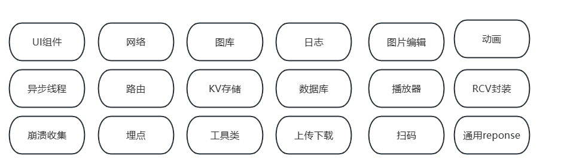
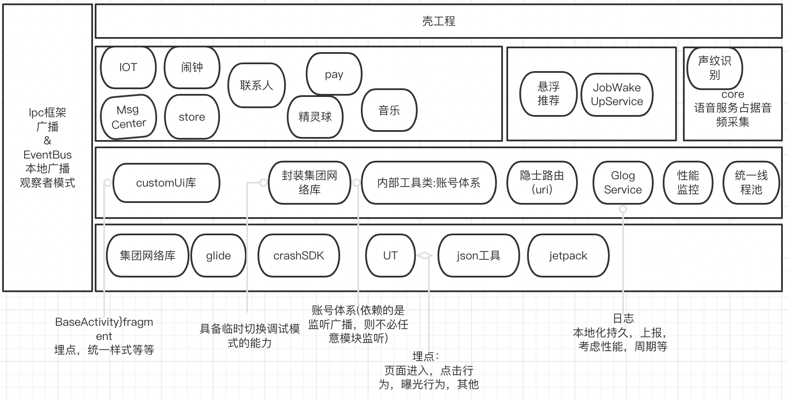

dump治理：

崩溃上报-----自研SDK。bugly，firebase等。

热修复----已经不火了，主要是google对于反射的api越来越多限制，兼容性较差；现在跨端技术选择很多，有的支持热更新；

​		直接发新版也比较容易。

崩溃防护。

《其他思考》

1. 补充version控制模块，动态配置功能feature

2. 针对某些热点点击功能统一拦截hook的设计，比如统一封装click

3. 设计一个统一的interface biz-service模块，将接口收拢在这里，别的模块进行监听，某个模块进行实现

4. 跨端开发，weex，rn, flutter局部尝试

   

《更多设计》

1. 依赖注入(注解+apt或反射)：

解决模块循环引用；加强代码可读性；无需更新本类，在外部配置即可；针对接口编程(没必要动不动就强制转换)。

2. 动态代理：

运行时给接口提供代理能力；

Proxy.newInstance；

InvokeHandler。原理是JVM在构造的时候传入你的invokeHanlder的实现，然后把被代理的接口函数实现了，当执行到的时候，替换成调用invoke函数。

初始化流程：

初始化集团网络appkey

UT初始化

保活主进程服务拉起

Glog日志服务拉起

语音core服务进程拉起

crash服务

各个模块初始化

### 编程风格

设计模式23种

代码复用

类原子化

