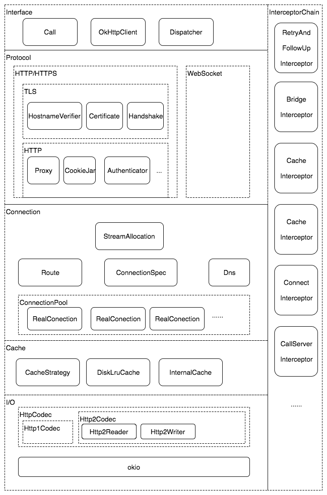
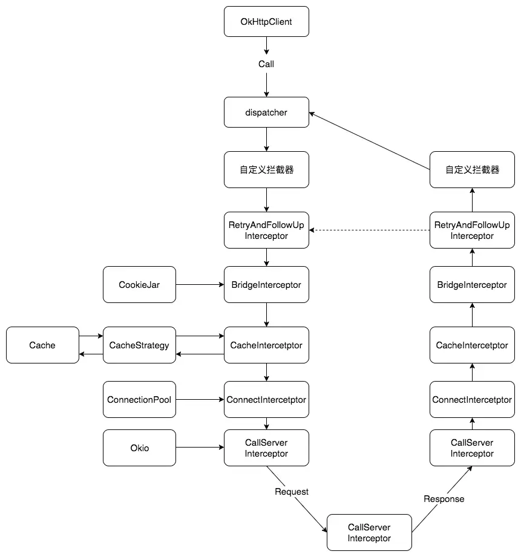

### Jetpack

#### Flow

[kotlin Flow快速学习2025-CSDN博客](https://blog.csdn.net/jzlhll123/article/details/149488028)

#### Navigation


#### DataBinding-MVVM

观察者模式。数据驱动。


#### Application的ActivityLifeCycleCallbacks

其实就是framework中对于activity的基础实现做了基类的设计。

在activity本身的onStop、onCreate等生命周期，通知到了application （因为只有他是唯一的）。

然后对于我们使用者而言，就是使用Application里面去注册即可。


你可以自己想象一下，如果我们自己想要实现一个activity切换的监听，就搞一个baseActivity，自己往activity的生命周期追加代码。其实功能与系统父类中干了一样的事情，只是因为不熟悉没用过罢了。


#### WorkManager

可延迟的异步任务。

android23+   JobScheduler

<androi23     BroadcastReceiver+AlarmManager

#### LifeCycle

AppCompatActivity实现了LifecycleOwner。再结合LifeCycleObserver。

在appCompact的基础包中，做了自定义的event，statusChanged等处理。

#### LiveData+ViewModel

从使用角度才能更好的理解它：

ViewModel不能去new，要ViewModelProvider.of(activity|fragment)，一个activity或者fragment，只有一个ViewModelStore
里面用hashMap存储k(xxxViewModel.class),  v (框架反射new出来的xxViewModel对象) 。在框架里就可以看到从1个activity无论获取多少次，就只有一份。

ViewModel里面不能放生命周期长的东西，比如context。

在restartActivity的时候会残留他，通过framework提供的activity onRetianxxxx函数实现。


liveData则本质上只是一个内部有监听列表的一个类而已。所以要建议放在viewModel里面；

LiveData感知生命是因为当你调用observer某个activity|fragment的时候，追加到了LiveCycle的监听里面去，随着生命周期的消失，也会自行被移除监听。

LiveData作为数据驱动的设计理念，存活的生命周期自然要跟activity保持一致，ViewModel显然是最合适的了。也因为ViewModel保证了唯一性，LiveData也能保证唯一性。


#### ROOM

[android ROOM kotlin官方文档完全学习-CSDN博客](https://blog.csdn.net/jzlhll123/article/details/149433460)

#### Paging

#### MVC、MVP、MVVM

#### Startup

通过一个contentProvider来实现自启动。因为在activity的启动流程中，可以看到contentProvider比application还要早。而且是自动启动的。很多自启的框架都是通过自定义`contentProvider`来初始化。

但是各个模块都搞的话，`ContentProvider`就太多了而且没有依赖关系。所以startup就可以让大家只共用一个。然后提供了一点简略的相互依赖的逻辑。使用起来呢，效果见仁见智，一般般吧。

一个有向无环图DAG实现的依赖关系初始化过程。

### leakcanary原理

1. 理解通过provider的初始化来不通过集成自动初始化；
2. activity application的lifecyclecallback，每次activity的回调；
3. 通过refWatcher监听activity的泄漏；
4. 同理fragment和fragmentView的destory的问题；利用生命周期回调。

weakRef-》obj-》RefQueue，一直寻轮queue查不到对象。

### 路由框架

>  它的设计初衷是解决模块间的解耦问题。让主工程或者模块A，不关注模块B，C，D的具体类名。

发展：

1. 第一版。最底层的route库，搞Router.java, 定义static List<? extends Activity> 然后搞个register（）方法。
   这样在app最顶层，就可以把所有模块的activity全部注册进来。

2. 第二版：从app顶端，下沉到各个模块，减少注册代码，DexFile 反射查询所有类调用注册。
   将app最顶层的注册动作，改变为：
   router底层模块定义接口IRoute 注册。 每个模块，自己实现自己的注册逻辑。
   每一个模块，定义一个专门的类实现IRouter。然后在init的时候，
   通过DexFile读取apk所有的我们规定的包名下的class，过滤实现了IRouter的类，添加到list。这样就减少了注册的动作。

3. 第三版：APT自动生成extends IRouter类。

   通过定义注解 让所有的Activity注解上。 然后编写APT，RouterProcessor abstractProcessor。
   让注解自己生成实现的IRouter类。Filter， processingEnv。
   这样的话，又减少了，每次添加实现IRouter类的方式。
   但是没完成，需要实现APT：
   javaCompileOptions.annotaionProcessorOptions.argurs;

   Processor.java中的init，可以从procesingEnv里面拿到Options，拿到名字。
   SupportedOptions（“moduleName”）
   annotaionProcessor 添加build.gradle里面才会被执行

   process（set《》， RoundEnvirontments）
   从routeEnvirmonet里面getElementAnnotionWith(Route.class) 节点，我们拿到一个Element的set数组，
   在遍历TypeElement后，getQualifiedName 动态的获取到了被注解的Activity的名字。

   然后不断拼接文字，继续从遍历的节点中拿到，getAnnotation的可以获得到注解的key value数，拼接到类中。

到现在，我们只需要给Activity添加注解,就可以通过编译时工具APT获取所有添加过注解的activity然后自动生成每一个IRouter的子类。

APP里面application搞一下init，把所有的activity添加到最底层的Router库的List里面去。其他啥也不用干了。
	

4. 第四版：优化反射的时间
   现在问题就是init那需要搞一堆反射去拿对应的IRouter实现类，太慢了。
   需要字节码插桩（ASM）+ Gradle （AOP一种实现）。将反射部分的代码，变成了真实的代码。


   SPI通信，注解，APT，反射，dexFile，Gradle+字节码插桩。


### RecylerView

**RecyclerView原理，RecylerView优化**

6大部件：

LayoutManager: 接管measure，layout，draw

ItemDecoration： Item添加子View需要自行添加和实现

ItemAnimator：添加删除时候的动画

Adapter： 主体逻辑组织，生产ViewHolder，绑定。

ViewHolder：子布局

Recycler： 缓存池

缓存原理：

4层：

1. mAttachedScrap，可见范围的ViewHolder。mChangedScrap有变化的数据；
2. mCachedView，只有2个。后来的recylerView增加了预取那就是2+N；
3. ViewCacheExtension，开发自行实现的缓存；
4. RecycledViewPool，不同的缓存类型默认每种5个；

优化：

notifyItemChanged: 可以设置payload;进行部分控件规则刷新

diffutil计算并，notifyRangeChanged: 局部刷新几个更新

减少层级；透明度，背景重叠移除；

onCreateViewHolder里面做一些点击监听；不要搞到onBinderViewHolder里面去；

目的都是为了减少onCreate和onBinder

额外设置缓存；

固定fixedSize；

Glide滑动中停止请求。


mAttachedScrap，cachedView不用bind和create。RecycledViewPool需要bind

### 编译时注解

https://blog.csdn.net/jzlhll123/article/details/140216236


### 组件化路由

ARouter，

编译时注解。运行时注解。反射。


### Android热修复

BootClassLoader用来加载系统类；PathClassLoader加载app类。

bundle取出Parcelable的时候，出现classNotFound。是因为使用了bootClassloader加载的。所以传递以后需要setClassLoader为本地的classLoader。


* QQ空间1代修复方案，将BaseDexClassLoader的DexPathList的Element[]数组，将class放到前面；

  缺点：随着修复数量上来，花费时间过大。需要重启；

* 微信Tinker：

  新进程合并dex方案，需要重启。

* 阿里百川AndFix：

  运行时native指针修改方法的替换。不用重启应用。缺点：主要针对函数的修复。兼容性差。

* 阿里Sophfix：

  综合方案。

### ANR

#### ANR原因和设计逻辑

Service Timeout:比如前台服务在20s内未执行完成，后台服务Timeout时间是前台服务的10倍，200s；

BroadcastQueue Timeout：比如前台广播在10s内未执行完成，后台60s

ContentProvider Timeout：内容提供者,在publish过超时10s;

InputDispatching Timeout: 输入事件分发超时5s，包括按键和触摸事件。

主线程：其实就是zygote fork出来的application， main函数所在的主线程。

卡顿有2个原因：

>  一个是messageQueue处理消息的next()；可能是绘制过慢。
>
>  一个是dispatchMsg处理太久。

**应用卡顿，原因一般都可以认为是Handler处理消息太耗时导致的**，细分的原因可能是方法本身太耗时、算法效率低、cpu被抢占、内存不足、IPC超时等等。

* ServiceANR:

原因/流程	ActiveServices	Service	超时时间
create	realStartServiceLocked	onCreate	20s/200s
start	sendServiceArgs	onStartCommand	20s/200s
foreground	sendServiceArgs	onStartCommand	10s

设计逻辑都是在执行某个事情的时候，先发送一个delay的anr消息出去；如果干完了就remove掉。否则收到了就开始dump。

* 广播ANR：
  类似。

* ContentProvider ANR：

  创建contentProvider的时候，可会有ANR。

1.当ContentProvider运行与独立进程的时候; onCreate方法运行与该进程的主线程,
其余增删改查等所有方法运行在Binder线程.
2.当ContentProvider运行在调用者同一个进程的时候; onCreate方法运行与该进程的主线程,其余增删改查等所有方法运行在调用时所在的线程.

只有初始化有ANR。后续的CURD其实走的是binder线程。

* Input超时：KeyDispatchTimeout：

  是在c++层，systemServer里面，做的按键事件队列。重置ANR的timeout。而ViewRootImpl会监听按键事件, 处理完成后，移除点击事件的队列消息。
  
  否则就上报ANR了。
  
  


#### ANR框架

1. blockCanary：设置主线程messaging printer；

2. watchlog：不断的发送消息；

3. Choreographer：

​	ViewRootImpl，postCallback等待一个vsync信号。

​	信号后来以后，打印一个"skipped xx frames！"的日志。

​	执行回调。

​	Choreographer.getInstance().postFrameCallback用来监听fps，也可以监听卡顿。

 4：ASM技术，函数插桩统计时间。微信Matrix影响相对较少。

### Glide

* 内存缓存 （先从存活的弱引用缓存；再从Lru缓存）

  key->loadFromMemory() 实际分为2块，1块是已经被人引用计数正在使用的资源；找不到再从cache中找。

* 磁盘缓存（原尺寸，实际使用尺寸）

* 尺寸优化ovveride、inSampleSize、565RGB

* 内存复用，BitmapPool

* 生命周期的把控，非主线程或者application的时候，就是一个全局的；

  而自行搞无界面的fragment来监听生命周期。因为fragment会伴随activitiy而如果是appcompact则有lifecycle。如果是继承标准activity则没有，那么所以他就通过这个机制来监听生命周期。


LruCache的实现（最近最久没有使用）

最简单的就是"双向链表"。来一个就挂到前面；size超了就移除尾部。

要查找就比较费事了，所以使用HashMap来辅助缓存key。

替代的就用：

LinkedHashMap就可以实现；找到他，删除他；然后添加到头。size超了就移除尾部。

并没有体现使用freq。

Glide几个优点：内存缓存分两块；磁盘缓存，有原尺寸，适用尺寸；565,8888的图像使用率。

内存复用池；生命周期用fragment管理是一大特点。

### Okhttp



从代码分层来看：

1. 接口层：okhttpClient（外观模式操控底下的复杂逻辑），Dispatcher（任务队列）, call（任务片）
2. 协议层：http1, http2, websocket；
3. 连接层：连接池；其实就是对于Socket连接的管理，以及对于http/2 socket多路复用；
4. 缓存层：diskLruCache来缓存到本地；当然也要结合http的报文参数。
5. I/O层：高效的IO操作的实现okio。目的对于操控对象池的复用，减少屏蔽内存抖动。

另外就是拦截器的设计，类似AOP，基本贯穿整个体系：

* 重试和重定向拦截器:  网络请求失败自动重试，重定向的时候复用

* 桥接拦截器： 主要是补充http请求包头

* 缓存拦截器： 本地缓存，更新缓存，移除等；

* 连接拦截器： 选择合适的realConnection | socket

* 请求服务拦截器：正式的请求，和处理http报文的解析封装。并操作io来存储。




从设计模式来看：

最后再总结下`okhttp`中涉及到的设计模式：

- `外观模式`。通过okHttpClient这个外观去实现内部各种功能。
- `建造者模式`。构建不同的Request对象。减少大量参数的输入。
- `工厂模式`。通过OkHttpClient生产出产品RealCall。忽略创建的细节，让调用者只关系接口。
- `享元模式`。通过线程池、连接池共享对象。主要的思路，通过工厂类，hashMap来缓存对象，查找并复用。
- `责任链模式`。将不同功能的拦截器形成一个链。

其实还是有一些设计模式没说到的，比如

- websocket相关用到的`观察者模式`。
- Cache集合相关的`迭代器模式`。

最重要的是拦截器设计，简化版拦截器的实现：

```
class call {
	excute() {
				var chain = Chain(0)
				chain.proceed()
	}
}

class Interceptor {
	 fun intercept(chain: Chain) : Response{
	 		var request = chain.request
	 		chain.proceed() //必须这样才能形成链条
	 }
}

Chain {
   proceed() {
    	//循环列表遍历
      for (i : interceptors) {
          var interceptor = interceptors(i)
          var chain = Chain(i + 1)//把下一个要处理的封装成chain传递进去
          var response = interceptor.intercept(chain)
          return response
      }
   }
}	
```

设计逻辑：

通过遍历interceptors列表，将下一个interceptor包裹成chain往当前interceptor里面传递。那么，在interceptor的intercept执行的时候，继续往下调用chain的proceed。进而形成了类似嵌套的链条调用。
