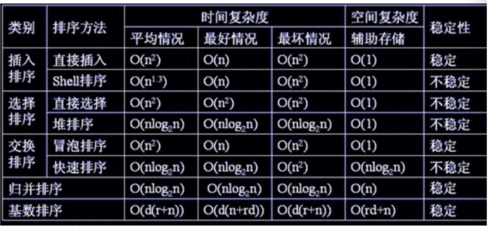

SparseArray(和他的系列)，ArrayMap替代HashMap。ArraySet替代HashSet。

### 1. 数组

优点：按照索引的话，查询在O(1)时间复杂度；

缺点：分配连续内存；添加删除需要移动其他元素。

### 2. 链表

优点：不用连续分配内存；添加删除很轻松；

缺点：含有大量的引用；查找时间复杂度O(n)

java：LinkedList

### 3. 哈希表

  数组在执行查、改的效率很高，而增、删(不是尾部)的效率低，链表相反，HashMap则是把这两者结合起来，看下HashMap的数据结构。

### 4. 栈

### 5. 队列

### 6. 二叉树

* `斜二叉树` 

* `完全二叉树`

  	就是满二叉树，层次遍历，缺失倒数几个的形态。

  * `满二叉树`

    一个二叉树，如果每一个层的结点数都达到最大值，则这个二叉树就是满二叉树。也就是说，如果一个二	叉树的深度为K，且结.  点总数是(2^k) -1 ，则它就是满二叉树。他是完全二叉树的一种特殊形态。
    
  * `堆` （Heap）

    1.堆中某个节点的值总是不大于或不小于其父节点的值; 小根堆，大根堆。
    2.堆总是一棵完全二叉树。

  > 使用场景，用于排序。
  >
  > 获取前K个最大的数。

* `平衡树`

  任意节点的子树的高度差都小于等于1。

* `二叉搜索树`\二叉排序树\二叉查找树Binary Search Tree

  	若它的左子树不空，则左子树上所有结点的值均小于它的根结点的值； 若它的右子树不空，则右子树上所有结点的值均大于它的根结点的值； 它的左、右子树也分别为二叉排序树。

  `二叉搜索树中序遍历的结果是有序的`。

  > 缺点：时间复杂度在O(logN), 当高度偏差越来越大，直到出现单支树的情况，时间复杂度会逐渐退化到O(N),也就是类似于单链表的查询。
  
  * `平衡二叉搜索树`、Balanced Binary Search Tree：
  
    	二叉搜索树，且平衡。仅此而已。
    	它能在O(logn)内完成插入、查找和删除操作，最早被发明的平衡二叉搜索树为AVL树。
    
    * `AVL树`
    
      增加和删除元素的操作则可能需要借由一次或多次树旋转，以实现树的重新平衡。
    
      > 		最先发明了AVL树，来解决基础的BST容易退化为链表的性能下降问题
      > 							
      > 		查找、插入和删除在平均和最坏情况下的时间复杂度都是`O(logn)`
      >					
      > 	适用于：
      >					
      > 		相对少，内存中，数据结构。一般会被红黑树替代。不太删除不太插入的情况。
      >					
      > 	缺点：
      >					
      > 		AVL的左右子树高度差不超过1，每次插入/删除操作时，几乎都需要通过旋转保持平衡
      > 		在频繁进行插入/删除的场景中，频繁的旋转操作使得AVL的性能大打折扣
    
  * `红黑树`
  
    红黑树是二叉搜索树的另一种优化形式，它不是像avl树那样保持高度平衡，而只是保持相对平衡。
  
    那种插入、删除很频繁的场景中，平衡树需要频繁着进行调整，这会使平衡树的性能大打折扣，为了解决这个问题，而发明。
  
    > 优点：已经说了，不像AVL树一样，过多的插入和删除的严格旋转
    >
    > 适用于：
    >
    > 	内存中，各种map的数据结构底层实现
    >
    > 缺点：
    >
    > 	海量数据。


* `多叉树`

  * `B树`、`B+树`：

  更加的矮胖。适合磁盘存储。数据库存储设计。

### 7. 图

### 8. 堆


### java面经

 

### 一、排序算法



其他基础

##### 1. 简单算法

* 交换位置不用额外

  ```c++
  //也可以用乘和除；与或非。但是加减最合适。同时考虑崩溃，溢出等
  arr[j] = arr[j] + arr[j + 1];  
  arr[j + 1] = arr[j] - arr[j + 1];  
  arr[j] = arr[j] - arr[j + 1];  
  ```

* 三个数比较大小

  略。见快速排序三数取中。            

##### 2. 二分查找（折半查找）

时间复杂度O(log(n)), 空间复杂度O（1）

细节是魔鬼，需要考虑各种+1，-1，和<=, <的问题。并注意左边界右边界问题。需要输入的是排序过的数组。

这里没有追究各种细节。需要仔细考虑才行。

```java
private int find(int[] arr, int target) {
    if (arr == null) {
        return -1;
    }

    int start = 0;
    int end = arr.length - 1;
    int center;

    while (start < end) {
        center = (start + end) / 2;
        if (target == arr[center]) {
            return center; //
            //改成
            //end = center;或者start=center就能达到解决左右侧边界问题.但是很多边界问题没有考虑。算法注意有点小问题
        } else if (target < arr[center]) {
            end = center - 1;
        } else { // 即>
            start = center + 1;
        }
    }
    return start;
}            
```

##### 1. 交换：冒泡排序

思路：双层循环，内循环两两比较，每次都将小（大）往旁边交换。下次循环可以减少尾部一次。

优化：简单：当某次内部循环没有产生交换，就整体停止；

```
		稍微进阶：记录每次内循环的边界；下次循环最多循环到这里即可，从而替代第一种优化，而且减少更多交换。
```

评价：实现简单，稳定，由于有2层循环，时间复杂度 O（n^2），空间O（1）。

常规：

```java
private void sort(int[] arr) {  
        int temp;  
  
        for (int i = 0, count = arr.length; i < count; i++) { 
            for (int j = 0; j < count - i - 1; j++) { //每次比较少一次  
                if (arr[j] < arr[j + 1]) {  
                    //交换  
                    temp = arr[j];  
                    arr[j] = arr[j + 1];  
                    arr[j + 1] = temp;
                }  
            }  
        }  
    }  
```

改进方案(记录上次交换最后一次的位置，下次就循环到那，就可以停止了)：

```java
private void sortLv2(int[] arr) {
    int temp;
    int count = arr.length;
    int boundIndex = count - 1; //lv2 增加一个边界，第一次边界是最大值

    for (int i = 0; i < count; i++) {
        int t = boundIndex;
        for (int j = 0; j < t; j++) {
            if (arr[j] < arr[j + 1]) {
                boundIndex = j; //lv2 记录下来交换后的位置
                //交换
                temp = arr[j];
                arr[j] = arr[j + 1];
                arr[j + 1] = temp;
            }
        }
    }
}
```

##### 2. 交换：快速排序

思路：

```
递归+分治。

步骤：取一个基准数(最左边元素, 这样代码好写，优化点也是将数值交换到这里)，双index（左index和右index）；

右index不断减少，元素比基准数小的就丢到基准数的位置，并将左index加1；

左index不断增大，元素比基准数大的就丢到右边index位置，并将右index减1；

直到index错位；

再将这个位置分割为左，右，递归下去。
```

优化：

```
第一点，基准数的好坏很关键，对于有序数列，如果用一端就很差，因此一般采用三值取中，即比较最左，最右，中间元素，看谁中值交	换到最左边。再进行partition；有序情况下，提升巨大；

第二点，对于partition的时候，判断start<end&&start+12 > end，则改成插入排序。
```


评价：实现复杂；时间O（nLog(n)）,空间O（nlog(n)）。

* 递归方式（进行了初值三值选中并交换到第一位）

```java
	//中值处理，将中间值引到第一位，这样就兼容了普通版quickSort
    private static int midNumber(int[] arr, int start, int end) { //忽略判断数组长度。
        int center = (start + end) / 2;
        int temp;
    		if (arr[center] > arr[end]) { //先把后2者排好
    			temp = arr[center];
        	arr[center] = arr[end];
        	arr[end] = temp;
        }
    	
        if (arr[start] > arr[end]) {//再让第一个和第三个比较。结果就是最后一个肯定是最大的
          temp = arr[start];
          arr[start] = arr[end];
          arr[end] = temp;
        }
    	
        if (arr[start] < arr[center]) { //再让第一位和中间比较，让第一位保持居中大。注意符号换了
          temp = arr[start];
          arr[start] = arr[center];
          arr[center] = temp;
        }
    	
        return arr[start];
    }

    public static void quickSort(int[] arr) {
        if (arr == null || arr.length == 1) {
          return;
        }
        quickSortInner(arr, 0, arr.length - 1);
    }

    /// 返回最终处理完了的那个中间位置
    private static int Partition(int[] arr, int start, int end)
    {
        int key = arr[start];

        while (start < end)
        {
            while (arr[end] >= key && end > start) //注意必须闭合，否则死循环
            {
                end--;
            }
            arr[start] = arr[end];

            while (arr[start] <= key && end > start) //注意必须闭合，否则死循环
            {
                start++;
            }
            arr[end] = arr[start];
        }

        arr[start] = key;
        return start;
    }
    
    private static void quickSortInner(int[] arr, int start, int end) {
        if (start < end) {
            //midNumber(arr, start, end); 打开就是优化1
            int index = Partition(arr, start, end);
            quickSortInner(arr, start, index - 1);
            quickSortInner(arr, index + 1, end);
        }
    }
```

* 非递归方式

```java
private static void quickSortInner2(int[] arr, int start, int end) {
    if (start < end) {
      Stack<Integer> stack = new Stack<>();
      stack.push(start); //初始化压入开始和结尾
      stack.push(end);
      
      while(!stack.empty()) {
        end = stack.pop(); //弹出的第一个是结尾，第二个是开始
        start = stack.pop();

        midNumber(arr, start, end);
        int index = Partition(arr, start, end);
        if (start < index - 1) {
          stack.push(start);
          stack.push(index - 1);
        }

        if (end > index + 1) {
          stack.push(index + 1);
          stack.push(end);
        }
      }
    }
  }
```

非递归在数据量大的时候，显得不太好。**这是因为数据量较大时，非递归实现时、栈的压栈、出栈、扩容耗费了大量时间**。并且递归在100百万的数据量下也没有弹出溢出，而且对于做了小于12个数的插入算法替代，栈将会极速减少。最终还是要看实际情况走。


##### 3. 插入：插入排序

思路：跟打牌一样。假定第一个就是有序的，然后从第二个开始当做新牌，不断地往原来序列中插入，后续的往后挪动。

评价：实现简单。数据交换相对较多，有时候不适合。适合少量数目1000以下的排序。改进后的shell排序，就适合大部分情况。排序不绝，用希尔排序。

优化点：

1. 如上面说的，opt1就可以提升挪动次数；适合10~20个数；
2. 二分法查找该插入的index位置；即折半插入算法；适合1000个排序。
3. 希尔排序。适合大部分排序，除非大数据。

```java
  private static void insertSortOpt1(int[] arr) {
        int j;
        int cur;

        for (int i = 1, count = arr.length; i < count; i++) {
            cur = arr[i]; //优化点：备份下
            for (j = i; j > 0; j--) {
                if (cur < arr[j - 1]) {
                    arr[j] = arr[j - 1]; //优化点：不做左右移动三次。改成只搞一次
                } else {
                    break;
                }
            }
            if(j != i) arr[j] = cur;
        }
    }

    public static void sort(int[] arr, int start, int end) {
        int cur;
        int j;
        for(int i = start + 1; i <= end; i++) {
            cur = arr[i]; //必须备份下,否则被替换了
            for (j = i; j > start; j--) {
                if (cur < arr[j - 1]) {
                    arr[j] = arr[j - 1];
                } else {
                    break;
                }
            }
            //这个不能放到里面去。必须在内循环后面。否则最后一个不能执行
            arr[j] = cur;
        }
    }

	private static void insertSortOpt2(int[] arr) {
        int low,high,m,temp,i,j;
        for(i = 1;i<arr.length;i++){
            //折半查找应该插入的位置
            low = 0;
            high = i-1;
            while(low <= high){
                m = (low+high)/2;
                if(arr[m] > arr[i])
                    high = m - 1;
                else
                    low = m + 1;
            }
            //统一移动元素，然后将这个元素插入到正确的位置
            temp = arr[i];
            for(j=i;j>high+1;j--){
                arr[j] = arr[j-1];
            }
            arr[high+1] = temp;
        }
    }
```


##### 4. 插入：希尔排序

  https://baijiahao.baidu.com/s?id=1645338224617537073&wfr=spider&for=p

  https://www.cnblogs.com/minxiang-luo/p/12392634.html

  

##### 5. 选择：选择排序

思路：每次扫描找出最小值，把前面替换。

优化：每次扫描同时找出最大值和最小值，分别往前后指针位置替换。

评价：实现简单，时间O(n^2)， 空间O(1)

```java
    private static void selectSort(int[] arr) {
        int miniIndex;
        int tmp;
        for(int i = 0, count = arr.length; i < count;i++){
            miniIndex = i;
            for (int j = i+1; j < count; j++) {
                if (arr[j] < arr[miniIndex]) {
                    miniIndex = j;
                }
            }

            if (miniIndex != i) {
                tmp = arr[miniIndex];
                arr[miniIndex] = arr[i];
                arr[i] = tmp;
            }
        }
    }
```

##### 6. 选择：堆排序


##### 7. 归并排序

思路：与快速排序类似，分治和递归。一直递归分下去，直到只有1个元素或者2个元素，排序后到临时数组中，再不断地往顶层归并。

优化：

1. 在merge函数中，增加判断一次arr[mid] <= arr[mid+1]即可加速；
2. 类似快排一样，对于start  < end&&start+12>end的情况，使用插入排序；
3. 多线程排序。

```java
private void merge(int[] arr, int start, int end, int mid, int[] helpArr) {
    if (arr[mid] <= arr[mid + 1]) { //优化点1
        return;
    }
  
    int i = start, j = mid + 1, t = 0;
    ///不断选择最小的放到tempArr中去 1.
    while (i <= mid && j <= end) {
        if (arr[i] <= arr[j]) {
            helpArr[t++] = arr[i++];
        } else {
            helpArr[t++] = arr[j++];
        }
    }
		///2.
    while (i <= mid) {
        helpArr[t++] = arr[i++];
    }
    ///3.
    while (j <= end) {
        helpArr[t++] = arr[j++];
    }
		///拷贝回去
    t--;
    while (t >= 0) {
        arr[end--] = helpArr[t--];
    }
}

private void mergeSort(int[] arr, int start, int end, int[] helpArr) {
    if (start < end) {
        int mid = (start + end) / 2;
        mergeSort(arr, start, mid, helpArr);
        mergeSort(arr, mid + 1, end, helpArr);
        merge(arr, start, end, mid, helpArr);
    }
}

private void mergeSortOpt(int[] arr, int start, int end, int[] helpArr) {
  if (start < end) {
    if (start + 12 > end) { //优化点2
      InsertSort.sort(arr, start, end);
    } else {
      int mid = (start + end) / 2;
      mergeSort(arr, start, mid, helpArr);
      mergeSort(arr, mid + 1, end, helpArr);
      merge(arr, start, end, mid, helpArr);
    }
  }
}

private void mergeSort(int[] arr) {
    int[] tmpArr = new int[arr.length];
    mergeSort(arr, 0, arr.length - 1, tmpArr);
}
```

##### 8. 基数排序

##### 9. 外部排序

10. ##### 回溯算法

11. ##### 动态规划

##### 分治、动态规划、贪心、回溯和分支界定

### 二、数据结构

##### 1. 二叉树

https://www.cnblogs.com/maybe2030/p/4732377.html

k层次的二叉树，最多有2^k-1个节点。

* 1 满二叉树

  除了最后一层，全部有2个节点，三角形；2^k-1个节点；

* 2 完全二叉树

  效率很高（没有内存浪费）。除了最后一层，其他层必须是完全的，且最后一层只允许出现在左节点。

* 3 补充：二叉树的顺序存储结构

  属于类似层次遍历一样的存储方式。如果遇到左节点不存在，因此，我们可以对完全二叉树有个理解就是线性(顺序)存储可以不用浪费存储空间。

* 4 二叉搜索树/二叉查找树/二叉排序树

  中序遍历可得有序的数列。

* 5 平衡二叉树

  左右两个子树的高度差不超过1。并且左右子树也是平衡二叉树。即，任意2个叶子节点的距离差不大于1.

##### 2. 面试题

* 1. 获取深度

     ```java
     int treeDepth(TreeNode node) {
     	if (root == null) {
             return 0;
         }
         int l = treeDepth(node.left);
         int r = treeDepth(node.right);
         return l > r ? l + 1 : r + 1;
     }
     ```

     

* 2. 判断一棵树是否是平衡二叉树

  ```java
  public boolean isBalanced(TreeNode root) {
      if (root == null) return true;
      return Math.abs(depth(root.left) - depth(root.right)) <= 1 && isBalanced(root.left) && isBalanced(root.right);
  }
  
  private int depth(TreeNode root) {
      if (root == null) return 0;
      return Math.max(depth(root.left), depth(root.right)) + 1;
  }
  ```

  ```java
  public boolean isBalanced(TreeNode root) {
      return recur(root) != -1;
  }
  
  private int recur(TreeNode root) {
      if (root == null) return 0;
      int left = recur(root.left);
      if(left == -1) return -1;
      int right = recur(root.right);
      if(right == -1) return -1;
      return Math.abs(left - right) <= 1 ? Math.max(left, right) + 1 : -1; //如果有不对，我们就直接reutrn -1 就可以快速跳出递归了。
  }
  ```

* 2. 三种遍历

     ```java
     //
     ```

      

  

  


##### 2. 单链表

* 不能遍历删除非尾结点

  ```c++
  struct LNode {
      int num;
      char* name;
      LNode* next;
  };
  
  typedef LNode* LNodePtr;
  
  //单链表：不允许遍历第一个参数List，删除第二个参数node。
  private static void deleteIt(LNodePtr * nodeList, LNodePtr node) {
      LNodePtr nodeThis = node;
      LNodePtr nodeNext = nodeThis->next;
      nodeThis->num = nodeNext->num;
      nodeThis->name = nodeNext->name;
      nodeThis->next = nodeNext->next;
      delete(nodeNext);
  }
  ```

* 找到倒数第K个节点

  ```java
  public int kthToLast(ListNode head, int k) { //遍历一次。
      int i = 0, j = 0;
      ListNode target = head;
      ListNode current = head;
      int ret = -1;
  
      while (true) {
          i++;
  
          if (i - j == k) {
              ret = target.val;
              target = target.next;
              j++;
          }
  
          if (current.next != null) {
              current = current.next;
          } else {
              break;
          }
      }
      return ret;
  }
  
  public ListNode getKthFromEnd(ListNode head, int k) {
      ListNode cur = head;
      ListNode tar = head;
    
      while (cur != null && k-- >= 1) {
          cur = cur.next;
      }
  
      while (cur != null) {
          cur = cur.next;
          tar = tar.next;
      }
  
      return tar;
  }
  ```

* 输入两个递增排序的链表，合并这两个链表并使新链表中的节点仍然是递增排序的。

  ```java
  public ListNode mergeTwoLists(ListNode l1, ListNode l2) {
      ListNode newNode = new ListNode(-100);//关键点，必须新建一个，用老的后面的步骤会导致错误
      ListNode retNode = newNode;
  
      while(l1 != null && l2 != null) {
          if (l1.val < l2.val) {
              newNode.next = l1;
              l1 = l1.next;
          } else {
              newNode.next = l2;
              l2 = l2.next;
          }
          newNode = newNode.next;
      }
  
      if (l1 != null) {
          newNode.next = l1;
      }
  
      if (l2 != null) {
          newNode.next = l2;
      }
  
      return retNode.next;
  }
  ```


#### Java集合类List，Map，Set相关的实现原理。
HashMap, TreeMap,  HashTable, ConcurrentHashMap, linkedHashMap...
HashSet, TreeSet, LinkedHashSet...
ArrayList, LinkedList, Stack...

ArrayList：数组
LinkedList：双向链表

HashSet数据结构：HashMap
LinkedHashSet数据结构：LinkedHashMap
TreeSet数据结构：TreeMap

内部用一个空object来做value；

HashMap  数据结构：使用数组+链表+红黑树；
TreeMap   数据结构：使用红黑树，保证了key的有序性；
HashTable数据结构：数组+链表，全部synchronized，不推荐；
LinkedHashMap基本与HashMap一致，只是每个节点使用双链表来串起来；
ConcurrentHashMap：数据结构：Segment数组（数组+链表结构），1个Segment里面是HashEntry数组。就是分段数组+链表+红黑树。

迭代器按照规则里面删除是安全的；
foreach迭代改变就危险；
copyOnWriteArrayList，基于一种假设，你的改变比较少；读的比较多。


