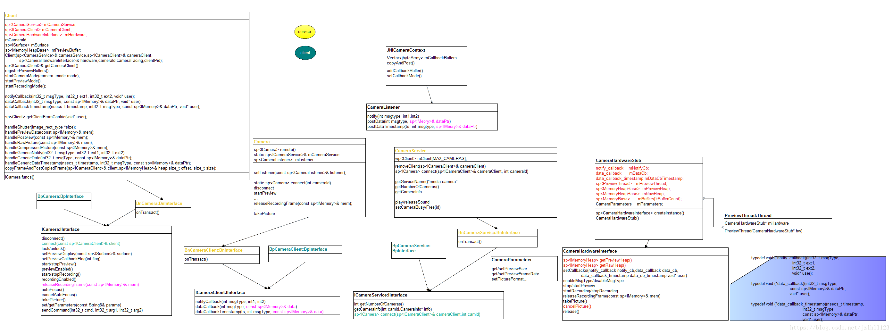

## Android多媒体

### 蓝牙

经典蓝牙

bluetoothAdapter.startDiscovery+广播接收。扫描到BluetoothDevice。

BluetoothServerSocket+BluetoothSocket实现通信。

BLE蓝牙

**基于 GATT 协议**，通过 “服务（Service）” 和 “特征（Characteristic）” 定义数据结构。

GATT：通用属性配置文件，定义了设备间数据交互的规则；
Service：服务，包含多个特征（如 “心率服务” 包含 “心率测量特征”）；
Characteristic：特征，数据的最小单元（可读写、通知）；
    service?.getCharacteristic(UUID_WRITE_CHARACTERISTIC)
    service?.getCharacteristic(UUID_NOTIFICATION_CHARACTERISTIC)
    mNotifyChar 用于接收数据
    mWriteChar 用于发送数据
UUID：服务和特征的唯一标识（如心率测量特征 UUID：00002a37-0000-1000-8000-00805f9b34fb）；
Advertising：BLE 设备广播自身信息（如名称、服务 UUID），供其他设备扫描。
核心 API：

BluetoothLeScanner：BLE 扫描工具（替代经典蓝牙的BluetoothAdapter扫描）；
BluetoothGatt：GATT 客户端，负责连接和数据交互；
BluetoothGattCallback：GATT 操作的回调（连接状态、数据接收等）。

> 业内通过blufi设计的通信，主要是他设计了前3个控制（是否是分包，是否是加密，是否checkSum等）字节+1个字节长度。
>
> 而且还提供了自动分组包，ack机制，wifi列表获取等基础设计。

### android Camera架构

#### camera1

https://blog.csdn.net/jzlhll123/article/details/80870675

用法架构：

Camera、open(),  takePreview， takePicture

SurfaceView

MediaRecorder

系统架构：

camera1架构：

camera api调用到framework native jni层，往下生成native的camera对象。然后去cameraService拿正式的binder代理对象。就形成了cameraService在app进程的代理关系。

那么，所有的操作就都是往cameraService去调用。比如open，takePicture函数都将透传到cameraService去。

然后CameraService，会调用HAL层。

像之前在MTK HAL层他有实现对接更底层的sensor逻辑，是没有开源的。

#### camera2

https://www.cnblogs.com/ymjun/p/13201363.html#_labelTop

APP进程：

上层：CameraDevice，CameraManager，CaptureRequestBuilder，CameraCaptureSession,   Surface。

Jni:

native层：ICameraDevice（callback），ICameraService（callback）

c++ AIDL binder:

CameraServer进程：

cameraService：cameraDeviceClient、CameraService，

​				Camera3Device, CameraProviderManager

HIDL HWBinder:

HAL进程：

HAL3(QCOM CameraProvider, MTK CamHalServer) : ICameraDeviceSession,  ICameraProvider

ioctl:

Sensor Driver

> drive知识：
>
> ioctl提供用户空间程序与内核驱动进行**自定义命令和数据**交互的通道。当标准的 read/write 等操作无法满足需求时使用（如配置设备参数、发送特殊控制指令）。
>
> poll,epoll：允许用户空间程序同时监视多个文件描述符的状态（是否可读、可写、有异常）。
>
> 字符设备：/dev/ttyS0, /dev/mac1, 
>
> 块设备：主要是存储使用。IO操作。
>
> 网络设备：socket通信。

#### MediaRecorder

https://blog.csdn.net/TaylorPotter/article/details/104878815

MPEG4Writer：

主要了解mp4的封装格式。

### surfaceView|TextureView|GLSurfaceView

#### surfaceView

虽然在app的view heirachy中，但是有独立的window独立的surface，对应着独立的surfaceFling中的layer，可以在子线程操作。但是View的属性支持就不够完整了。

#### GLSurfaceView

自带渲染线程的SurfaceView。

#### TextureView

通过操控SurfaceTexture，实现硬件加速层显示。内存消耗更多一些。

### 图片显示

imageView|ImageReader|自定义View（onDraw canvas.drawBitmap）

### 录音

AudioRecord wav pcm数据 添加头部

MediaRecorder 

### 播放音频

AudioTrack（不解码 PCM）

MediaPlayer（创建了解码器）

SoundPool

### Camera

SurfaceView|TextureView

NV21(420SP)

YV12

### MediaExtractor|MediaMuxer

解析和封装MP4

### MediaCodec

硬编码。涉及到buffer可能存在的转码。

### OpenGL|EGL

GLSurfaceView

GLSurfaceView.Renderer

texture

### 编解码

* 音视频解码流程：

解协议**Demuxing**，**HTTP/HTTPS, RTMP, RTSP,** ...

​	输出：MP4, MKV, AVI, 

解封装（音频流，视频流）:解析mp4,flv等容器格式，分离出独立的音频流和视频流。

​	提取pts，dts。

​	输出：压缩音频流AAC，mp3，压缩视频流H.264/265,AV1，VP9等，字幕等。

Decoding音频解码，视频解码：

​	输出：PCM，YUV数据。

送显：

​	重采样，声道转换和混音；

​	色彩空间转换，yuv-rgba, 图像增加等等。

* 音视频编码流程：

采集：声卡（模数转换ADC，得到PCM），摄像头（得到RGB->ISP[降噪、曝光、色彩校正等]->YUV数据）

​	输出：PCM，YUV

预处理：重采样，YUV420p

编码：压缩：

​	输出AAC，H.264...

封装：添加时间戳，形成MP4，FLV，TS

协议：RTSP，RTMP，WebRTC...

#### H.264

宏块16*16 yuv数据。

I帧|P帧|B帧。

GOP画面组。

IDR帧：携带了sps，pps信息。

NALU（NAL unit）裸流单元。

> 分辨率，高帧率起来以后，宏块相似度，出现大量冗余；
>
> 运动矢量的编码算法压缩率降低。

RTMP基于TCP的多媒体传输流，RTSP。

MP4Box协议。

TS格式：TS层（数据流识别和传输的必要信息）、PES层（加了时间戳等数据）、ES层（音视频的数据）。

TS文件由多个TS packet。188字节。

音画同步：

以音频|视频|外部时钟为准的同步源。比较时间差，视频如果播放过快，就加大一些延迟降低播放速度；如果视频播放慢了，则或者加快一些，丢掉一些帧。

### ffmpeg

### TS

### Mp4box

### 协议栈

