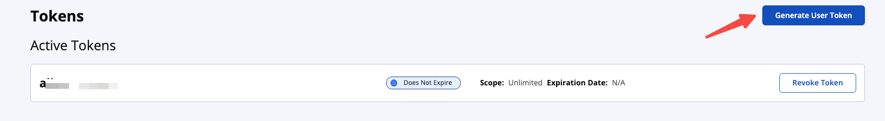

## Android最简化发布aar到mavenCentral

最近折腾jitpack发布，发现他对于项目结构要求比较严格。基本标配就是一个library目录加app，和settings.gradle，gradle这样的配置才行。

多模块或者没有模块都比较麻烦。而且之前我遇到过一次，编译等了足足8个小时。


今天研究了mavenCentral，借助神迹github插件，https://vanniktech.github.io/gradle-maven-publish-plugin/central/，现在已经十分轻松轻快了，而且很方便在android studio中操作。直接推荐。


### 注册

https://central.sonatype.com/ 

推荐直接使用github登录即可。官方推荐使用github。还能分担他们的服务压力。

### namespaces

检查是否有Namespaces， 如图：

没有的话，点击Register New Namespace创建。

https://central.sonatype.org/register/namespace/


### UserName和Password

登录 [Sonatype Central Portal](https://central.sonatype.com/)

点击右上角用户头像 → **View User Tokens**

进入 **Generate User Token**

记录生成的 `username` 和 `password`，保存好，后续不可见，后面使用1️⃣。

# 

```
Username
2xxxXx
Password
Sf111111xxxxdxxxxdddxxxK
```


### GPG

```
# 安装 GPG
brew install gnupg

# 安装 pinentry-mac（用于密码输入）
brew install pinentry-mac

# 验证安装
gpg --version
```

也可以选择，自己下载：[下载地址](https://www.gnupg.org/download/index.html)

安装完成后在控制台输入`gpg --version`，即可查看版本号。


生成gpg密钥对：

```
# 生成密钥（推荐使用 RSA 4096）
gpg --full-generate-key
```

操作（这里最后的passphrase密码，后面有用2️⃣）：

```
请选择您要使用的密钥类型：
   (1) RSA 和 RSA
   (2) DSA 和 Elgamal
   (3) DSA（仅用于签名）
   (4) RSA（仅用于签名）
   (9) ECC（签名和加密）
  (10) ECC（仅用于签名）
您的选择是？ 1

RSA 密钥的长度应在 1024 位与 4096 位之间。
您想要使用的密钥长度？(3072) 4096

请设定这个密钥的有效期限。
         0 = 密钥永不过期
密钥的有效期限是？(0) 0

真实姓名： Your Name
电子邮件地址： your-email@example.com
注释： Maven Central Deploy Key

# 设置一个强密码（passphrase），后续需要使用
```

查看（丢失了可以重复查看，后面有用3️⃣）：

```
# 列出所有密钥
gpg --list-keys

# 列出私钥及 keygrip（用于免密配置）
gpg --list-secret-keys --keyid-format LONG

### 输出结果：
----------------------------------
pub   rsa4096/123213131423 2026-01-01 [SC]
      xxxxxxxxxxxxxxxxxxxxxxxxxxxxxxxxxABCD1234
uid                 [ultimate] Your Name <your-email@example.com>
sub   rsa4096/XXXXXXXXXXXXXXXX 2026-01-01 [E]


```

上传到公开的密钥服务器(任一成功即可) :

```
gpg --keyserver keys.openpgp.org --send-keys xxxxxxxxxxxxxxxxxxxxxxxxxxxxxxxxxABCD1234
gpg --keyserver pgp.mit.edu --send-keys xxxxxxxxxxxxxxxxxxxxxxxxxxxxxxxxxABCD1234
gpg --keyserver keyserver.ubuntu.com --send-keys xxxxxxxxxxxxxxxxxxxxxxxxxxxxxxxxxABCD1234
```

导出(后面有用4️⃣)：

```
gpg --export-secret-keys -o /Documents/xxx/xxx/secring.gpg
```

### 配置属性

接下来，完形填空。创建配置文件，并添加上面操作的：1️⃣，2️⃣，3️⃣，4️⃣。、

3️⃣，注意只要**最后的8位**：

```
touch ~/.gradle/gradle.properties

# 1️⃣
mavenCentralUsername=2xxxXx
mavenCentralPassword=Sf111111xxxxdxxxxdddxxxK
# 2️⃣
signing.password=xxxx
# 3️⃣ 
signing.keyId=abcd1234 
# 4️⃣
signing.secretKeyRingFile=/Users/xxx/XXX/secring.gpg

```


### 集成插件

直接在module的build.gradle中集成：

```kotlin
plugins {
		...
    id("com.vanniktech.maven.publish") version "0.35.0"
}

mavenPublishing {
  publishToMavenCentral()

  signAllPublications()
}

mavenPublishing {
  coordinates("com.example.mylibrary", "library-name", "1.0.3")

  pom {
    name = "My Library"
    description = "A description of what my library does."
    inceptionYear = "2026"
    url = "https://github.com/username/mylibrary/"
    licenses {
      license {
        name = "The Apache License, Version 2.0"
        url = "http://www.apache.org/licenses/LICENSE-2.0.txt"
        distribution = "http://www.apache.org/licenses/LICENSE-2.0.txt"
      }
    }
    developers {
      developer {
        id = "username"
        name = "User Name"
        url = "https://github.com/username/"
      }
    }
    scm {
      url = "https://github.com/username/mylibrary/"
      connection = "scm:git:git://github.com/username/mylibrary.git"
      developerConnection = "scm:git:ssh://git@github.com/username/mylibrary.git"
    }
  }
}
```

多个模块的时候，复制这些到其他子模块。修改其他的配置version，name等模块信息。


### 发布

然后选择模块下的publishToMavenCentral，点击。你不用编译，他自己会编译。


注意这个时候，还没有发成功，可能需要几十秒到几分钟：

再上到https://central.sonatype.com/publishing。点击发布：


发布成功！