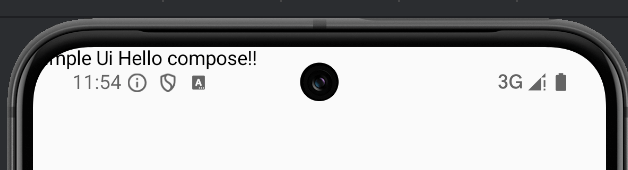
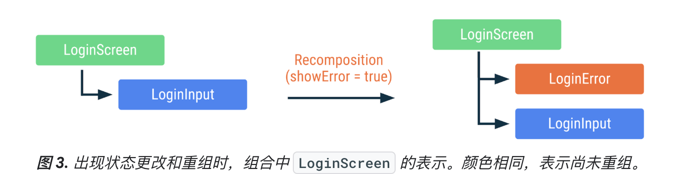

https://developer.android.google.cn/develop/ui/compose/documentation?hl=zh-cn


## 接入

```kotlin
dependencies {

    val composeBom = platform("androidx.compose:compose-bom:2026.02.01")
    implementation(composeBom)
    androidTestImplementation(composeBom)

    // Choose one of the following:
    // Material Design 3
    implementation("androidx.compose.material3:material3")
    // or skip Material Design and build directly on top of foundational components
    implementation("androidx.compose.foundation:foundation")
    // or only import the main APIs for the underlying toolkit systems,
    // such as input and measurement/layout
    implementation("androidx.compose.ui:ui")

    // Android Studio Preview support
    implementation("androidx.compose.ui:ui-tooling-preview")
    debugImplementation("androidx.compose.ui:ui-tooling")

    // UI Tests
    androidTestImplementation("androidx.compose.ui:ui-test-junit4")
    debugImplementation("androidx.compose.ui:ui-test-manifest")

    // Optional - Add window size utils
    implementation("androidx.compose.material3.adaptive:adaptive")

    // Optional - Integration with activities
    implementation("androidx.activity:activity-compose:1.12.4")
    // Optional - Integration with ViewModels
    implementation("androidx.lifecycle:lifecycle-viewmodel-compose:2.10.0")
    // Optional - Integration with LiveData
    implementation("androidx.compose.runtime:runtime-livedata")
    // Optional - Integration with RxJava
    implementation("androidx.compose.runtime:runtime-rxjava2")

}
```


## **选择compose的理由**

更少代码，更直观。

可以构建不与特定 activity 或 fragment 相关联的小型无状态组件。

改进无障碍，布局。

动画更轻松。


## **编程思想**

* **View框架：**

​	命令式UI模型。通过findViewById得到元素，直接修改界面元素的属性，修改了内部状态。

​	通过加载xml实例化widget树。每一个widget内部又有自己的状态，通过getter/setter直接与widget交互。


* **compose框架：**

  整个行业都转向**声明性编程范式**。在概念上从头开始重新生成整个屏幕，然后仅执行必要的更改。这对框架提出的挑战是如何智能地减少重绘的资源消耗。在声明式方法中，widget不暴露setter/getter函数，也是相对的没有状态。这样通过ViewModel观察数据变更后，Composable函数就可以将当前应用状态转变为UI。

  

* **数据沿着可组合函数层次往下流动**：

  应用会向顶级composable函数提供数据，沿着层级结构向下传递：


* **事件沿着可组合函数层次向上传递**：
  用户与UI元素交互，触发事件，进而app使用新数据再次调用Composable函数刷新界面。这叫做*recomposition*(重组)。


## **简单认识Compose**

### 简单UI

```kotlin
@Composable
fun SimpleTestUi(name: String) {
    Text("Simple Ui $name!")
}

override fun onCreate(savedInstanceState: Bundle?) {
    super.onCreate(savedInstanceState)
    enableEdgeToEdge()
    setContent {
        SimpleTestUi("Hello compose!") //暂时没有考虑主题，没有考虑statusBar padding问题，后续学习。
    }
}
```



>  不要管为什么顶在statusBar上面。android15的edgeToEdge默认沉浸式。后面再学习。1️⃣

* `@Composable`注解。交给编译器转变为界面。
* 可以入参。
* 没有返回值。因为我们期待的屏幕的状态，而不是一个组件。
* `Text()`是一个composable函数，还可以结合其他composable函数来生成UI层次结构。


**另外一个例子，带remember stateOf的状态显示：**

```kotlin
@Composable
fun ClickCounter(clicks: Int, onClick: () -> Unit) {
    Button(onClick = onClick) {
        Text("I've been clicked $clicks times")
    }
}

override fun onCreate(savedInstanceState: Bundle?) {
    super.onCreate(savedInstanceState)
    enableEdgeToEdge()
    setContent {
        AndroidCompontsTheme {
            Scaffold(modifier = Modifier.fillMaxSize()) { innerPadding ->
                MainUi(
                    name = "Android",
                    modifier = Modifier.padding(innerPadding)
                )
            }
        }
    }
}

@Composable
fun MainUi(name: String, modifier: Modifier = Modifier) {
    // 使用remember和mutableStateOf创建Compose状态变量
    var clicks by remember { mutableIntStateOf(0) }

    Column(
        modifier = modifier.background(
            color = Color.Transparent,
            shape = RoundedCornerShape(Dp(4f))
        ),
        horizontalAlignment = Alignment.CenterHorizontally
    ) {
        ClickCounter(clicks) {
            clicks++
        }
    }
}
```

### Composition组合

```kotlin
@Composable
fun LoginScreen(showError: Boolean) {
    if (showError) {
        LoginError()
    }
    LoginInput() // This call site affects where LoginInput is placed in Composition
}

@Composable
fun LoginInput() { /* ... */ }

@Composable
fun LoginError() { /* ... */ }
```

**组合**：

​	指的就是应用程序的用户界面，通过运行这些Composable函数来生成的。

​	组合就是一个用来描述用户界面的树结构。


### Recomposition（重组）

在命令式界面模型中，如需更改某个 widget，您可以在该 widget 上调用 setter 以更改其内部状态。

在 Compose 中，您可以使用新数据再次调用Composable函数。

#### **重组**

​	是指在输入更改时再次调用Composable函数的过程。当 Compose 根据新输入重组时，它仅调用可能已更改的函数或 lambda，而跳过其余函数或 lambda。通过跳过所有未更改参数的函数或 lambda，Compose 可以高效地重组。





#### 避免和注意

为了避免**Side-Effect**（翻译：**附带效应** 或者 **副作用**），保持高效的重组，

**3个避免**：

* 避免写入共享对象的属性；
* 避免更新`ViewModel`中的可观察对象；
* 避免更新`SharedPreferences`等耗时操作且导致状态不一致问题

为了尽可能高效的刷新UI，避免刷新不需要更新的其他组件部分。

所有可组合函数或 lambda 表达式的执行都应该无副作用。当你需要执行副作用操作时，请从回调函数中触发它。

当Compose认为可组合项的参数可能已发生变化时，重组就会开始。重组是*乐观的*，这意味着Compose期望在参数再次变化之前完成重组。如果某个参数在重组完成前*确实*发生了变化，Compose可能会取消当前重组，并使用新参数重新开始。当重组被取消时，Compose 会丢弃此次重组生成的 UI 树。如果您有任何依赖于正在显示的 UI 的副作用，即使重组被取消，这些副作用也会被应用。这可能会导致应用状态不一致。为了应对乐观重组，确保所有可组合函数和lambda表达式都是幂等的且无副作用。

如果您的可组合函数需要数据，它应该为这些数据定义参数。然后，您可以将耗时的工作转移到Composable之外的另一个线程，并使用`mutableStateOf`或`LiveData`将数据传递给Compose。

**5个注意：**

- 重组会跳过尽可能多的可组合函数和 lambda。
- 重组是乐观的操作，可能会被取消。
- 可组合函数可能会像动画的每一帧一样非常频繁地运行。
- 可组合函数可以并行执行。
- 可组合函数可以按任何顺序执行。

总结来讲，

3个避免：指的是，让composable函数不要跟耗时和副作用联系；

5个注意：指的是这些函数的执行是不可控的，可能是并行的，可能是任意顺序的，也可能很频繁，也可能不执行。这就要求我们写出保持快速、幂等且没有副作用的代码。


### ~~构建自适应应用~~

~~根据应用显示的变化（主要是应用窗口的大小）来更改布局，还能适应可折叠设备折叠状态的变化（例如折叠状态），以及屏幕密度和字体大小的变化。还可以动态替换组件或者隐藏显示内容。比如双窗格变成列表之类。~~

- ~~使用窗口大小类别来做出布局决策~~
- ~~使用 Compose Material 3 自适应库进行构建~~
- ~~支持触控以外的输入方式~~

~~todo [构建自适应应用  | Jetpack Compose  | Android Developers](https://developer.android.google.cn/develop/ui/compose/build-adaptive-apps?hl=zh-cn)~~

~~暂时看来本章节，不用学习。后续再回头来做学习。~~


## 第一课结束 todoList

第一课结束后，留下了大量问题：

| 问题列表                                                     |
| ------------------------------------------------------------ |
| Side-Effect （副作用）是什么? “乐观”重组，这个事情看下来我们需要好好处理下副作用。 |
| 数据采用State (remember + mutableStateOf/...)方式承载。 State/mutableStateOf ? |
| flow如何结合？                                               |
| 前面看到了，该如何正确的做异步？似乎我们是有state来持有和更新数据，结合到flow，viewModel该如何做。 |
| Size相关，statusBar padding，边衬区....                      |

全屏相关：

[设置全屏显示  | Jetpack Compose  | Android Developers](https://developer.android.google.cn/develop/ui/compose/system/setup-e2e?hl=zh-cn#padding-modifiers)

safeDrawingPadding 用于Compose的边衬区：

https://developer.android.google.cn/develop/ui/compose/system/insets-ui?hl=zh-cn

而View使用：

[边衬区：应用圆角  | Views  | Android Developers](https://developer.android.google.cn/develop/ui/views/layout/insets/rounded-corners?authuser=4&hl=zh-cn)


