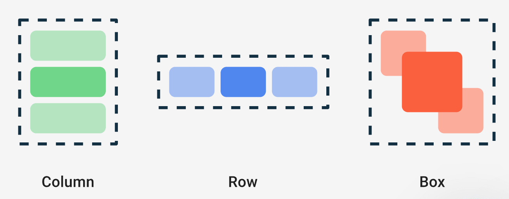

Compose通过以下方法把State转成了UI:

```
State-> Composition(组合) -> Layout (布局) -> Drawing (绘制) -> UI
```

本文章讲述`Layout`部分，一些代码块来帮助我们对于UI元素的布局。

### 一、目标

- 高性能：只测量一次子项。能更高效的遍历更深的界面树。以前的View系统就是O(n方)。这是通过**固有特性测量(其他章节有介绍)**实现的。

- 更轻松地自定义layouts：其他章节介绍。

  

### 二、基本示例

示例，就是一个Composable函数，可以包含多个界面元素，但是他们堆叠在一起：

```''
@Composable
fun ArtistCard() {
    Text("Alfred Sisley")
    Text("3 minutes ago")
}
```


因此Compose提供了一些标准的布局来排列元素。大部分情况只使用标准布局元素（layout包下的类）就好了。

比如：

```kotlin
//1. Column
@Composable
fun ArtistCardColumn() {
    Column { //追加了Column垂直布局，就让他们竖向往下排列显示；
        Text("Alfred Sisley")
        Text("3 minutes ago")
    }
}

//2. Row + Colunm
@Composable
fun ArtistCardRow(artist: Artist) {
    Row(verticalAlignment = Alignment.CenterVertically) { //使用Row，就可以水平的排列显示；
        Image(bitmap = artist.image, contentDescription = "Artist image")
        Column {
            Text(artist.name)
            Text(artist.lastSeenOnline)
        }
    }
}

//3. Box
@Composable
fun ArtistAvatar(artist: Artist) {
    Box { //使用 Box 可将元素放在其他元素上。Box 还支持为其包含的元素配置特定的对齐方式。
        Image(bitmap = artist.image, contentDescription = "Artist image")
        Icon(Icons.Filled.Check, contentDescription = "Check mark")
    }
}
```




还可以通过设置Row的`horizontalArrangement` 和 `verticalAlignment`参数，Column设置，`verticalArrangement` 和 `horizontalAlignment`，调整位置:

```kotlin
Row(
      verticalAlignment = Alignment.CenterVertically,
      horizontalArrangement = Arrangement.End
  ) {
      Image(bitmap = artist.image, contentDescription = "Artist image")
      Column { /*...*/ }
  }
```

**Compose 可以有效地处理嵌套布局，不用像View体系那样害怕嵌套！**


### 三、布局模型与性能

父节点会在其子节点之前进行测量，但会在其子节点的尺寸和放置位置确定之后再对自身进行调整。compose通过一次测量子项，避免多次测量O(n2)的性能问题。

后续章节：Compose固有特性测量。会详细介绍。

#### Android View体系的多层测量困境

Android View体系采用自顶向下的递归测量模式，核心缺陷是允许子View反向影响父View尺寸，形成双向尺寸依赖，这也是其测量效率低下的根源。

其中wrap_content，weight等常用布局属性，会加剧低效，因为设置wrap_content的父View需完全依赖所有子View的测量结果才能确定自身尺寸，而子View若也设置wrap_content，又需依赖自身子View的测量结果，形成嵌套依赖。这种依赖在带weight的LinearLayout、RelativeLayout等场景中会触发多次测量，且无强制测量次数限制，当布局层级加深时，每层的重复测量会递归叠加，最终使测量复杂度达到O(n²)，造成严重的性能内耗。

#### Compose的单次测量优势

Compose通过严格的设计规则彻底解决了测量低效的问题，其核心是强制单次测量原则，每个子组件在每次布局传递中仅能被测量一次，一旦违反就会抛出运行时异常，从根源上杜绝重复测量。

它的测量流程遵循单向数据流，父节点向下传递宽高约束，子节点在约束范围内确定自身尺寸后向上返回结果，不允许反向修改父节点的约束，也不会出现回溯测量的情况。

针对组件间的尺寸依赖问题，Compose引入固有特性测量机制，父组件可提前查询子组件的固有尺寸（非二次测量），以此确定合适的约束后再进行正式测量。这种设计让Compose无论布局层级多深，测量复杂度都能稳定保持为O(n)，大幅提升了UI渲染效率。


### 四、修饰符（Modifiers）

下一章节重点讲述，这里概述。

```kotlin
@Composable
fun ArtistCardModifiers(
    artist: Artist,
    onClick: () -> Unit
) {
    val padding = 16.dp
    Column(
        Modifier
            .clickable(onClick = onClick)
            .padding(padding)
            .fillMaxWidth()
    ) {
        Row(verticalAlignment = Alignment.CenterVertically) { /*...*/ }
        Spacer(Modifier.size(padding))
        Card(
            elevation = CardDefaults.cardElevation(defaultElevation = 4.dp),
        ) { /*...*/ }
    }
}
```

在上面的代码中，结合使用了不同的修饰符函数。

- `clickable` 使可组合项响应用户输入，并显示涟漪。
- `padding` 在元素周围留出空间。
- `fillMaxWidth` 使可组合项填充其父项为它提供的最大宽度。
- `size()` 指定元素的首选宽度和高度。


### 五、其他

可滚动布局

https://developer.android.google.cn/develop/ui/compose/touch-input/pointer-input/understand-gestures?hl=zh-cn

https://developer.android.google.cn/develop/ui/compose/lists?hl=zh-cn

todo

自适应布局

BoxWithConstraints

todo

基于槽位的布局

Scaffold提供了TopAppBar，BottomAppBar，FloatingActionButton，Drawer提供了槽位，轻松放置且正确协同工作。