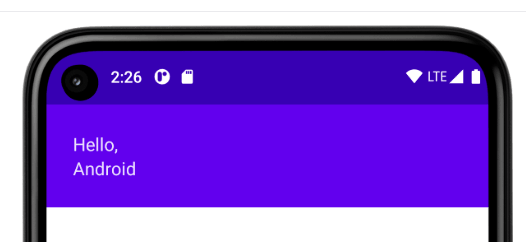
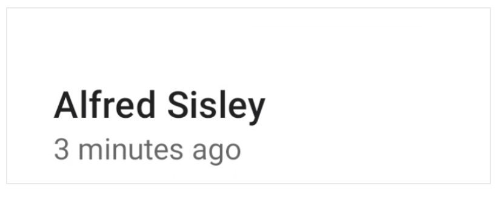

## Compose 修饰符

借助修饰符，您可以修饰或扩充可组合项。您可以使用修饰符来执行以下操作：

- 更改可组合项的大小、布局、行为和外观
- 添加信息，如无障碍标签
- 处理用户输入
- 添加高级互动，如使元素可点击、可滚动、可拖动或可缩放。


### 基本示例

修复符就是kotlin对象，提供了很多类函数来创建修饰符。

```kotlin
@Composable
private fun Greeting(...) {
    Column(
        modifier = Modifier
            .padding(24.dp)
            .fillMaxWidth()
    ) {
        Text(text = "Hello,")
        Text(text = name)
    }
}
```



在上面的代码中，结合使用了不同的修饰符函数:

- `padding` 在元素周围留出空间。
- `fillMaxWidth` 使可组合项填充其父项为它提供的最大宽度。

最佳实践是让所有可组合项接受 `modifier` 参数，并将该修饰符传递给其发出界面元素的第一个子项。

> 最佳实践：自定义 Compose 组件 → 必须像 View 体系一样，有「唯一的根父控件」
>
> 1. 不能直接暴露**多个并列、无包裹的元素**（比如直接写两个并列 Row，外面不包布局）；
> 2. 外部传入的 `modifier`，**只绑定这个唯一的根父控件**；
> 3. 这个 `modifier` 负责控制**整个组件的基础约束**（大小、边距、位置、点击、外层布局行为）。
>
> - **View**：自定义控件 → 必须继承 `LinearLayout/RelativeLayout`（唯一根父控件），外部设置 `layout_width/margin/padding` → 作用于**整个根父控件**；
> - **Compose**：自定义可组合项 → 必须用 `Column/Row/Box` 包成**唯一根布局**，外部传 `modifier` → 作用于**整个根布局**。


### 顺序很重要

```kotlin
Modifier.padding(20dp).clickable {}
```

执行逻辑：

1. 先给组件**加 20dp 内边距**，把组件整体撑大；
2. 再给，撑大后的整个区域加点击。

✅ 结果：内边距的空白区域也能点击。

```kotlin
Modifier.clickable {}.padding(20dp)
```

1. 先给**组件原始大小**加点击；
2. 再在点击区域外面加 20dp 空白。

✅ 结果：只有原始组件能点击，空白内边距点了没反应。

**一句话总结**：**修饰符越靠前，作用范围越大**。

#### 没有margin只有padding

View 体系：**分两个属性**

- `padding`：内边距（元素内部空白，点击有效）
- `margin`：外边距（元素外部空白，点击无效）

Compose 体系：**只有一个 `padding`**

没有专门的`margin`修饰符！**用 `padding` + 修饰符顺序，直接模拟出 margin 和 padding 两种效果**：

1. 想做 **View 的 margin（外边距）** → `padding` 放最前面
2. 想做 **View 的 padding（内边距）** → `padding` 放后面


### 常用内置修饰符

Compose 自带的布局（`Column`/`Row`/`Box`），**默认行为是：父布局包裹子元素的大小**。子元素多大，父布局就多大；

完全等价于 ViewGroup 的 `wrap_content`！

- View：`layout_width="wrap_content"` → 包裹子元素
- Compose：布局不加修饰符 → 默认包裹子元素

#### size相关

- `size`

  使用`size()`来设置尺寸：

  ```kotlin
  @Composable
  fun ArtistCard(/*...*/) {
      Row(
          modifier = Modifier.size(width = 400.dp, height = 100.dp)
      ) {
          Image(/*...*/)
          Column { /*...*/ }
      }
  }
  ```

  如果指定的尺寸不符合来自布局父项的约束条件，则可能不会采用该尺寸。

- `requiredSize`

  如果您希望可组合项的尺寸固定不变，而不考虑传入的约束条件，请使用 `requiredSize` 修饰符：

  在此示例中，即使父项的 `height` 设置为 `100.dp`，`Image` 的高度还是 `150.dp`，因为 `requiredSize` 修饰符优先级较高。将 `requiredSize` 等修饰符直接传递给子项，替换子项从父项接收的约束条件。父项会将子项的 `width` 和 `height` 值视为已根据父项提供的约束条件强制转换过。然后，布局系统会假定子项遵守这些约束条件，将子项居中放置在父项分配的空间中。

  ```kotlin
  @Composable
  fun ArtistCard(/*...*/) {
      Row(
          modifier = Modifier.size(width = 400.dp, height = 100.dp)
      ) {
          Image(
              /*...*/
              modifier = Modifier.requiredSize(150.dp) //高优先级
          )
          Column { /*...*/ }
      }
  }
  ```

- `wrapContentSize`

  通过对子项应用 `wrapContentSize` 修饰符来取消默认的居中行为。

  ```kotlin
  Modifier.wrapContentSize(
      align: Alignment = Alignment.TopStart, // 默认：左上，改这个参数，就能实现任意对齐方式。
      unbounded: Boolean = false 
  )
  ```

  Alignment.TopStart左上（默认）

  Alignment.TopEnd右上

  Alignment.BottomStart左下

  Alignment.BottomEnd右下

  Alignment.BottomCenter底部居中

  Alignment.CenterStart左居中


#### padding,offset相关

- `padding`

​	如需在整个元素周围全添加内边距使用`padding`。

- `paddingFromBaseLine`

  如需在文本基线上方添加内边距，以实现从布局顶部到基线保持特定距离，请使用 `paddingFromBaseline` 修饰符。

  ```kotlin
  @Composable
  fun ArtistCard(artist: Artist) {
      Row(/*...*/) {
          Column {
              Text(
                  text = artist.name,
                  modifier = Modifier.paddingFromBaseline(top = 50.dp)
              )
              Text(artist.lastSeenOnline)
          }
      }
  }
  ```

  


- `offset`

  如需相对于原始位置放置布局，请添加 `offset`修饰符，并设置在 **x** 轴和 **y** 轴的偏移量。偏移量可以是正数，也可以是非正数：

  ```kotlin
  @Composable
  fun ArtistCard(artist: Artist) {
      Row(/*...*/) {
          Column {
              Text(artist.name)
              Text(
                  text = artist.lastSeenOnline,
                  modifier = Modifier.offset(x = 4.dp)
              )
          }
      }
  }
  ```

  `padding` 和 `offset` 之间的区别在于，向可组合项添加 `offset` 不会改变其测量结果：

  

   `padding内边距`：给元素加空白 → 元素的**测量宽高变大** → 周围的布局会给它留足空间 → 不会重叠。**会改变元素占用的空间大小**（影响布局）。类似View 的 `setPadding()`（改变 View 大小）

   `offset偏移`：把元素**平移**→ 元素的**测量宽高完全不变** → 周围布局不知道它挪了位置 → 可能和其他元素重叠。**只挪位置，不改变空间大小**（不影响布局），类似View 的 `translationX/translationY`（只移动，不改变 View 大小）

  **和 View 体系对比**：

  

  有两种重载函数:

​	偏移量参数和采用lambda的offset。https://developer.android.google.cn/develop/ui/compose/performance?hl=zh-cn#defer-reads性能章节会讲述。

 

- `absoluteOffset`

  如果您需要设置偏移量，而不考虑布局方向，该修饰符中的正偏移值一律会将元素向右移。


#### fillMax相关

- `fillMaxSize` & `fillMaxWidth` & `fillMaxHeight`

  子布局填充父项允许的所有可用高度、宽度，高宽。

## Compose 中的作用域安全

Compose 作用域安全：**编译器直接禁止错误用法！**比如：

你想在 Row 里用 `matchParentSize()` → **直接报错，编译不通过**

你想在 Box 里用 `weight()` → **直接报错，编译不通过**

View 体系的问题：没有作用域安全！全靠你自己试错！比如：

你在 `LinearLayout` 里才能用 `layout_weight`

你在 `RelativeLayout` 里才能用 `layout_alignParentTop`

你在 `ConstraintLayout` 里才能用 `layout_constraintLeft_toLeftOf`

但 View 不会提示你！你写了，编译也能过，**运行时才发现无效、布局错乱**。

| 父布局（所属作用域）                             | 修饰符名称          | 核心作用                                                     |
| :----------------------------------------------- | ------------------- | ------------------------------------------------------------ |
| **Box**(BoxScope)                                | `matchParentSize()` | 子项尺寸完全跟随父 Box 大小，**不会撑大父布局**，仅适配父现有尺寸 |
| **Box**(BoxScope)                                | `align()`           | 控制子项在 Box 内的对齐方式（居中、左上、右下、底部等）      |
| **Row**(RowScope)                                | `weight()`          | 按比例分配 Row 的**剩余宽度**，实现子项按权重占比布局        |
| **Row**(RowScope)                                | `alignByBaseline()` | 让 Row 内多个子项按**文本基线对齐**，保证文字排版整齐        |
| **Column**(ColumnScope)                          | `weight()`          | 按比例分配 Column 的**剩余高度**，实现子项按权重占比布局     |
| **Column**(ColumnScope)                          | `alignByBaseline()` | 让 Column 内子项按文本基线对齐，适配文字排版                 |
| LazyColumn/LazyRow<br />/LazyGrid(LazyListScope) | `stickyHeader()`    | 实现列表吸顶粘性头部，滚动时固定在顶部                       |
| Scaffold(ScaffoldScope)                          | `scaffoldPadding()` | 应用 Scaffold 的安全内边距，避免内容被顶部栏、底部栏遮挡     |

比如：

`matchParentSize`只会跟随父Box大小，就像ConstraintLayout一样，4个方向约束layout_constraintXXX_toXXXOf="parent"；

而`fillMaxSize()`将占用父项允许的所有可用空间，反过来使父项展开并填满所有可用空间。

`weight` 与LinearLayout的效果一样。


## Compose 修饰符 复用

修饰符是**链式拼接**的，顺序决定效果；

修饰符是**固定对象**，可以存起来反复用。

为了**省事和性能**，多个组件用一样的样式（边距、背景、大小），写一次，到处用，统一修改。页面刷新（重组）、动画、列表滚动时，**不会反复新建修饰符对象**，减少卡顿。

### 简单示例1：无作用域修饰符（通用修饰符）

 适用：`padding`/`background`/`size`/`fillMaxWidth` 等所有通用修饰符

定义成**全局变量**，任何组件都能用：

```kotlin
// 定义一次
val commonStyle = Modifier
    .fillMaxWidth()
    .background(Color.Red)
    .padding(12.dp)

// 多个组件直接复用
@Composable
fun MyPage() {
    Text(modifier = commonStyle, text = "标题")
    Button(modifier = commonStyle, onClick = {}, text = "按钮")
}
```

### 常用示例2：动画 / 列表 必须复用（性能）

动画场景（每秒刷新几十次）：避免每次刷新都新建修饰符，浪费性能，提取出去，只创建一次

列表场景（LazyColumn）：避免每个 item 都新建修饰符，提取复用，列表滑动更流畅

```kotlin
// 列表item统一样式
val itemStyle = Modifier
    .padding(12.dp)
    .size(100.dp)

@Composable
fun MyList() {
    LazyColumn {
        items(data) {
            Image(modifier = itemStyle) // 直接复用
        }
    }
}
```

### 进阶用法1：有作用域修饰符（weight/align/...）

`weight`/`align` 这类修饰符，**只能在对应父布局内提取**，不能写全局！

```kotlin
Column {
    // 在Column作用域内提取weight样式
    val textStyle = Modifier
        .weight(1f)
        .align(Alignment.CenterHorizontally)

    // 直接复用
    Text(modifier = textStyle)
    Text(modifier = textStyle)
}
```

作用域修饰符**不能跨布局用**：Column 里提取的`weight`，给 Box 里面的组件用 → 直接无效！

### 进阶用法2：复用的修饰符，追加效果

用 `.then()` 或者直接拼接，给通用样式加**独有的效果**

```kotlin
// 通用基础样式
val baseStyle = Modifier.padding(10.dp)

// 复用 + 额外加点击
Text(modifier = baseStyle.clickable {})

// 复用 + 额外加背景
Button(modifier = baseStyle.background(Color.Blue))
```
