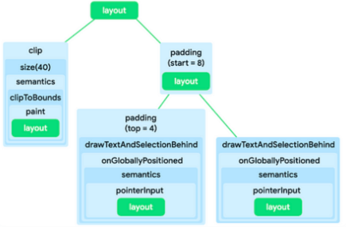
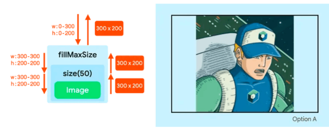
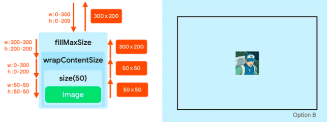

## 约束条件和修饰符顺序

多个修复符串起来，可以修改composable的外观和风格，而串起来的修饰符链，会影响约束条件，进而影响composable的测量和layout。

### UI Tree设计中的节点和Modified

向可组合项添加多个修饰符会创建修饰符链。当您串联多个修饰符时，每个修饰符节点都会*封装链的其余部分和布局节点*。例如，当您链接 `clip` 和 `size`修饰符时，`clip` 修饰符节点会封装 `size` 修饰符节点，后者随后会封装 `Image` 布局节点。

```kotlin
Image(
  ...,
  Modifier
  .clip(Circleshape)
  .size(40.dp)
)
```

总结：

- 同一时间只能绑 **1 个** 组件；但可以**反复复用**给不同组件， `Modifier` 实例可以被多个组件**分别引用**



是不是像看天书？其实这一小节讲的是Compose设计概念。

**修饰符**：UI 树中是**线性单链**，只能一对一包裹，控制右边所有内容的**约束条件**和**绘制范围** → 决定了它只能修改「单个组件」的约束、样式、事件；

**布局节点**：UI 树中是**多分支结构**，可以管理多个子节点 → 决定了它能排列、摆放多个组件。


### 布局阶段的限制

我们先理解Compose的显示算法：所有组件定大小、摆位置，永远遵循这 3 步：

1. **测量子项**：父组件先量孩子能多大
2. **确定自身尺寸**：根据孩子大小，定自己的宽高
3. **放置子项**：把孩子放在自己里面的位置

而**约束条件（Constraints）** 就是 父给子的**尺寸做了限定：规定子组件最小多小、最大多大**，子组件必须在这个范围内选大小。

#### 限制条件

有界约束，无界限约束，精确约束。还可以组合它们，比如限制宽度，但是高度不受限制。

Compose 布局测量采用**深度优先**遍历方式，父节点将尺寸约束逐层传递给子节点（修饰符链会原样转发或修改约束），叶子节点依据约束确定自身大小后回传，父节点再根据所有子节点的测量结果确定自身尺寸并向上回传，最终完成整个界面树的尺寸测量。

**常用影响约束条件的修饰符**：

| 修饰符族群     | 具体修饰符                                                   | 约束修改逻辑（核心作用）                     | 关键特性                             |
| -------------- | ------------------------------------------------------------ | -------------------------------------------- | ------------------------------------ |
| **固定尺寸族** | `size(size: Dp)``size(width: Dp, height: Dp)`                | 将宽 / 高的**min=max**设为指定值，遵守父约束 | 优先服从父约束，超出则被限制         |
| **强制尺寸族** | `requiredSize(size: Dp)``requiredSize(width: Dp, height: Dp)` | 直接**替换**父约束，强制设为指定宽高         | 无视父约束，超出后居中显示           |
| **单边尺寸族** | `width(width: Dp)``height(height: Dp)`                       | 仅修改**单个方向**的约束，另一方向保持原样   | 只控制宽 / 高其中一个维度            |
| **尺寸范围族** | `sizeIn(minWidth, maxWidth, minHeight, maxHeight)`           | 自定义宽高的**最小 / 最大约束范围**          | 精细控制尺寸区间，灵活适配           |
| **填充父级族** | `fillMaxSize()``fillMaxWidth()``fillMaxHeight()`             | 将对应方向的**min=max = 父最大可用尺寸**     | 强制撑满父容器，修改为精确约束       |
| **包裹内容族** | `wrapContentSize(align: Alignment)`                          | 重置约束为**自适应内容大小**，取消强制填充   | 解除精确约束，恢复 wrap 模式         |
| **间距约束族** | `padding(all: Dp)``padding(horizontal/vertical)`             | 缩小传入的约束范围，为子项预留内边距空间     | 修改约束边界，不改变组件实际测量大小 |

以上所有修饰符**均会直接修改父→子传递的约束条件**，属于核心约束类修饰符；

`align`/`offset`/`clip`/`background` 等**不修改约束**，仅控制位置、绘制，不属于约束类修饰符；

约束类修饰符**顺序直接决定最终约束结果**，后序修饰符需遵守前序修饰符修改后的约束。

```kotlin
Image(
    painterResource(R.drawable.hero),
    contentDescription = null,
    Modifier
        .fillMaxSize()
        .size(50.dp)
)
```



```kotlin
Image(
    painterResource(R.drawable.hero),
    contentDescription = null,
    Modifier
        .fillMaxSize()
        .wrapContentSize()
        .size(50.dp)
)
```



### **实际应用建议**

1. **需要固定尺寸**：直接使用 `size()`，避免与 `fillMaxSize()` 组合
2. **需要内容自适应**：使用 `wrapContentSize()` + `sizeIn()` 组合，提供最小/最大尺寸限制
3. **需要居中显示**：`fillMaxSize()` + `wrapContentSize()` + `size()` 是经典组合，可实现**内容居中**且**尺寸可控**
4. **避免冲突**：不要同时使用 `size()` 和 `fillMaxSize()`，除非你明确知道约束传递机制
