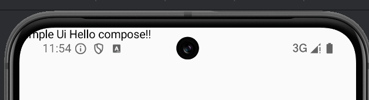

### 简介

[Jetpack Compose UI App Development Toolkit - Android Developers](https://developer.android.google.cn/compose)

官方文档学习

* **选择compose的理由**

更少代码，更直观。

可以构建不与特定 activity 或 fragment 相关联的小型无状态组件。

改进无障碍，布局。

动画更轻松。

#### **编程思想**

View框架：命令式UI模型。通过findViewById得到元素，直接修改界面元素的属性，修改了内部状态。

​	通过加载xml实例化widget树。每一个widget内部又有自己的状态，通过getter/setter直接与widget交互。


compose框架：整个行业都转向声明式UI模型。现在是，在概念上从头开始重新生成整个屏幕，然后仅执行必要的更改。这对框架提出的挑战是如何智能地减少重绘的资源消耗。

​	在声明式方法中，widget不暴露setter/getter函数，也是相对的没有状态。这样通过ViewModel观察数据变更后，Composable函数就可以将当前应用状态转变为UI。

**数据沿着可组合函数层次往下流动**：应用会向顶级composable函数提供数据，沿着层级结构向下传递：


**事件沿着可组合函数层次向上传递**：用户与UI元素交互，触发事件，进而app使用新数据再次调用Composable函数刷新界面。这叫做*recomposition*(重组)。


##### 简单的可组合函数(@Composable)

```kotlin
@Composable
fun SimpleTestUi(name: String) {
    Text("Simple Ui $name!")
}

override fun onCreate(savedInstanceState: Bundle?) {
    super.onCreate(savedInstanceState)
    enableEdgeToEdge()
    setContent {
        SimpleTestUi("Hello compose!")
    }
}
```



(暂时不要管为什么顶在statusBar上面。android15的edgeToEdge默认沉浸式。后面学到如何padding再讲解。1️⃣)

* `@Composable`注解。交给编译器转变为界面。

* 可以入参。
* `Text()`是一个composable函数，还可以结合其他composable函数来生成UI层次结构。
* 没有返回值。因为我们期待的屏幕的状态，而不是一个组件。

##### 重组


```kotlin

@Composable
fun ClickCounter(clicks: Int, onClick: () -> Unit) {
    Button(onClick = onClick) {
        Text("I've been clicked $clicks times")
    }
}

//一个真实可以用的为如下代码。
override fun onCreate(savedInstanceState: Bundle?) {
    super.onCreate(savedInstanceState)
    enableEdgeToEdge()
    setContent {
        AndroidCompontsTheme {
            Scaffold(modifier = Modifier.fillMaxSize()) { innerPadding ->
                MainUi(
                    name = "Android",
                    modifier = Modifier.padding(innerPadding)
                )
            }
        }
    }
}

@Composable
fun MainUi(name: String, modifier: Modifier = Modifier) {
    // 使用remember和mutableStateOf创建Compose状态变量
    var clicks by remember { mutableIntStateOf(0) }

    Column(
        modifier = modifier.background(
            color = Color.Transparent,
            shape = RoundedCornerShape(Dp(4f))
        ),
        horizontalAlignment = Alignment.CenterHorizontally
    ) {
        ClickCounter(clicks) {
            clicks++
        }
    }
}
```

在命令式界面模型中，如需更改某个 widget，您可以在该 widget 上调用 setter 以更改其内部状态。在 Compose 中，您可以使用新数据再次调用可组合函数。

重组是指在输入更改时再次调用可组合函数的过程。当函数的输入更改时，会发生这种情况。当 Compose 根据新输入重组时，它仅调用可能已更改的函数或 lambda，而跳过其余函数或 lambda。通过跳过所有未更改参数的函数或 lambda，Compose 可以高效地重组。


* **Side-Effect**（翻译：**附带效应** 或者 **副作用**） 避免在compose中进行如下操作：

	* 写入共享对象的属性；
	
	* 更新ViewModel中的可观察对象；
	
	* 更新SharedPreferences。

为了尽可能高效的刷新UI，避免刷新不需要更新的其他组件部分。

所有可组合函数或 lambda 表达式的执行都应该无副作用。当你需要执行副作用操作时，请从回调函数中触发它。

当Compose认为可组合项的参数可能已发生变化时，重组就会开始。重组是*乐观的*，这意味着Compose期望在参数再次变化之前完成重组。如果某个参数在重组完成前*确实*发生了变化，Compose可能会取消当前重组，并使用新参数重新开始。当重组被取消时，Compose 会丢弃此次重组生成的 UI 树。如果您有任何依赖于正在显示的 UI 的副作用，即使重组被取消，这些副作用也会被应用。这可能会导致应用状态不一致。为了应对乐观重组，确保所有可组合函数和lambda表达式都是幂等的且无副作用。

如果您的可组合函数需要数据，它应该为这些数据定义参数。然后，您可以将耗时的工作转移到组合之外的另一个线程，并使用`mutableStateOf`或`LiveData`将数据传递给Compose。

- 重组会跳过尽可能多的可组合函数和 lambda。
- 重组是乐观的操作，可能会被取消。
- 可组合函数可能会像动画的每一帧一样非常频繁地运行。
- 可组合函数可以并行执行。
- 可组合函数可以按任何顺序执行。


> TodoList:
>
> Side-Effect （副作用）
>
> 数据采用State (remember + mutableStateOf/...)方式承载。
>
> Why？
